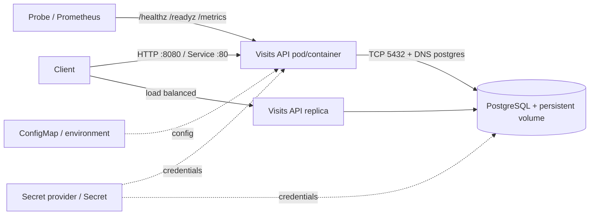

# Capstone: Visits API từ Compose đến Kubernetes

Đây là một dịch vụ Go nhỏ nhưng có đủ “điểm móc” để học production behavior: PostgreSQL persistence, startup retry, health/readiness tách biệt, metrics dạng Prometheus, structured-ish logs, timeout, graceful shutdown, non-root image và Kubernetes hardening.

Không xem đây là production template nguyên xi. Phần [production gaps](#những-gì-còn-thiếu-trước-production) cố ý chỉ ra những quyết định phụ thuộc hạ tầng/doanh nghiệp.

## Kiến trúc



| Endpoint | Ý nghĩa | Có kiểm tra DB? |
|---|---|---:|
| `GET /healthz` | Process/event loop còn sống | Không |
| `GET /readyz` | Replica có thể nhận traffic cần DB | Có |
| `GET /metrics` | Hai metric tối thiểu cho lab | Không |
| `GET /visits` | Đọc tối đa 100 bản ghi mới nhất | Có |
| `POST /visits` | Tạo `{"message":"..."}` | Có |

Liveness cố ý **không** phụ thuộc DB: restart API không chữa được database outage. Readiness phụ thuộc DB để loại replica khỏi traffic khi nó không thể phục vụ request.

## Chạy unit test

Yêu cầu Go 1.27+:

```bash
go test ./...
```

Nếu máy host chặn Go toolchain, build stage trong Docker vẫn có thể compile/test độc lập:

```bash
docker run --rm -v "${PWD}:/src" -w /src golang:1.27-alpine go test ./...
```

## Chạy bằng Docker Compose

### 1. Chuẩn bị và kiểm tra cấu hình

PowerShell:

```powershell
Copy-Item .env.example .env
docker compose config --quiet
docker compose build
docker compose up -d
docker compose ps
```

Bash:

```bash
cp .env.example .env
docker compose config --quiet
docker compose up -d --build
docker compose ps
```

PostgreSQL mặc định **không publish cổng ra host**; API truy cập nó qua internal network `data`. Khi thật sự cần nối database client từ host, bật override và chỉ bind loopback:

```bash
docker compose -f compose.yaml -f compose.debug.yaml up -d
# PostgreSQL lúc này ở 127.0.0.1:15432 (hoặc DB_DEBUG_PORT)
```

Credential trong `.env.example` chỉ dành cho local lab. File `.env` đã bị loại khỏi build context và Git trong sample; giữ quy tắc này nếu copy capstone sang repository khác.

### 2. Smoke test

PowerShell:

```powershell
Invoke-RestMethod http://localhost:8080/healthz
Invoke-RestMethod http://localhost:8080/readyz
Invoke-RestMethod -Method Post -Uri http://localhost:8080/visits `
  -ContentType application/json -Body '{"message":"hello containers"}'
Invoke-RestMethod http://localhost:8080/visits
Invoke-WebRequest http://localhost:8080/metrics | Select-Object -ExpandProperty Content
```

Bash:

```bash
curl -fsS localhost:8080/healthz
curl -fsS localhost:8080/readyz
curl -fsS -X POST localhost:8080/visits \
  -H 'content-type: application/json' \
  -d '{"message":"hello containers"}'
curl -fsS localhost:8080/visits
curl -fsS localhost:8080/metrics
```

Quan sát artifact/runtime thay vì chỉ thấy HTTP 200:

```bash
docker image history container-deep-dive-api
docker compose top
docker compose logs -f --tail=50 api
docker compose exec api id
docker compose exec api sh -c 'cat /proc/1/status | head'
docker network inspect container-deep-dive_data
docker volume inspect container-deep-dive_postgres-data
```

### 3. Chứng minh persistence

```bash
docker compose down
docker compose up -d
curl -fsS localhost:8080/visits
```

Record vẫn tồn tại vì `down` không xóa named volume. `docker compose down --volumes` **xóa dữ liệu lab**; chỉ chạy sau khi đã backup hoặc khi thật sự muốn reset.

### 4. Backup/restore không phụ thuộc redirect của shell

```bash
docker compose exec db pg_dump -U app -d visits -Fc -f /tmp/visits.dump
docker compose cp db:/tmp/visits.dump ./visits.dump
docker compose cp ./visits.dump db:/tmp/restore.dump
docker compose exec db pg_restore -U app -d visits --clean --if-exists /tmp/restore.dump
```

Một file backup chưa từng restore test chưa phải là chiến lược backup đáng tin cậy. Với production phải chốt transaction consistency, encryption, retention, off-site storage và RPO/RTO.

## Deploy lên Kubernetes local

### Prerequisites

- Cluster lab và `kubectl`; xác nhận bằng `kubectl config current-context`.
- Dynamic StorageClass mặc định cho PVC, hoặc tự khai báo storage class phù hợp.
- Image local được node nhìn thấy. Docker Desktop thường dùng được image vừa build; kind cần `kind load docker-image visits-api:dev`.
- Namespace pin Pod Security Standards ở `v1.36`; nếu cluster dùng minor khác, kiểm tra policy của minor đó trước khi đổi label version.

### 1. Build và cung cấp image

```bash
docker build -t visits-api:dev .
# Chỉ với kind:
kind load docker-image visits-api:dev
```

### 2. Tạo namespace và secret local

```bash
kubectl apply -f k8s/base/namespace.yaml
kubectl create secret generic capstone-db \
  --namespace container-lab \
  --from-literal=database=visits \
  --from-literal=username=app \
  --from-literal=password=local-only-change-me \
  --dry-run=client -o yaml | kubectl apply -f -
```

PowerShell dùng backtick thay cho `\` để xuống dòng, hoặc viết command trên một dòng. Cách trên vẫn để mật khẩu local trong shell history; production cần secret manager/external secret workflow và quyền RBAC/audit phù hợp.

### 3. Render, diff rồi apply dev overlay

```bash
kubectl kustomize k8s/overlays/dev
kubectl diff -k k8s/overlays/dev
kubectl apply -k k8s/overlays/dev
kubectl rollout status deployment/visits-api -n container-lab --timeout=120s
kubectl get pods,svc,pvc -n container-lab -o wide
```

Nếu `diff` trả exit code `1` vì có khác biệt, đó không nhất thiết là lỗi. Hãy đọc diff trước khi apply.

### 4. Truy cập và quan sát

Terminal 1:

```bash
kubectl port-forward -n container-lab service/visits-api 8080:80
```

Terminal 2:

```bash
curl -fsS localhost:8080/readyz
curl -fsS -X POST localhost:8080/visits \
  -H 'content-type: application/json' \
  -d '{"message":"hello kubernetes"}'
curl -fsS localhost:8080/visits
kubectl logs -n container-lab deployment/visits-api --all-pods --tail=20
kubectl get events -n container-lab --sort-by=.lastTimestamp
```

`k8s/optional/ingress.yaml` chỉ dùng khi cluster đã có NGINX Ingress Controller và DNS/hosts phù hợp. Ingress object tự nó không tạo data plane.

## Failure drills bắt buộc

Mỗi drill cần ghi: giả thuyết, lệnh quan sát, root cause, cách khôi phục, và tín hiệu/alert lẽ ra phải bắt được lỗi.

### Database outage

```bash
kubectl scale statefulset/postgres -n container-lab --replicas=0
kubectl get pods -n container-lab
curl -i localhost:8080/healthz
curl -i localhost:8080/readyz
kubectl scale statefulset/postgres -n container-lab --replicas=1
kubectl rollout status statefulset/postgres -n container-lab --timeout=120s
```

Kỳ vọng: health vẫn `200`, readiness thành `503`; API không nên bị liveness restart chỉ vì DB down.

### Secret sai và env không tự reload

Sửa secret local, rồi quan sát pod hiện tại vẫn giữ env cũ. Thực hiện rollout restart có kiểm soát:

```bash
kubectl create secret generic capstone-db -n container-lab \
  --from-literal=database=visits --from-literal=username=app \
  --from-literal=password=wrong --dry-run=client -o yaml | kubectl apply -f -
kubectl rollout restart deployment/visits-api -n container-lab
kubectl get pods -n container-lab -w
```

Khôi phục secret đúng rồi restart lại Deployment. Hãy giải thích vì sao secret mount dạng volume có semantics cập nhật khác env var, và vì sao application-level credential rotation vẫn cần thiết kế hai pha.

### Resource pressure

Không đặt memory cực thấp trên cluster dùng chung. Trên cluster lab, patch limit nhỏ có thể tạo `OOMKilled`; dùng các lệnh sau để tìm bằng chứng:

```bash
kubectl describe pod -n container-lab -l app.kubernetes.io/name=visits-api
kubectl get pod -n container-lab -l app.kubernetes.io/name=visits-api \
  -o jsonpath='{range .items[*]}{.metadata.name}{"\t"}{.status.containerStatuses[0].lastState.terminated.reason}{"\n"}{end}'
kubectl top pod -n container-lab
```

Sau thử nghiệm, `kubectl apply -k k8s/overlays/dev` để đưa spec về baseline.

### Service selector sai

Tạo bản copy của `api-service.yaml`, làm selector không còn khớp và apply trên lab; quan sát:

```bash
kubectl get service,endpointslice -n container-lab
kubectl describe service visits-api -n container-lab
kubectl get pods -n container-lab --show-labels
```

Khôi phục bằng `kubectl apply -k k8s/overlays/dev`. Mục tiêu là học đường suy luận `Service selector → EndpointSlice → Pod readiness`, không phải restart pod.

## Prod overlay dùng để review, không apply mù quáng

```bash
kubectl kustomize k8s/overlays/prod > rendered-prod.yaml
```

Trước khi dùng, phải thay registry/tag bằng artifact bất biến, xác nhận registry pull auth, CNI thực thi NetworkPolicy, metrics pipeline cho HPA, ingress namespace/labels, StorageClass, capacity cho PDB và topology thực tế. NetworkPolicy prod chỉ cho ingress từ namespace `ingress-nginx` hoặc pod cùng namespace có label `role=test-client`.

## Những gì còn thiếu trước production

- PostgreSQL đơn replica trong cluster không phải HA database; cân nhắc managed DB/operator có backup và failover đã kiểm thử.
- Migration đang chạy khi mọi replica start; dự án thật cần migration job/versioning và concurrency policy rõ ràng.
- Chưa có TLS/mTLS, authentication/authorization, rate limit, schema migration governance hay data classification.
- Metric demo không có route/status labels, histogram, tracing, dashboard, recording rules hoặc alert routing.
- Chưa có image signing/provenance/SBOM admission, vulnerability SLA, registry retention và rebuild policy.
- HPA chỉ có CPU; chưa load-test để suy ra requests, limits, saturation point và scaling lag.
- Chưa có multi-zone storage semantics, backup/restore automation, RPO/RTO test hay disaster recovery.
- Chưa có GitOps/CI promotion, policy-as-code, canary/progressive delivery và audit evidence.

Đây chính là backlog cho tuần 21–24. Mỗi bổ sung phải đi cùng test và lý do, không chỉ thêm YAML cho “đủ công nghệ”.

## Cleanup

```bash
kubectl delete namespace container-lab
docker compose down
```

Namespace deletion xóa cả PVC/resource trong namespace tùy storage reclaim policy; hãy backup evidence/data cần giữ trước. Muốn xóa volume Compose local, chạy riêng `docker compose down --volumes` sau khi xác nhận đúng project.
