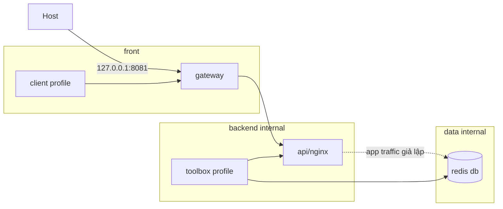

# 03 — Networking segmentation lab

Topology:



`api` dùng Nginx tĩnh để lab tập trung network. `db` dùng Redis. Không có port DB nào publish ra host.

## Chạy đường đúng

```bash
docker compose config
docker compose up -d
curl http://localhost:8081
docker compose ps
docker network ls
```

Toolbox chỉ chạy khi gọi explicit/profile:

```bash
docker compose run --rm client wget -qO- http://gateway
docker compose run --rm toolbox wget -qO- http://api
docker compose run --rm toolbox sh -c 'nc -zvw 2 db 6379'
```

## Chứng minh isolation

Client chỉ ở `front`, nên không có đường/name tới API và DB:

```bash
docker compose run --rm client nslookup api
docker compose run --rm client nslookup db
```

Hai lệnh trên **được kỳ vọng thất bại**. Host cũng không kết nối được `localhost:6379` vì DB không publish. Xem network membership:

```bash
docker network inspect docker-networking_front
docker network inspect docker-networking_backend
docker network inspect docker-networking_data
```

## Failure drill

Xóa `backend` khỏi service `gateway`, recreate rồi quan sát Nginx không resolve/reach `api`. Đặt lại config và `docker compose up -d --force-recreate`.

```bash
docker compose down
```

Liên quan: [Bài 06](../../../Lessions/Docker/06-networking-chuyen-sau.md).
