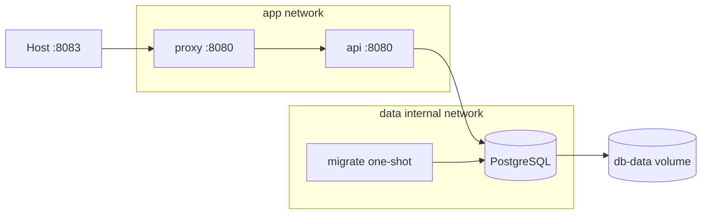

# 05 — Compose production baseline

Stack gồm Nginx unprivileged → Flask/Gunicorn API → PostgreSQL, migration one-shot, secret dạng file, hai network, named volume, health dependency, resource/security/logging baseline.



## Chuẩn bị lab secret

Không commit secret thật. Tạo file từ template:

PowerShell:

```powershell
Copy-Item ./secrets/db_password.txt.example ./secrets/db_password.txt
```

Bash:

```bash
cp ./secrets/db_password.txt.example ./secrets/db_password.txt
chmod 600 ./secrets/db_password.txt
```

Giá trị template chỉ dành cho local lab.

## Chạy

```bash
docker compose config
docker compose up --build -d --wait
docker compose ps -a
curl http://localhost:8083/live
curl http://localhost:8083/ready
curl -X POST http://localhost:8083/visits
curl http://localhost:8083/visits
```

`migrate` phải exit `0`; API chỉ start sau DB healthy và migration hoàn thành.

## Kiểm chứng topology/hardening/data

```bash
docker compose logs --tail 100 api migrate db
docker compose exec api id
docker compose exec api sh -c 'touch /should-fail'
docker compose exec api sh -c 'touch /tmp/works && ls -l /tmp/works'
docker network inspect docker-compose-production_data
docker volume inspect docker-compose-production_db-data
```

Lệnh ghi `/should-fail` được kỳ vọng thất bại do rootfs read-only; `/tmp` là tmpfs nên ghi được. DB không publish port ra host.

Recreate và chứng minh data còn:

```bash
docker compose down
docker compose up -d --wait
curl http://localhost:8083/visits
```

## Render production override

Trong production, CI đã build/push image và cung cấp exact digest. Ví dụ chỉ render (thay placeholder bằng digest thật):

PowerShell:

```powershell
$env:APP_IMAGE='registry.example.com/team/api@sha256:REPLACE_ME'
$env:BIND_ADDRESS='0.0.0.0'
$env:PUBLIC_PORT='8080'
docker compose -f compose.yaml -f compose.production.yaml config
```

Bash:

```bash
APP_IMAGE='registry.example.com/team/api@sha256:REPLACE_ME' \
BIND_ADDRESS='0.0.0.0' PUBLIC_PORT=8080 \
docker compose -f compose.yaml -f compose.production.yaml config
```

Khi deploy thật: login/pull/verify digest trước, rồi `up -d --no-build --wait`. Base file vẫn có `build` để local dev; `--no-build` là guard production. Production nên pin cả DB/proxy image theo digest được duyệt qua `DB_IMAGE`/`PROXY_IMAGE`.

## Backup database (lab)

Logical dump cần được lưu off-host và restore test. Trên Bash:

```bash
docker compose exec -T db pg_dump -U app -d app > app.sql
```

Trên PowerShell, tránh phụ thuộc binary redirection cho custom format; SQL text như trên có thể dùng `docker compose exec -T db pg_dump -U app -d app | Set-Content -Encoding utf8 app.sql`. Dự án thật cần automation, encryption, retention và test restore sang database mới.

## Dọn

```bash
docker compose down
```

Không thêm `-v` nếu muốn giữ database. Nếu thực sự muốn reset lab, xác nhận exact project/volume rồi mới `docker compose down -v`.

Liên quan: [Bài 08](../../../Lessions/Docker/08-compose-tu-dev-den-prod.md), [Bài 09](../../../Lessions/Docker/09-security-hardening.md), [Bài 13](../../../Lessions/Docker/13-production-patterns.md).
