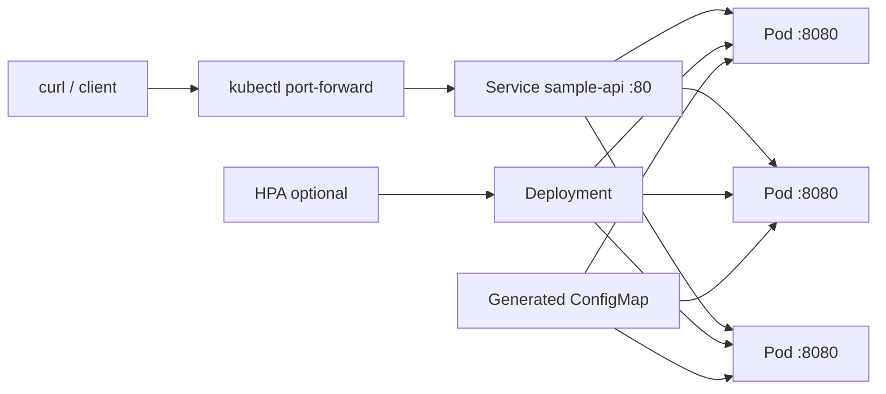

# Kubernetes project mẫu: `sample-api`

Project này chạy được trên cluster local `kind` và minh họa Deployment, Service, probes, resources, security context, Kustomize overlays, HPA/PDB, NetworkPolicy, RBAC, storage lab, Helm và debugging.

> Mọi image/version trong lab đều được pin để tái lập tương đối, nhưng không phải cam kết hỗ trợ production. Trước dự án thật, chọn Kubernetes/add-on/image theo support matrix và policy của tổ chức.

## Sơ đồ



## Yêu cầu

- Docker Engine hoặc Docker Desktop đang chạy.
- `kind` v0.32.0 trở lên, `kubectl`; bài Helm cần `helm`.
- Tối thiểu khoảng 4 CPU, 8 GiB RAM, 15 GiB disk cho Docker.

Nguồn cài đặt chính thức: [kubectl](https://kubernetes.io/docs/tasks/tools/), [kind](https://kind.sigs.k8s.io/docs/user/quick-start/), [Helm](https://helm.sh/docs/intro/install/).

## 1. Build image

Chạy từ root repository:

```powershell
docker build -t sample-api:dev CodeSample/kubernetes/app
```

Kiểm tra local trước Kubernetes:

```powershell
docker run --rm -p 18080:8080 -e APP_MESSAGE=hello-docker sample-api:dev
# terminal khác
curl.exe http://localhost:18080/
curl.exe http://localhost:18080/livez
curl.exe http://localhost:18080/readyz
curl.exe http://localhost:18080/metrics
```

Nhấn Ctrl+C để dừng container.

## 2. Tạo cluster multi-node

```powershell
kind create cluster --config CodeSample/kubernetes/kind-config.yaml
kubectl config use-context kind-deep-k8s
kubectl get nodes -o wide
kind load docker-image sample-api:dev --name deep-k8s
```

`kind-config.yaml` pin Kubernetes v1.36.1 bằng digest do [kind v0.32.0 chính thức phát hành](https://github.com/kubernetes-sigs/kind/releases/tag/v0.32.0). Node image này cần kind v0.32.0 trở lên cho `kind load`; digest giúp tránh tag bị thay đổi. Nếu chuyển phiên bản, chọn đúng image/digest từ kind release notes và cập nhật đồng bộ version Pod Security trong `base/namespace.yaml` sau khi kiểm tra compatibility.

## 3. Deploy bằng Kustomize

```powershell
kubectl kustomize CodeSample/kubernetes/overlays/dev
kubectl diff -k CodeSample/kubernetes/overlays/dev
kubectl apply -k CodeSample/kubernetes/overlays/dev
kubectl rollout status deployment/sample-api -n deep-k8s --timeout=3m
kubectl get deploy,rs,pod,svc,endpointslice,configmap -n deep-k8s -o wide
```

Verify:

```powershell
kubectl port-forward service/sample-api -n deep-k8s 8080:80
# terminal khác
curl.exe http://localhost:8080/
curl.exe http://localhost:8080/metrics
```

Response `/` chứa hostname, version và message từ ConfigMap. Overlay dev có 1 replica; overlay prod có 3 replicas + PDB + NetworkPolicy:

```powershell
kubectl diff -k CodeSample/kubernetes/overlays/prod
kubectl apply -k CodeSample/kubernetes/overlays/prod
kubectl rollout status deployment/sample-api -n deep-k8s
```

Kindnet mặc định không phải môi trường chứng minh NetworkPolicy production. Hãy dùng CNI có NetworkPolicy và chạy cả negative test trước khi kết luận policy được enforce.

## 4. Autoscaling tùy chọn

HPA cần Metrics API. Kiểm tra:

```powershell
kubectl get apiservice v1beta1.metrics.k8s.io
kubectl top pods -n deep-k8s
```

Nếu chưa có, cài Metrics Server theo [repository chính thức](https://github.com/kubernetes-sigs/metrics-server) với phiên bản tương thích. Local kind có thể cần cấu hình certificate riêng; option bỏ verify TLS chỉ chấp nhận cho lab.

```powershell
kubectl apply -f CodeSample/kubernetes/autoscaling/hpa.yaml
kubectl get hpa -n deep-k8s --watch
```

Không apply HPA cùng lúc với automation liên tục ép `spec.replicas`. Xóa sau lab để dev overlay sở hữu lại replicas:

```powershell
kubectl delete -f CodeSample/kubernetes/autoscaling/hpa.yaml --ignore-not-found
kubectl apply -k CodeSample/kubernetes/overlays/dev
```

## 5. Helm thay cho Kustomize

Không deploy Helm release cùng tên resources vào namespace đang có Kustomize objects. Dùng namespace khác:

```powershell
helm lint CodeSample/kubernetes/chart/sample-api
helm template demo CodeSample/kubernetes/chart/sample-api --namespace helm-lab
helm upgrade --install demo CodeSample/kubernetes/chart/sample-api --namespace helm-lab --create-namespace --wait --timeout 3m
helm test demo -n helm-lab
helm list -n helm-lab
```

Image local đã load vào kind dùng được ở mọi namespace.

## Cấu trúc sample

| Đường dẫn | Mục đích | Apply trực tiếp? |
|---|---|---|
| `app/` | Go HTTP app + Dockerfile non-root/scratch | Build bằng Docker |
| `base/` | Namespace, generated ConfigMap, Deployment, Service | Có: `kubectl apply -k` |
| `overlays/dev` | 1 replica, config dev | Có |
| `overlays/prod` | 3 replicas, PDB, NetworkPolicy | Có; local policy support có giới hạn |
| `scheduling/` | Pending, taint/affinity, topology spread | Theo từng lab |
| `networking/` | Ingress, Gateway API, NetworkPolicy | Có điều kiện controller/CRD/CNI |
| `storage/` | hostPath lab + PVC, StatefulSet concept | Chỉ local hoặc khi có StorageClass |
| `jobs/` | Job/CronJob idempotency semantics | Có |
| `autoscaling/` | HPA/PDB | HPA cần Metrics API |
| `security/` | RBAC và manifest cố ý bị PSA từ chối | Theo lab |
| `chart/` | Helm chart tối giản nhưng hardened | Có |
| `observability/` | Runbook incident | Tài liệu |
| `operations/` | Upgrade/DR game-day checklist | Tài liệu |

## Validation trước apply

```powershell
kubectl kustomize CodeSample/kubernetes/overlays/dev | kubectl apply --dry-run=client -f -
kubectl kustomize CodeSample/kubernetes/overlays/prod | kubectl apply --dry-run=client -f -
helm lint CodeSample/kubernetes/chart/sample-api
helm template demo CodeSample/kubernetes/chart/sample-api --namespace helm-lab | kubectl apply --dry-run=client -f -
```

Client dry-run không chạy server admission hay kiểm chứng controller/CNI/CSI. Khi có cluster disposable, dùng server-side dry-run và smoke test:

```powershell
kubectl apply --dry-run=server -k CodeSample/kubernetes/overlays/dev
kubectl wait --for=condition=available deployment/sample-api -n deep-k8s --timeout=180s
```

## Cleanup

Các lệnh sau xóa resource lab; kiểm tra context trước:

```powershell
kubectl config current-context
helm uninstall demo -n helm-lab --ignore-not-found
kubectl delete namespace helm-lab --ignore-not-found
kubectl delete namespace deep-k8s --ignore-not-found
```

Chỉ xóa cluster local có tên chính xác `deep-k8s` khi không cần dữ liệu lab:

```powershell
kind delete cluster --name deep-k8s
```

## Đọc kèm

[Lộ trình Kubernetes](../../Lessions/Kubernetes/README.md) giải thích mental model, tình huống sử dụng, failure modes và câu hỏi tự kiểm tra cho từng sample.
