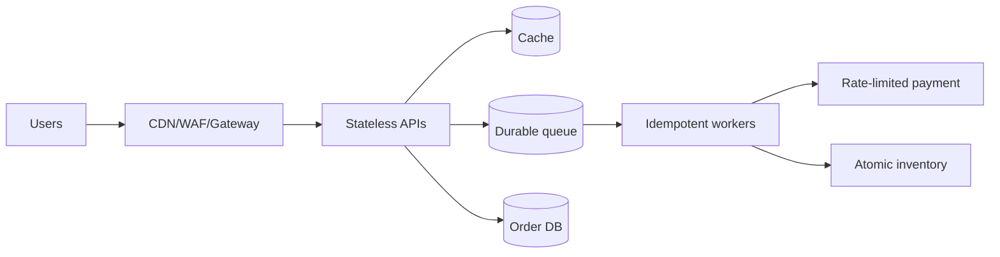
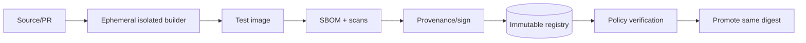

# System design — model outlines và rubric

Không chấm theo việc trùng kiến trúc này. Chấm xem quyết định có nối với requirement, failure model và khả năng vận hành hay không.

## SD-01 — Flash sale

Strong outline:

- Làm rõ consistency: reserve inventory atomically/serialized by SKU; order/ledger durable before async response; idempotency keys and outbox/saga, không transaction giả xuyên provider.
- Pre-scale cho peak báo trước; HPA theo concurrency/queue, node headroom, bounded worker concurrency theo DB/payment. Queue/backpressure/load shedding cho noncritical feature.
- Multi-zone topology, PDB cho maintenance, readiness sau warm, graceful drain; managed DB/queue multi-zone và tested failover.
- Payment timeout/retry budget/circuit breaker, không retry tầng tầng; reconcile uncertain result.
- Trace checkout, SLO/error budget, inventory/order invariant metrics; degraded read-only/catalog mode.
- RPO 0 order đòi synchronous durable commit/quorum phù hợp; backup không tự đạt RPO 0, cần replication/log and restore drill.

Red flag: “scale Pods lên 1000” nhưng không model DB/payment/connection/queue; eventual inventory làm oversell mà không compensating process.

## SD-02 — Multi-tenant platform

Strong outline:

- Phân nhóm trust/compliance trước khi chia clusters; environment/region/PII có thể là hard boundary. Namespace là soft boundary, không đủ cho hostile tenant.
- Identity federation → group RoleBindings; separate ServiceAccounts/workload identity; no shared static cloud keys. Default-deny network/egress, quotas/limits, Restricted Pod Security, approved registries/signatures.
- Dedicated/sandbox node pools cho untrusted/PII; encrypt etcd and tenant keys where required; centralized immutable audit.
- Self-service API/template tạo service, namespace, SLO dashboard, policy tests and GitOps; resource status/error actionable, escape hatch with expiry.
- Fleet strategy avoids 150 bespoke clusters; standardized addons/version waves and platform SLO/on-call. Showback by requests/actual/business unit.

Red flag: cấp namespace + cluster-admin; platform abstraction không cho team xem underlying resources/events; mọi exception vĩnh viễn.

## SD-03 — Supply chain

Strong outline:

- Untrusted PR builders receive no prod signing identity/secret, isolated ephemeral VM/sandbox, bounded egress; private deps only trusted branch with BuildKit secret mount.
- Lockfiles/base digest/reproducible timestamps where practical; cache scoped by repo/trust and not allowed to forge attestations.
- Central base ownership/rebuild automation; SBOM + vulnerability/license/secret scans, triage SLA/exception owner/expiry.
- Keyless/short-lived signing identity or protected key; provenance binds commit/builder/materials. Admission verifies policy/signature/digest, not tag.
- Same digest promoted; registry retention/mirror and disaster policy. Compromise playbook revokes identities, denies digest, rebuilds from trusted sources and audits deploys.
- Feedback budget: parallel gates/cache, fast PR scan plus deeper release scan; actionable finding path.

Red flag: signing anything already in registry without trusted build provenance; token in ARG; shared privileged runner for forks.

## SD-04 — Stateful analytics

Strong outline:

- Challenge premise: managed broker/object storage may lower on-call/TCO. Put stateless ingest/query/processing on K8s first; in-cluster broker only with mature operator and ownership.
- Capacity model: 3 TB/day ≈35 MB/s average before replication/peak; account 3× replication, retention, compaction and 2–5× peak, network/IOPS/attach limits.
- Odd quorum controllers across zones; brokers distributed with stable PVC/identity, anti-affinity/topology, fencing and spare capacity; PDB respects quorum but doesn't protect zone failure.
- Separate storage classes for latency/capacity, WaitForFirstConsumer, Retain, encryption; query/cache and compaction resource isolation.
- Native incremental/log backup and metadata/schema, off-region/object-lock copy; restore subset then full cluster regularly, measure RPO/RTO.
- Upgrade one failure domain/canary according operator compatibility; observability includes under-replicated partitions, lag, disk/IO, leader elections, restore age.

Red flag: equate StatefulSet with HA/backup; one snapshot in same cloud account; no data growth/replication math.

## SD-05 — Global active-active

Strong outline:

- Global traffic uses health/latency steering with session/data locality and conservative failover; each region has independent capacity/dependencies.
- Split consistency domains: profile uses conflict-resolution/version/vector/LWW choice documented; ledger has single-writer/consensus home region or globally consistent database, idempotent commands and immutable entries.
- Timeouts/retry budgets/circuit breakers/load shedding prevent cross-region cascade; dedupe IDs survive retries/failover.
- Config/image digest promoted in waves; regional canary and feature flags. Secrets/keys scoped and replicated intentionally.
- Traces include region/request/idempotency; SLO per/global, replication lag and failover correctness. Practice region loss and failback/split-brain fencing.

Red flag: active-active writes to ordinary per-region databases with no conflict model; DNS TTL presented as deterministic instant failover.

## SD-06 — Ransomware/credential compromise

Strong outline:

- Prevention: separate accounts/projects and roles, short-lived MFA identities, guarded break-glass, no broad cluster→cloud credential, audit export to independent account, signed immutable images.
- Database continuous log/incremental backups ≤15m plus immutable object lock in different admin boundary; KMS/key escrow designed so attacker cannot delete both data and recovery keys.
- Detection and containment: freeze deploy, revoke identities/tokens, isolate clusters/accounts, preserve evidence. Assume cluster state/images/config touched.
- Clean-room new account/cluster from known-good IaC/toolchain, restore identity/KMS/network/control addons, verify artifacts, restore data, deploy critical apps, canary traffic/DNS; do not restore compromised etcd blindly.
- RTO 4h is only credible after timed full exercises, automated dependency ordering and pre-provisioned access. Document legal/comms/forensics.

Red flag: backups writable/deletable by same cluster-admin/cloud editor; “rotate password and restart Pods” establishes no clean trust root.

## SD-07 — Fleet observability

Strong outline:

- Define telemetry contract: service/route/status/region bounded labels, correlation/trace context, PII rules; reject/hash unbounded user IDs.
- Local agents buffer with disk budget/backpressure; regional aggregation; metrics recording rules/downsampling, log retention tiers/search-on-demand, trace head+tail/error sampling.
- Multi-tenant auth/quotas and cost showback; critical audit separated immutable/longer retention. Platform/control-plane/CNI/CSI signals standardized.
- Page on user SLO multi-window burns, not every Pod restart; link exemplar trace/log/runbook. Track ingest loss/query latency and fallback when backend unavailable.
- Optimize 15 TB/day by filter at source, sampling verbose logs, per-team budgets; measure MTTR, alert precision and cost per request/team.

Red flag: keep all data forever; cardinality budget absent; observability outage blocks application or produces no signal that data was dropped.

## SD-08 — Compose/VM migration

Strong outline:

- Discovery: owner, dependency, traffic/SLO, state, backup, deploy/runtime contract. Classify retire/retain VM/rehost/replatform/refactor; databases likely managed/external first, not blind StatefulSet.
- Establish landing zone: image pipeline, registry, identity, namespace/network/security/resource defaults, ingress, observability, GitOps and support model.
- Pilot 2–3 stateless reversible services; externalize config/log/session, implement probes/shutdown/resources; dual-run/shadow/canary and objective gates.
- Data services use replication/CDC/logical backup, consistency check, cutover and failback window; never copy live volume casually.
- Waves based dependency/business risk, training/pairing/on-call/game days. Success: deploy lead time/failure rate/MTTR/SLO/cost and fewer snowflakes, not migration count.

Red flag: 12-month big bang; use Kubernetes to run databases before storage/on-call/restore maturity; no option to leave a workload on VM.

## Cách chấm sâu

| Điểm 0–1 | Điểm 2 | Điểm 3–4 |
|---|---|---|
| Nêu tên tool, không gắn requirement | Cơ chế phần lớn đúng nhưng failure/cost mỏng | Lượng hóa, nêu alternatives, failure/cost/owner và phased validation |

Cho mỗi trong 6 trục: requirements, correctness, reliability, security, operability, trade-offs. Sau đó quy đổi về rubric 100 điểm trong đề.
