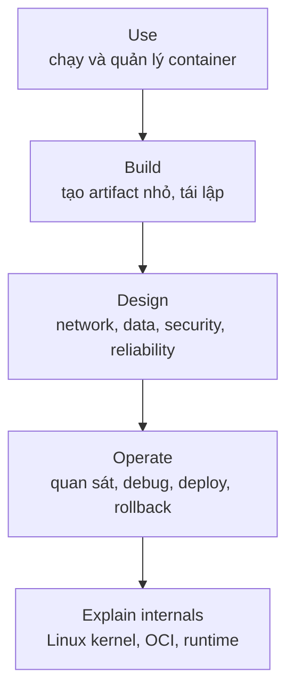
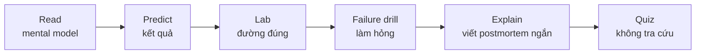

# 00 — Roadmap và cách đánh giá năng lực

## “Am hiểu sâu” nghĩa là gì?

Không phải thuộc nhiều lệnh. Một kỹ sư Docker mạnh có thể đi qua bốn tầng:

Ở mỗi tầng, bạn cần làm được ba việc: **giải thích**, **thực thi**, **chẩn đoán**. Ví dụ, “biết volume” chỉ được đánh dấu khi bạn giải thích lifecycle, tạo/backup/restore được, và xử lý được lỗi UID/GID hoặc mount che dữ liệu.

## Kiểm tra đầu vào 30 phút

Không tra cứu, hãy trả lời và thực hiện:

1. Vì sao xóa container làm mất writable layer nhưng không nhất thiết mất named volume?
2. `EXPOSE 8080`, `-p 8080:80` và process bind `127.0.0.1` khác nhau thế nào?
3. Viết Dockerfile multi-stage, non-root cho một app bạn biết.
4. Vì sao `ARG TOKEN` không phải cách an toàn để cấp secret khi build?
5. Tìm nguyên nhân một container có trạng thái `Exited (137)`.
6. Tạo hai network để proxy nhìn thấy API nhưng không nhìn thấy database.
7. Chứng minh image đang chạy là đúng digest đã duyệt.

0–2 câu: theo đủ 12 tuần. 3–5: có thể đi nhanh bài 01–04 nhưng vẫn làm lab. 6–7: tập trung bài 05–16 và biến mỗi lab thành một failure drill.

## Lộ trình theo mốc bàn giao

| Mốc | Bài | Artifact phải nộp | Tiêu chí qua |
|---|---|---|---|
| M1 — Container user | 01–02 | Nhật ký lệnh và lifecycle diagram | Tự giải thích mọi flag đã dùng |
| M2 — Image author | 03–05 | Image multi-stage + báo cáo size/cache/SBOM | Rebuild nhanh, không lộ secret, chạy non-root |
| M3 — App designer | 06–10 | Compose app có network/data/security/limit | Restart an toàn, data còn, attack surface nhỏ |
| M4 — Operator | 11–15 | Dashboard/log query/runbook/rollback | Khoanh vùng 5 lỗi có chủ đích dưới 15 phút/lỗi |
| M5 — Project owner | 16 | Capstone và evidence | Đạt Definition of Done trong bài 16 |

## Nhịp học một bài

Gợi ý failure drill: kill PID 1, đổi quyền volume, bind sai interface, làm đầy memory, dùng tag không tồn tại, làm hỏng healthcheck, ngắt network, rotate secret, rollback image.

## Khi nào dùng Docker?

**Nên dùng** khi cần môi trường tái lập giữa dev/CI/prod, đóng gói dependency, chạy nhiều thành phần tách biệt, tạo preview/test environment nhanh, hoặc phát hành artifact theo image digest.

**Không tự động chọn Docker** cho chương trình desktop cần tích hợp GUI/driver sâu, workload đòi kernel khác host, hệ thống stateful chưa có chiến lược backup/restore, hoặc đội ngũ chưa sẵn sàng vận hành registry/patch/monitoring. Container không sửa kiến trúc kém; nó làm cách đóng gói và isolation nhất quán hơn.

## Evidence portfolio

Giữ lại cho mỗi mốc: Dockerfile/Compose, output `docker inspect`, sơ đồ, kết quả test, image size, scan/SBOM, backup + restore log, một postmortem, và quyết định trade-off. Đây cũng là bằng chứng tốt hơn câu “em biết Docker” khi phỏng vấn.

## Tự kiểm tra

1. Vì sao chỉ chạy được happy path chưa chứng minh năng lực production?
2. Hãy chọn ba failure drill phù hợp dự án hiện tại và nêu tín hiệu quan sát.
3. Trường hợp nào VM phù hợp hơn container? Có thể dùng cả hai cùng lúc không?

## Nguồn chính thức

- [Docker overview](https://docs.docker.com/get-started/docker-overview/)
- [Docker workshop](https://docs.docker.com/get-started/workshop/)
