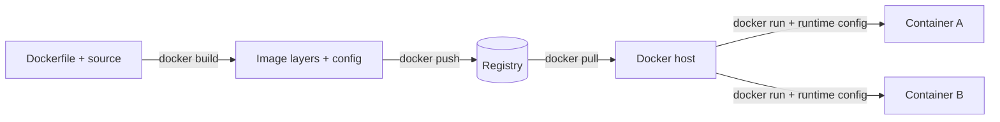
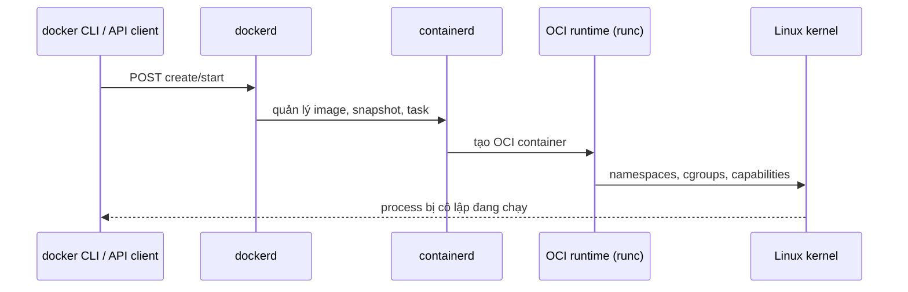

# 01 — Mental model và kiến trúc Docker

## Kết quả cần đạt

Bạn phân biệt được image, container, registry và VM; mô tả đường đi từ CLI đến Linux process; biết Docker giải quyết bài toán nào và ranh giới nào nó không giải quyết.

## Image, container và registry

- **Image**: gói bất biến gồm filesystem layers và metadata (entrypoint, env, user, platform).
- **Container**: một process cô lập được tạo từ image + runtime configuration + writable layer.
- **Repository**: tập các phiên bản image cùng tên; **registry** lưu/phân phối repository.
- **Tag** là tên có thể trỏ lại; **digest** định danh nội dung bất biến.

Một class không phải object; tương tự, image không phải container đang chạy. Từ một image có thể tạo nhiều container độc lập.



## Client–server–runtime



Tên component là mental model, chi tiết triển khai có thể thay đổi. Hãy dùng `docker info` và `docker version` để biết client đang nói với daemon/context nào.

## Container khác VM

| Thuộc tính | Container Linux | VM |
|---|---|---|
| Kernel | Chia sẻ kernel host/VM | Kernel riêng |
| Khởi động | Thường rất nhanh vì là process | Boot cả OS |
| Isolation | Namespace/cgroup/capability | Hypervisor/hardware boundary mạnh hơn |
| Image | App + user space dependency | Cả OS image |
| Kernel khác host | Không trực tiếp | Có |

Trên Docker Desktop, Linux containers vẫn chia sẻ **kernel của Linux VM**, không phải kernel Windows/macOS. Vì thế mount/network performance và địa chỉ host có thể khác native Linux.

## Các cơ chế Linux nền

- **Namespaces** tạo góc nhìn riêng cho PID, mount, network, UTS hostname, IPC, user, cgroup.
- **cgroups** đo và giới hạn CPU, RAM, PID, I/O tùy cấu hình kernel/runtime.
- **Capabilities** chia quyền root thành các mảnh; Docker bỏ một phần mặc định, ta nên bỏ thêm.
- **Seccomp / AppArmor / SELinux** giảm syscall hoặc truy cập tài nguyên.
- **Copy-on-write filesystem** ghép read-only image layers với writable container layer.

Container mặc định có isolation hữu ích nhưng không phải sandbox tuyệt đối. Mount Docker socket, `--privileged`, host PID/network hoặc capabilities rộng có thể làm thủng ranh giới.

## Khi nào dùng — ví dụ cụ thể

Một nhóm có API Go, PostgreSQL và Redis. Mỗi laptop có phiên bản khác nhau, CI hay lỗi “works on my machine”. Đóng gói API thành image và mô tả dependencies bằng Compose làm phiên bản, network và lệnh khởi động tái lập. PostgreSQL data phải đặt ở volume; image chỉ chứa phần mềm.

Không nên nhét cả API + PostgreSQL + cron + SSH vào một container chỉ để giả lập VM. Tách theo lifecycle/ownership, nhưng “một process tuyệt đối” không phải luật cứng: một container có thể có helper process nếu chúng thực sự cùng lifecycle và PID 1 quản lý signal/reaping đúng.

## Lab

Làm [01-first-container](../../CodeSample/docker/01-first-container/README.md). Sau đó chạy:

```bash
docker compose ps
docker inspect docker-first-web
docker top docker-first-web
docker stats docker-first-web --no-stream
docker compose down
```

Trong `inspect`, tìm image digest/ID, command, env, mounts, network và restart policy. Không cố học thuộc toàn bộ JSON; học cách đặt câu hỏi cho metadata.

## Tự kiểm tra

1. Vì sao hai container từ cùng image vẫn có PID, network và writable layer khác nhau?
2. Một Linux image có chạy trực tiếp trên Windows kernel không? Docker Desktop giải quyết thế nào?
3. Registry, repository, tag và digest quan hệ ra sao?
4. `--privileged` làm thay đổi threat model như thế nào?

## Nguồn chính thức

- [What is a container?](https://docs.docker.com/get-started/docker-concepts/the-basics/what-is-a-container/)
- [What is an image?](https://docs.docker.com/get-started/docker-concepts/the-basics/what-is-an-image/)
- [Docker Engine security](https://docs.docker.com/engine/security/)
