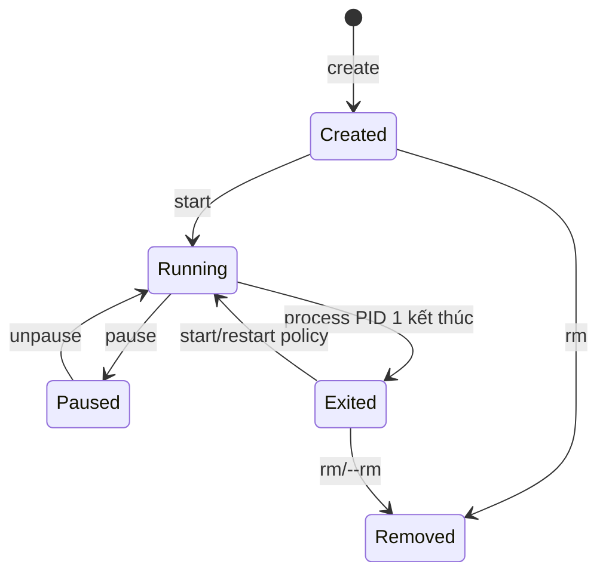

# 02 — CLI và vòng đời container

## Trước khi chạy: xác định context

```bash
docker context ls
docker context show
docker version
docker info
```

CLI có thể điều khiển daemon từ xa. Lệnh `docker ps` “không thấy container” thường do nhầm context, không phải container biến mất.

## `run` thực chất là gì?

`docker run` = pull (nếu cần) + create + start + attach tùy flag.

```bash
docker pull nginx:alpine
docker create --name demo -p 127.0.0.1:8080:80 nginx:alpine
docker start demo
docker logs demo
docker stop --time 10 demo
docker rm demo
```

Các flag quan trọng:

| Flag | Ý nghĩa | Khi dùng |
|---|---|---|
| `--name` | Tên ổn định | Script/debug; không dùng ID ngẫu nhiên |
| `-d` | Chạy detached | Service dài hạn |
| `--rm` | Xóa container khi dừng | Job/lab tạm; không dùng khi cần postmortem container |
| `-it` | stdin + pseudo-TTY | Shell/CLI tương tác, không phải service |
| `-p HOST_IP:HOST:CONTAINER` | Publish port | Chỉ publish interface cần thiết |
| `-e`, `--env-file` | Runtime env | Config không nhạy cảm; secret nên dùng file/store chuyên dụng |
| `--mount` | Mount rõ loại/options | Ưu tiên hơn cú pháp `-v` khó đọc |
| `--read-only` | Root filesystem chỉ đọc | Hardening, thêm tmpfs cho path phải ghi |

## Trạng thái và exit code



- `0`: hoàn thành bình thường.
- `1` hoặc app-specific: lỗi ứng dụng.
- `126`: command tìm thấy nhưng không thực thi được; `127`: không tìm thấy command (thường từ shell).
- `137` thường là SIGKILL (`128+9`), có thể do OOM hoặc người vận hành kill; phải kiểm tra `State.OOMKilled` và events, không kết luận chỉ từ số.
- `143` thường là SIGTERM (`128+15`).

```bash
docker inspect demo --format '{{json .State}}'
docker wait demo
docker events --since 10m --filter container=demo
```

## PID 1 và signal

`docker stop` gửi stop signal (thường SIGTERM), chờ grace period rồi SIGKILL. PID 1 phải forward/handle signal và reap zombie. Exec form giữ app làm PID 1:

```dockerfile
ENTRYPOINT ["/app/server"]
CMD ["--port", "8080"]
```

Shell form `CMD /app/server` thêm `/bin/sh -c`; signal có thể dừng ở shell. Với wrapper script, cuối script dùng `exec "$@"`. Dùng `--init` khi app không reap child process tốt; không mặc định cài full init system.

## Attach, exec, logs, cp

- `attach` nối vào stdio của PID 1; `Ctrl+C` có thể gửi signal.
- `exec` tạo process mới trong namespaces của container; không sửa image.
- `logs` đọc stdout/stderr qua logging driver, không phải mọi file log trong container.
- `cp` hữu ích khi điều tra; không phải cơ chế deploy/config chính.

```bash
docker exec -it demo sh
docker logs --since 5m --tail 100 -f demo
docker cp demo:/etc/nginx/nginx.conf ./nginx.conf.copy
docker diff demo
```

Image tối giản có thể không có shell. Khi khả dụng, `docker debug IMAGE_OR_CONTAINER` mang toolbox ngoài vào thay vì bake công cụ debug vào production image.

## Cleanup có chủ đích

```bash
docker container prune        # chỉ stopped containers; đọc danh sách/xác nhận
docker image prune            # dangling images mặc định
docker volume ls
docker system df -v
```

Không biến `docker system prune -a --volumes` thành cron mù: volume có thể chứa dữ liệu, cache có thể cần cho CI, stopped container có evidence điều tra.

## Lab

Với [01-first-container](../../CodeSample/docker/01-first-container/README.md): `up`, xem log, `exec`, gửi signal, xem exit state, `start` lại, đổi file nguồn rồi chứng minh image cũ không đổi cho tới khi build lại.

## Tự kiểm tra

1. `run`, `create`, `start` khác nhau ở đâu?
2. Khi container exit 137, cần thêm bằng chứng nào để kết luận OOM?
3. Vì sao `exec` sửa file không phải cách vá production?
4. Tình huống nào dùng `--rm` gây mất bằng chứng cần debug?

## Nguồn chính thức

- [Run containers](https://docs.docker.com/engine/containers/run/)
- [Start containers automatically](https://docs.docker.com/engine/containers/start-containers-automatically/)
- [docker debug](https://docs.docker.com/reference/cli/docker/debug/)
- [docker events](https://docs.docker.com/reference/cli/docker/system/events/)
