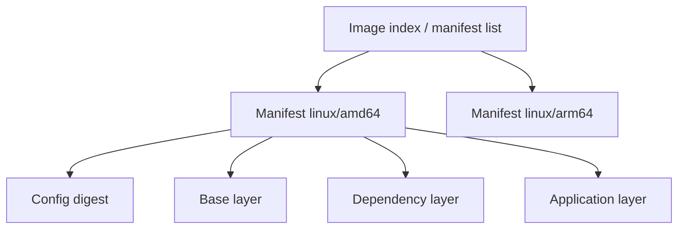
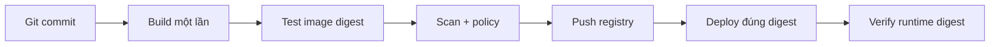

# 03 — Image, layer và registry

## Cấu trúc image

Một OCI image gồm manifest, config JSON và content-addressed layers. Layer là tar diff của filesystem; digest bảo vệ nội dung. Image config còn chứa command, environment, user, working directory, history và platform.



Các image có thể chia sẻ layer giống nhau. Container thêm writable layer copy-on-write; sửa/xóa file lớn ở layer sau không làm byte của layer trước biến mất khỏi image history.

## Tag có thể đổi, digest thì bất biến

```bash
docker pull alpine:3.21
docker image inspect alpine:3.21
docker image ls --digests alpine
docker image tag alpine:3.21 local/alpine:course
```

`latest` chỉ là tag mặc định, không có nghĩa “ổn định nhất” hay “mới nhất đã duyệt”. Quy ước thực tế:

- Dev: tag dễ đọc như `git-<short-sha>`.
- Release: tag SemVer và Git SHA cùng trỏ một digest.
- Deploy: ưu tiên digest đã qua kiểm thử (`repo/app@sha256:...`) để chống tag drift.
- Base image: pin digest khi cần build tái lập; đồng thời có bot/quy trình chủ động cập nhật digest để nhận bản vá.

Pin mà không cập nhật sẽ giữ lỗ hổng cũ mãi; không pin làm cùng source có thể ra artifact khác. Đây là trade-off cần automation.

## Tên image và registry

Dạng đầy đủ: `[registry[:port]/][namespace/]repository[:tag][@digest]`.

```bash
docker login registry.example.com
docker tag deep-docker/go-api:dev registry.example.com/team/go-api:git-a1b2c3d
docker push registry.example.com/team/go-api:git-a1b2c3d
docker pull registry.example.com/team/go-api@sha256:<digest>
docker logout registry.example.com
```

Không đưa password trực tiếp trên command line/history; dùng `--password-stdin` hoặc credential helper/token ngắn hạn theo registry. Registry production cần TLS, authentication, authorization theo repository, retention, vulnerability scanning, replication/backup và immutable release tags nếu hỗ trợ.

## Đọc layer và metadata

```bash
docker history --no-trunc deep-docker/go-api:dev
docker image inspect deep-docker/go-api:dev
docker manifest inspect nginx:alpine
docker image ls --tree   # nếu CLI/image store hỗ trợ
```

`history` không phải SBOM và size mỗi dòng không luôn phản ánh dung lượng thực dùng trên disk do layer sharing/compression. Dùng `docker system df -v` để quan sát local store; dùng SBOM/scanner cho package inventory.

## `save/load` khác `export/import`

| Cặp lệnh | Bảo toàn | Khi dùng |
|---|---|---|
| `docker image save/load` | Image config, tags, layers/history | Chuyển image qua air-gap/tar |
| `docker container export/import` | Flatten filesystem container; mất phần lớn metadata/history | Điều tra/legacy đặc biệt, hiếm khi là pipeline phát hành |

```bash
docker image save -o app-image.tar deep-docker/go-api:dev
docker image load -i app-image.tar
```

Không dùng `docker commit` làm quy trình build chính: thay đổi khó review/tái lập. Dockerfile + source control tạo provenance rõ hơn.

## Registry workflow production



Nguyên tắc “build once, promote many”: không rebuild source riêng cho staging và production. Promote cùng digest; config/secret là runtime concern.

## Lab

Build [02-buildkit-go](../../CodeSample/docker/02-buildkit-go/README.md), gắn hai tag cho cùng image ID, xem `history`, rồi chạy container theo image ID. Nếu có registry thử nghiệm, push tag và pull bằng digest.

Failure drill: đổi tag local sang image khác và chứng minh deploy theo digest không bị trôi.

## Tự kiểm tra

1. Xóa file 200 MB ở instruction sau có làm image nhỏ đi 200 MB không? Vì sao?
2. Tag và digest khác nhau về tính bất biến thế nào?
3. Vì sao vừa pin base digest vừa cần bot cập nhật?
4. `save/load` phù hợp hơn `export/import` trong air-gap vì sao?

## Nguồn chính thức

- [Image concepts](https://docs.docker.com/get-started/docker-concepts/the-basics/what-is-an-image/)
- [Build, tag and publish](https://docs.docker.com/get-started/docker-concepts/building-images/build-tag-and-publish-an-image/)
- [OCI Image Specification](https://github.com/opencontainers/image-spec)
