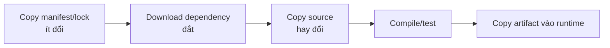

# 04 — Dockerfile thực chiến

## Golden path

```dockerfile
# syntax=docker/dockerfile:1
FROM golang:alpine AS build
WORKDIR /src
COPY go.mod ./
RUN --mount=type=cache,target=/go/pkg/mod go mod download
COPY . .
RUN --mount=type=cache,target=/root/.cache/go-build \
    CGO_ENABLED=0 go build -trimpath -ldflags="-s -w" -o /out/server ./cmd/server

FROM alpine
RUN addgroup -S app && adduser -S -G app -u 10001 app
COPY --from=build --chown=app:app /out/server /usr/local/bin/server
USER app
EXPOSE 8080
ENTRYPOINT ["server"]
```

Đây là pattern, không phải công thức mù. Image `scratch`/distroless nhỏ hơn nhưng có thể thiếu CA certificates, timezone data hoặc shell; runtime Alpine dùng musl có thể không tương thích binary/glibc. Chọn theo dependency và cách debug thật.

## Thứ tự instruction và cache

Build context là tập file builder nhìn thấy. `COPY . .` sớm làm thay đổi source vô hiệu hóa cả dependency install. Hãy copy lock/manifest trước, cài dependency, rồi copy source. Dùng `.dockerignore` để loại `.git`, secret, build output và cache.



## Các instruction cần hiểu chính xác

| Instruction | Điểm dễ sai |
|---|---|
| `FROM` | Chọn trusted minimal base; tag có thể trôi; stage có thể đặt tên |
| `RUN` | Xảy ra lúc build và tạo layer; gộp update+install+cleanup khi package manager cần |
| `COPY` | Mặc định từ build context; hỗ trợ `--from`, `--chown`, `--chmod` |
| `ADD` | Có hành vi thêm như URL/Git/tar extraction; chỉ dùng khi chủ đích |
| `ARG` | Build-time, scope theo stage; không dùng cho secret |
| `ENV` | Lưu trong image/runtime mặc định; có thể override lúc run |
| `CMD` | Default command/arguments, dễ override |
| `ENTRYPOINT` | Executable cố định; kết hợp CMD làm default args |
| `USER` | User cho instruction tiếp theo và runtime; numeric UID giúp policy rõ |
| `WORKDIR` | Tạo/chuyển thư mục; tránh chuỗi `cd` |
| `EXPOSE` | Metadata/documentation; không publish port |
| `HEALTHCHECK` | Kiểm tra nội bộ container; cần tool phù hợp và nhẹ |
| `STOPSIGNAL` | Điều chỉnh signal nếu app không dùng mặc định |

## Exec form và shell form

```dockerfile
# Tốt cho PID 1 và signal
ENTRYPOINT ["/app/server"]
CMD ["--listen=:8080"]

# Có shell expansion; /bin/sh trở thành PID 1 nếu không exec
CMD /app/server --listen="$PORT"
```

Nếu cần expand env lúc runtime, dùng một entrypoint script tối giản và dòng cuối `exec "$@"`, hoặc để app tự đọc env. JSON exec form không tự expand `$PORT`.

## Package manager và reproducibility

- Pin application dependency bằng lockfile và dùng `npm ci`, `pip --require-hashes` hoặc tương đương khi quy trình cho phép.
- Với apt: `apt-get update && apt-get install ...` trong cùng `RUN`, `--no-install-recommends`, xóa lists; không `apt-get upgrade` ngẫu nhiên thay cho cập nhật base.
- Không cài compiler/debugger vào final stage nếu runtime không cần.
- Dùng build args cho lựa chọn build không nhạy cảm; config môi trường nằm ở runtime.
- Thêm OCI labels như source, revision, licenses qua build metadata.

## UID/GID và file ownership

Non-root trong container vẫn cần quyền đúng. `COPY --chown=10001:10001` tránh `chown -R` ở layer sau. Khi bind mount từ host, numeric UID/GID host có thể không khớp container; giải quyết bằng ownership, dev-only user mapping hoặc named volume, không dùng `chmod 777` như phản xạ.

## Anti-patterns

- `FROM ...:latest` không có update policy.
- `COPY . .` trước cài dependency.
- Token/password trong `ARG`, `ENV`, source hoặc `.npmrc` được copy.
- Chạy root dù app không cần.
- Dùng `curl | sh` không pin/verify nguồn.
- Nhiều daemon không liên quan + SSH trong một container.
- Healthcheck gọi dependency bên ngoài rồi đánh dấu app chết vì mạng downstream.
- `sleep infinity` để giữ container sống thay vì sửa lifecycle.

## Lab

Làm [02-buildkit-go](../../CodeSample/docker/02-buildkit-go/README.md). So sánh target `runtime` và `debug`, xem user/PID/size/history, sửa chỉ source rồi quan sát cache.

## Tự kiểm tra

1. Vì sao lockfile nên được copy trước source?
2. `CMD ["echo", "$HOME"]` có expand biến không? Cách nào rõ hơn?
3. `COPY --chown` giúp image/layer tốt hơn `RUN chown -R` thế nào?
4. Khi nào image không shell là lợi thế và khi nào gây khó vận hành?

## Nguồn chính thức

- [Dockerfile reference](https://docs.docker.com/reference/dockerfile/)
- [Building best practices](https://docs.docker.com/build/building/best-practices/)
- [Multi-stage builds](https://docs.docker.com/build/building/multi-stage/)
