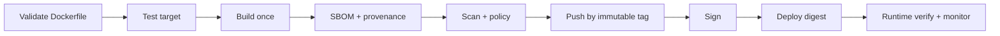

# 05 — BuildKit, buildx và supply chain

## BuildKit giải quyết gì?

BuildKit là backend build hiện đại: biểu diễn build thành graph (LLB), bỏ stage không dùng, chạy nhánh độc lập song song, truyền context tăng dần, cache hiệu quả và cung cấp mount/exporter/attestation. `buildx` là CLI mở rộng để điều khiển builder, multi-platform, cache và output.

```bash
docker buildx ls
docker buildx inspect --bootstrap
docker buildx du
docker buildx prune --filter until=168h   # xem/xác nhận trước trong môi trường dùng chung
```

## Cache đúng mental model

Cache dựa trên instruction và input mà instruction phụ thuộc, không đơn thuần dựa timestamp. Khi một layer invalid, các layer sau cần xét lại. `RUN apt-get update` không tự hết cache chỉ vì một tuần đã qua.

```dockerfile
# syntax=docker/dockerfile:1
RUN --mount=type=cache,target=/root/.cache/pip \
    pip install -r requirements.txt
RUN --mount=type=bind,source=.,target=/src,ro \
    make -C /src artifact
```

- **Cache mount** giữ package/compiler cache giữa build nhưng nội dung mount không tự thành image layer.
- **Bind mount lúc build** tránh copy input tạm vào layer.
- **External cache** chia cache cho CI builder ngắn hạn:

```bash
docker buildx build \
  --cache-from type=registry,ref=registry.example.com/team/app:buildcache \
  --cache-to type=registry,ref=registry.example.com/team/app:buildcache,mode=max \
  --tag registry.example.com/team/app:git-a1b2c3d --push .
```

Cache registry có thể chứa build intermediate; áp dụng quyền truy cập và không đưa secret vào layer ngay từ đầu.

## Secret và SSH mount

Không dùng build arg/environment cho credential vì có thể lộ trong metadata/cache/history. Build secret tồn tại tạm ở một `RUN`:

```dockerfile
RUN --mount=type=secret,id=npmrc,target=/root/.npmrc,required=true npm ci
RUN --mount=type=ssh,required=true git clone git@github.com:org/private.git
```

```bash
docker build --secret id=npmrc,src=.npmrc --ssh default .
```

Secret mount ngăn secret bị bake vào image; nó không ngăn build script độc hại gửi secret ra mạng. Chỉ build code/Dockerfile tin cậy, hạn chế network và credential scope.

Thực hành độc lập: [08-build-secret](../../CodeSample/docker/08-build-secret/README.md).

## Multi-stage và target

```dockerfile
FROM base AS test
RUN run-tests

FROM base AS build
RUN compile

FROM minimal AS runtime
COPY --from=build /out/app /app

FROM runtime AS debug
USER root
RUN install-debug-tools
```

CI có thể `--target test`; production lấy `runtime`; image debug phát hành riêng, không biến production thành hộp công cụ. Build stage không tự có mặt trong final image, nhưng secret đã copy vào một layer của final stage rồi xóa ở layer sau vẫn bị lộ.

## Multi-platform

Một image index có variant cho nhiều platform; registry chọn đúng manifest khi pull.

```bash
docker buildx build \
  --platform linux/amd64,linux/arm64 \
  -t registry.example.com/team/app:git-a1b2c3d \
  --push .
```

Ba chiến lược:

1. QEMU emulation: dễ, chậm cho compile/test nặng.
2. Nhiều native nodes: nhanh/chính xác hơn, vận hành builder phức tạp.
3. Cross-compilation: tốt với Go/Rust/.NET phù hợp; vẫn nên test trên architecture đích.

`BUILDPLATFORM`, `TARGETOS`, `TARGETARCH` giúp cross-compile. Multi-platform output thường push registry; khả năng `--load` nhiều platform phụ thuộc image store/builder.

## Bake và build graph

Khi nhiều image/target/platform dùng chung cấu hình, `docker-bake.hcl` tránh script flag dài:

```hcl
group "default" { targets = ["api"] }
target "api" {
  context = "."
  tags = ["example/api:dev"]
  platforms = ["linux/amd64", "linux/arm64"]
}
```

Kiểm tra resolved plan bằng `docker buildx bake --print` trước khi push.

## SBOM, provenance, scan và chữ ký

```bash
docker buildx build --sbom=true --provenance=mode=max \
  -t registry.example.com/team/app:git-a1b2c3d --push .
docker buildx imagetools inspect registry.example.com/team/app:git-a1b2c3d
```

- **SBOM**: inventory thành phần, không tự khẳng định an toàn.
- **Provenance**: bằng chứng cách/nơi build, không thay chữ ký.
- **Vulnerability scan**: so package/version với advisory; false positive/negatives và exploitability cần triage.
- **Signature + policy**: xác minh ai/automation đã phát hành và chỉ cho phép artifact hợp lệ.

Attestation support phụ thuộc builder driver, image store và registry; nếu không giữ được image index/attestation, push từ builder hỗ trợ thay vì giả định `--load` bảo toàn mọi metadata.

## Pipeline đề xuất



## Lab

Làm [02-buildkit-go](../../CodeSample/docker/02-buildkit-go/README.md): build hai lần, sửa source, quan sát cache; build target debug; thử multi-platform (chỉ push nếu có registry). Làm [08-build-secret](../../CodeSample/docker/08-build-secret/README.md), kiểm tra history và filesystem không chứa token.

## Tự kiểm tra

1. Vì sao cache mount nhanh hơn nhưng không nên được coi là dependency lock?
2. Secret mount bảo vệ khỏi những gì, không bảo vệ khỏi những gì?
3. Khi nào chọn cross-compile thay QEMU?
4. SBOM, scan, provenance và signature trả lời bốn câu hỏi khác nhau nào?

## Nguồn chính thức

- [BuildKit](https://docs.docker.com/build/buildkit/)
- [Optimize build cache](https://docs.docker.com/build/cache/optimize/)
- [Build secrets](https://docs.docker.com/build/building/secrets/)
- [Multi-platform builds](https://docs.docker.com/build/building/multi-platform/)
- [Build attestations](https://docs.docker.com/build/metadata/attestations/)
