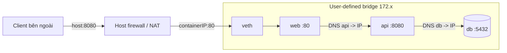
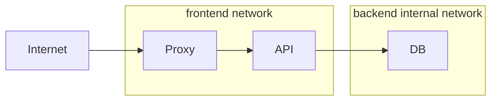

# 06 — Networking chuyên sâu

## Mental model: process bind vào interface trong network namespace

Mỗi container trên bridge user-defined có network namespace, interface ảo và IP riêng. Cặp veth nối namespace vào Linux bridge; Docker embedded DNS phân giải tên container/service; host dùng NAT/firewall để publish port.



Ba số khác nhau thường bị nhầm:

- App phải listen trong container, thường `0.0.0.0:8080`, không phải chỉ `127.0.0.1`.
- `EXPOSE 8080` là metadata, không mở firewall hay publish.
- `-p 127.0.0.1:8080:8080` ánh xạ host loopback port 8080 vào container port 8080. Bỏ host IP thường publish trên mọi interface; xem đó là thay đổi security boundary.

## User-defined bridge và DNS

```bash
docker network create app-net
docker run -d --name web --network app-net nginx:alpine
docker run --rm --network app-net busybox wget -qO- http://web
docker network inspect app-net
```

User-defined bridge có DNS theo name/alias và isolation tốt hơn default `bridge`. Không hard-code container IP: IP có thể đổi khi recreate; dùng service name và retry kết nối.

Các container trên cùng network có thể truy cập container ports mà không cần `ports`. Chỉ publish dịch vụ cần host/bên ngoài truy cập; database nội bộ thường không publish.

## Chọn network driver

| Driver | Khi dùng | Trade-off/cảnh báo |
|---|---|---|
| `bridge` | Nhiều container trên một host | Mặc định tốt; user-defined bridge nên được ưu tiên |
| `host` | Cần network stack host/giảm NAT hoặc rất nhiều port | Mất network isolation; port conflict; hành vi/hỗ trợ phụ thuộc nền tảng |
| `none` | Batch xử lý offline, sandbox không mạng | Chỉ loopback; không pull/download lúc runtime |
| `overlay` | Kết nối services qua nhiều Docker hosts/Swarm | Cần swarm/control plane và mở đúng ports; không thay Kubernetes CNI |
| `macvlan` | Legacy cần container như thiết bị L2 có MAC riêng | Host↔container và switch promiscuous/MAC limits gây khó |
| `ipvlan` | Underlay/IP control, hạn chế số MAC | Cần kiến thức routing/L2/L3 của hạ tầng |

Không chọn host network chỉ để “sửa DNS”; đó là bỏ isolation thay vì tìm root cause.

## Segmentation trong Compose

Proxy nối `frontend`; API nối cả `frontend` và `backend`; DB chỉ nối `backend` với `internal: true`. Network không thay authentication/TLS nhưng giảm đường tấn công.



Thực hành: [03-networking-lab](../../CodeSample/docker/03-networking-lab/README.md).

## DNS, `/etc/hosts`, alias và localhost

- `localhost` trong container là chính container đó, không phải host và không phải container khác.
- Compose service discovery dùng **service name** trên network chung; scale nhiều replica có thể trả nhiều địa chỉ/được load balance tùy cơ chế.
- `container_name` thường không cần và cản scale/name isolation giữa projects.
- `host.docker.internal` hữu ích trên Docker Desktop; trên Engine Linux cần cấu hình phù hợp (ví dụ host-gateway) và không nên làm kiến trúc production phụ thuộc ngầm.
- `depends_on` không sửa retry/DNS readiness; app vẫn phải timeout, backoff và reconnect.

## Port và giao thức

```bash
docker run --rm -p 127.0.0.1:8080:80/tcp nginx:alpine
docker port <container>
```

TCP và UDP là mapping riêng. Published port có thể đi qua iptables/nftables/proxy tùy daemon/platform. Với IPv6, kiểm tra daemon/network đã bật IPv6, subnet và firewall; không suy luận từ IPv4.

## Runbook debug network

Đi từ trong ra ngoài:

1. Process có chạy và listen đúng port/interface? `docker top`, app log, `ss -lntp` nếu image có tool.
2. Container có network/IP/gateway nào? `docker inspect`, `docker network inspect`.
3. Hai service có **network chung**? DNS resolve service name không?
4. Gọi container port từ peer cùng network được không?
5. Port có publish và bind đúng host IP không? `docker port`.
6. Host gọi được không? Port collision/firewall/VPN/proxy?
7. Client từ máy khác gọi được không? Cloud security group/router/TLS?

Toolbox tạm thay vì sửa production image:

```bash
docker run --rm -it --network container:<target> nicolaka/netshoot
# hoặc docker debug <target> nếu môi trường hỗ trợ
```

Chỉ dùng image toolbox đã được tổ chức cho phép; nó chia sẻ network namespace và có thể quan sát traffic nhạy cảm.

## Tự kiểm tra

1. Vì sao app bind `127.0.0.1` trong container thường không tới được qua `-p`?
2. Vì sao DB không cần `ports` để API cùng network kết nối?
3. User-defined bridge hơn default bridge ở những điểm nào?
4. Khi nào macvlan hợp lý hơn bridge, và hạ tầng phải kiểm tra gì?

## Nguồn chính thức

- [Network drivers](https://docs.docker.com/engine/network/drivers/)
- [Bridge driver](https://docs.docker.com/engine/network/drivers/bridge/)
- [Port publishing](https://docs.docker.com/engine/network/port-publishing/)
- [Overlay driver](https://docs.docker.com/engine/network/drivers/overlay/)
