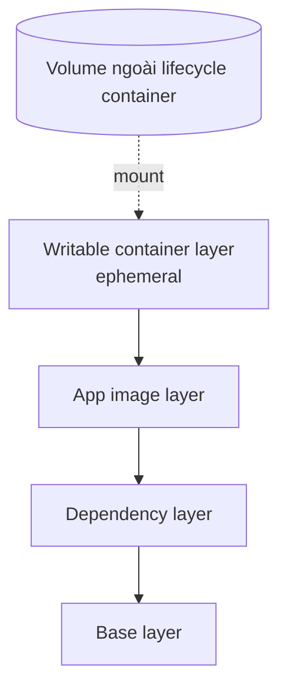
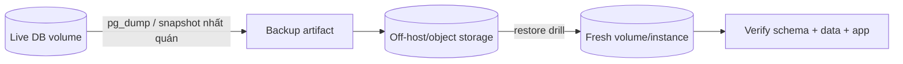

# 07 — Storage và dữ liệu

## Writable layer là ephemeral theo lifecycle container

Image layers read-only được ghép với writable layer riêng. Xóa/recreate container là bỏ writable layer đó. “Restart” cùng container thường còn layer; “recreate” tạo layer mới. Vì production deploy hay recreate, dữ liệu quan trọng không được dựa vào container layer.



## Chọn kiểu mount

| Kiểu | Owner/quản lý | Khi dùng | Rủi ro chính |
|---|---|---|---|
| Writable layer | Container | File tạm không quan trọng | Mất khi remove, copy-on-write/I/O không lý tưởng |
| Named volume | Docker/volume driver | Database, uploads, shared persistent data | Cần backup, quyền và lifecycle riêng |
| Bind mount | Host path cụ thể | Source dev, config do host quản lý, socket có chủ đích | Phụ thuộc host path; container có thể sửa host; quyền/SELinux |
| tmpfs | RAM host | Secret/cache/temp nhạy cảm và không cần persist | Mất khi stop; tiêu thụ RAM; Linux behavior |
| Image mount | Image read-only khác | Tool/assets đóng gói riêng, khi image store hỗ trợ | Tính năng/platform support cần kiểm tra |

Ưu tiên cú pháp `--mount` vì rõ `type`, `source`, `target`, `readonly`:

```bash
docker volume create app-data
docker run --rm --mount type=volume,src=app-data,dst=/data alpine sh -c 'echo hi > /data/value'
docker run --rm --mount type=volume,src=app-data,dst=/data,readonly alpine cat /data/value
docker run --rm --mount type=bind,src="$PWD",dst=/work,readonly alpine ls /work
docker run --rm --mount type=tmpfs,dst=/tmp,tmpfs-size=64m alpine df -h /tmp
```

PowerShell quoting/path khác Bash; Compose giúp path cross-platform dễ đọc hơn.

## Mount che dữ liệu

Mount vào `/app` làm nội dung image sẵn có tại `/app` bị che trong container (không bị xóa khỏi image). Named volume rỗng có thể được Docker populate từ target directory tùy trường hợp; đừng dựa vào hành vi mơ hồ cho migration dữ liệu.

Failure drill:

```bash
docker run --rm --mount type=tmpfs,dst=/usr/share/nginx/html nginx:alpine
```

Trang mặc định “mất” vì mount che path. Gỡ mount/recreate sẽ thấy lại.

## UID/GID, permissions và MAC labels

Filesystem kiểm tra numeric UID/GID, không phải tên user. App user `10001` cần quyền trên volume. Trên Linux bind mount, dùng ownership/mode có chủ đích; với SELinux, bind mount có thể cần label option phù hợp (`z`/`Z`) theo tài liệu và threat model. Trên Docker Desktop, file sharing đi qua VM nên permission/performance có khác.

Không chữa bằng `chmod -R 777`. Có thể dùng one-shot init/migration container chạy quyền tối thiểu để tạo/chown đúng, sau đó runtime non-root.

## Database: volume chưa phải backup

Volume làm dữ liệu sống qua recreate nhưng không bảo vệ khỏi xóa nhầm, corruption, ransomware, host chết hoặc lỗi logic. Backup phải có:

- Chính sách consistency: database-native logical/physical backup, snapshot phối hợp freeze/quiesce.
- Lưu ngoài host/failure domain, mã hóa và access control.
- Retention/versioning, giám sát job.
- **Restore test định kỳ** và RPO/RTO đo được.



Lab [04-storage-backup](../../CodeSample/docker/04-storage-backup/README.md) dùng tar cho dữ liệu file đơn giản để học lifecycle. Với PostgreSQL trong [05-compose-production](../../CodeSample/docker/05-compose-production/README.md), dùng `pg_dump`/`pg_restore`, không tar nóng thư mục data rồi mặc định coi là nhất quán.

## Volume lifecycle và Compose

```bash
docker volume ls
docker volume inspect project_db-data
docker compose down       # giữ named volume mặc định
docker compose down -v    # xóa named volume của project: destructive
```

External volume không do project tự tạo/xóa; hợp lý khi data được lifecycle khác quản lý. Anonymous volume dễ mồ côi; đặt tên top-level rõ hơn. Trước prune, dùng `docker system df -v` và map owner.

## Performance và driver

- Database ghi nhiều: named volume trên native Linux thường phù hợp hơn bind-mounted source qua Desktop file sharing.
- Source code dev: bind mount/watch tốt cho feedback loop; không dùng bind source trong production.
- Remote volume plugin/NFS/CIFS: kiểm tra locking, fsync/durability, latency, mount options, failure/reconnect và credential.
- Log: ưu tiên stdout/stderr + logging driver/collector; đừng để file log vô hạn trong writable layer.

## Tự kiểm tra

1. Restart, recreate và remove ảnh hưởng writable layer/volume thế nào?
2. Vì sao volume persistence không đồng nghĩa backup?
3. Mount một empty directory vào path có file image gây triệu chứng gì?
4. Khi nào tmpfs tốt hơn volume? Phải giới hạn tài nguyên gì?

## Nguồn chính thức

- [Docker storage](https://docs.docker.com/engine/storage/)
- [Volumes](https://docs.docker.com/engine/storage/volumes/)
- [Bind mounts](https://docs.docker.com/engine/storage/bind-mounts/)
- [tmpfs mounts](https://docs.docker.com/engine/storage/tmpfs/)
