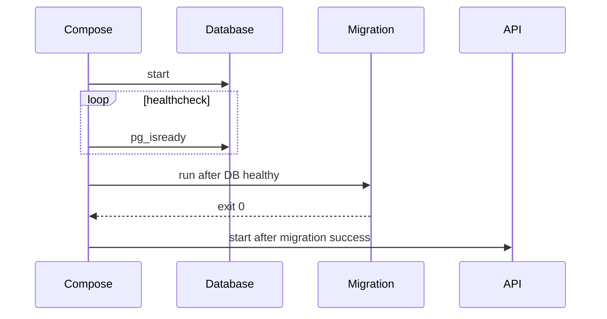

# 08 — Docker Compose từ dev đến production

Compose là **declarative application model** cho services, networks, volumes, configs và secrets. Compose rất tốt cho development/integration test và deployment một host; nó không tự cung cấp scheduler đa node, HA control plane hay rolling update cấp cluster như orchestrator.

## Model cơ bản

```yaml
services:
  api:
    build: ./api
    environment:
      DB_HOST: db
    depends_on:
      db:
        condition: service_healthy
    networks: [backend]
  db:
    image: postgres:alpine
    healthcheck:
      test: ["CMD-SHELL", "pg_isready -U $${POSTGRES_USER}"]
    volumes:
      - db-data:/var/lib/postgresql/data
    networks: [backend]
volumes:
  db-data:
networks:
  backend:
```

`docker compose config` render model cuối, bắt lỗi interpolation/merge và nên chạy trong CI.

## Project và tên tài nguyên

Compose nhóm resource theo project. Project name đến từ flag/env/top-level/name/path theo precedence; dùng `docker compose -p myproject ...` khi cần tách hai instance. Tránh `container_name`: nó phá naming isolation và cản scale nhiều replica.

```bash
docker compose config
docker compose config --services
docker compose up -d --build --wait
docker compose ps
docker compose logs -f --tail 100 api
docker compose exec api sh
docker compose run --rm migrate
docker compose down --remove-orphans
```

`run` tạo one-off container và command override; port service thường không publish trừ khi yêu cầu. `exec` chạy trong container hiện có.

## Readiness và dependency

Short `depends_on` chỉ tạo thứ tự start, không chứng minh dependency sẵn sàng. Dùng healthcheck + `condition: service_healthy`; migration one-shot dùng `service_completed_successfully`. Dù vậy, app vẫn cần connection timeout/backoff/reconnect vì dependency có thể chết sau startup.



## Environment: hai việc khác nhau

1. **Interpolation** Compose file (`${TAG:-dev}`) xảy ra ở CLI trước khi model gửi đi.
2. **Container environment** được đặt bởi `environment`, `env_file`, image `ENV`, CLI override theo precedence.

```bash
docker compose config --environment
docker compose run --rm -e DEBUG=1 api env
```

Không commit `.env` có secret; `.env` không phải secret store. Escape `$` thành `$$` khi muốn shell trong container nhận biến, ví dụ healthcheck PostgreSQL. Ghi rõ required/default `${DB_NAME:?required}` để fail fast.

## Merge/override cho môi trường

```bash
docker compose -f compose.yaml -f compose.production.yaml config
docker compose -f compose.yaml -f compose.production.yaml up -d
```

File sau merge/override file trước theo rule của Compose, không phải mọi list đều “thay toàn bộ”. Luôn xem `config` resolved. Production override thường:

- Bỏ bind mount source/hot reload.
- Dùng image digest đã build, không build trên server.
- Thay port/replica/resource/logging/restart.
- Trỏ secret/config production.

Profiles bật tool tùy chọn, không nên gate core services:

```yaml
services:
  adminer:
    image: adminer
    profiles: [debug]
```

```bash
docker compose --profile debug up -d
```

## `configs` và `secrets`

Secret xuất hiện dạng file trong container, tốt hơn environment (dễ lộ qua inspect/log/process dump). Với local Compose, phải hiểu source file và host vẫn cần được bảo vệ; đây không tự động là vault hay encryption at rest. Production secret manager cần rotation/audit/least privilege.

Ứng dụng nên hỗ trợ convention `_FILE` hoặc tự đọc file:

```yaml
secrets:
  db_password:
    file: ./secrets/db_password.txt
services:
  api:
    secrets: [db_password]
    environment:
      DB_PASSWORD_FILE: /run/secrets/db_password
```

## Development loop

- Bind mount source hoặc Compose Watch cho sync/rebuild/restart tùy file.
- Cache dependencies trong named volume có chủ đích; tránh volume che `node_modules` gây khác nền tảng mà không hiểu.
- Dùng profile cho debugger/admin UI; không ship profile tool ra production.
- Integration test có `docker compose up --wait`, chạy test, luôn teardown trong finally/trap.

## Production một host

Compose có thể phù hợp cho hệ thống nhỏ với chấp nhận single-host failure và quy trình bổ sung: systemd/service start, restart policy, TLS proxy, backup off-host, monitoring/alert, log rotation, artifact registry, deploy digest, rollback và host patching. Không quảng cáo `docker compose up` như toàn bộ chiến lược production.

Lab đầy đủ: [05-compose-production](../../CodeSample/docker/05-compose-production/README.md).

## Tự kiểm tra

1. Vì sao `depends_on` không thay retry trong app?
2. Interpolation và container environment khác nhau ở đâu?
3. Tại sao phải xem `docker compose ... config` sau khi merge?
4. Compose một host còn thiếu những thuộc tính nào so với orchestrator đa node?

## Nguồn chính thức

- [Compose file reference](https://docs.docker.com/reference/compose-file/)
- [Startup order](https://docs.docker.com/compose/how-tos/startup-order/)
- [Environment variables](https://docs.docker.com/compose/how-tos/environment-variables/)
- [Profiles](https://docs.docker.com/compose/how-tos/profiles/)
- [Use Compose in production](https://docs.docker.com/compose/how-tos/production/)
