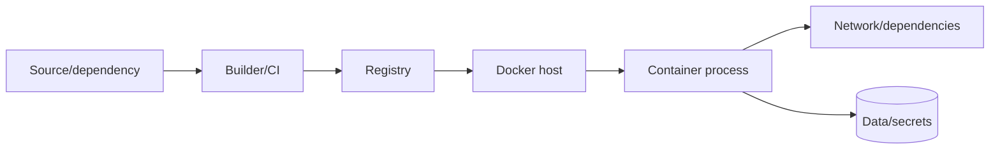

# 09 — Security và hardening

## Threat model trước checklist

Xác định: image đến từ đâu, ai sửa build pipeline, container xử lý dữ liệu gì, có network/mount/capability nào, host có workload khác không, hậu quả nếu app bị RCE là gì. Hardening là defense in depth; không flag đơn lẻ nào biến code không tin cậy thành an toàn tuyệt đối.



Mỗi mũi tên là trust boundary cần identity, least privilege, integrity và audit.

## Docker daemon/socket là đặc quyền cao

Trên daemon thông thường, user có quyền Docker hoặc container mount `/var/run/docker.sock` có thể yêu cầu daemon mount host filesystem/chạy privileged container; coi gần tương đương quyền root host. Không mount socket chỉ để container “xem trạng thái”. Nếu buộc phải automation, dùng API proxy allowlist, mTLS/authorization plugin, rootless/context riêng hoặc runner cô lập theo threat model.

Không expose Docker TCP API không TLS/auth ra network. Remote access nên dùng SSH context hoặc TLS mutual authentication theo tài liệu.

## Runtime least privilege

Baseline Compose:

```yaml
services:
  api:
    user: "10001:10001"
    read_only: true
    tmpfs:
      - /tmp:rw,noexec,nosuid,size=64m
    cap_drop: [ALL]
    security_opt:
      - no-new-privileges:true
    pids_limit: 100
```

Áp dụng từng lớp và test chức năng:

- Non-root numeric UID/GID; không chỉ đặt username mơ hồ.
- Read-only rootfs; chỉ mount path thực sự phải ghi, ưu tiên read-only mount.
- Drop all capabilities, add lại capability cụ thể nếu có evidence.
- `no-new-privileges` chặn process nhận thêm privilege qua setuid/file capability.
- Giữ seccomp profile mặc định; chỉ custom hẹp khi hiểu syscall, không dùng `unconfined` để chữa lỗi vội.
- AppArmor/SELinux policy nơi host hỗ trợ.
- Giới hạn PID/CPU/RAM để giảm blast radius DoS.
- Network segmentation và egress control ở lớp phù hợp; Docker bridge `internal` không phải policy engine đầy đủ.

`--privileged`, host PID/network, device mount, `/proc`/`/sys` host mount và capability `SYS_ADMIN` làm threat model thay đổi mạnh; cần review riêng, không “thêm cho chạy”.

Lab: [06-security-hardening](../../CodeSample/docker/06-security-hardening/README.md).

## Rootless và user namespace

- **Rootless mode** chạy daemon và containers trong user namespace mà không daemon root; giảm hậu quả daemon/runtime exploit, nhưng có khác biệt/giới hạn về network, cgroup, storage/host features tùy host.
- **userns-remap** map container root sang unprivileged host UID trong khi daemon vẫn root.
- **Non-root app user** vẫn nên dùng dù daemon rootless; đây là các lớp khác nhau.

Kiểm tra thay vì giả định:

```bash
docker info --format '{{json .SecurityOptions}}'
docker inspect <container> --format '{{.Config.User}} {{json .HostConfig.CapDrop}} {{json .HostConfig.SecurityOpt}}'
```

## Image và dependency supply chain

1. Chọn Docker Official/Verified/trusted publisher hoặc base nội bộ được quản trị.
2. Dùng minimal runtime stage; xóa tool/package không cần bằng cách không đưa vào final stage.
3. Lock dependency và pin/promote digest theo policy.
4. Build trong runner cô lập, credential ngắn hạn; BuildKit secret/SSH mounts.
5. Tạo SBOM/provenance, scan và triage theo exploitability/SLA.
6. Ký image/attestation và enforce policy ở deploy nếu nền tảng hỗ trợ.
7. Rebuild định kỳ khi base/dependency được vá; image “không đổi” không có nghĩa risk không đổi.

Scanner không thấy logic bug, credential runtime, kernel vulnerability hoặc misconfiguration. CVE count thấp cũng không chứng minh image an toàn.

## Secret lifecycle

Secret cần: tạo → phân phối least privilege → dùng không log → rotate → revoke → audit. Tránh:

- Commit `.env`, private key, cloud credential.
- `ARG`/`ENV` secret trong Dockerfile.
- Copy secret rồi `rm` ở layer sau.
- In secret trong error/log/command arguments.
- Dùng một credential admin dài hạn cho mọi môi trường.

Compose secret file cải thiện cách truyền nhưng host source file vẫn cần ACL/encryption. App nên re-read/reload hoặc có chiến lược restart khi rotate.

## Kernel và host

Containers chia sẻ kernel, nên host patching rất quan trọng. Giảm dịch vụ trên host, khóa SSH, firewall, audit daemon config, hạn chế membership group Docker, tách workload có mức tin cậy khác nhau bằng host/VM. Không chạy untrusted multi-tenant code chỉ dựa vào default container isolation.

## Security review mẫu

| Câu hỏi | Evidence |
|---|---|
| Image nào đang chạy? | Repo + digest + provenance/signature |
| Process quyền gì? | User, capabilities, seccomp, read-only, mounts |
| Đi đâu/ai gọi được? | Networks, published ports, firewall, TLS/auth |
| Secret ở đâu? | Secret manager/file mount ACL, rotation log |
| Nếu bị RCE? | Không socket/host mounts, limits, segmentation, non-root |
| Patch/rollback? | SLA, rebuild pipeline, digest promotion, tested rollback |

## Tự kiểm tra

1. Vì sao mount Docker socket nguy hiểm dù container chạy non-root?
2. Rootless daemon, userns-remap và app non-root giải quyết các lớp nào?
3. Secret đã xóa ở instruction sau có biến mất khỏi image layer cũ không?
4. Scanner báo 0 CVE còn bỏ sót những nhóm rủi ro nào?

## Nguồn chính thức

- [Docker Engine security](https://docs.docker.com/engine/security/)
- [Rootless mode](https://docs.docker.com/engine/security/rootless/)
- [Seccomp profiles](https://docs.docker.com/engine/security/seccomp/)
- [Protect Docker daemon socket](https://docs.docker.com/engine/security/protect-access/)
- [Build secrets](https://docs.docker.com/build/building/secrets/)
