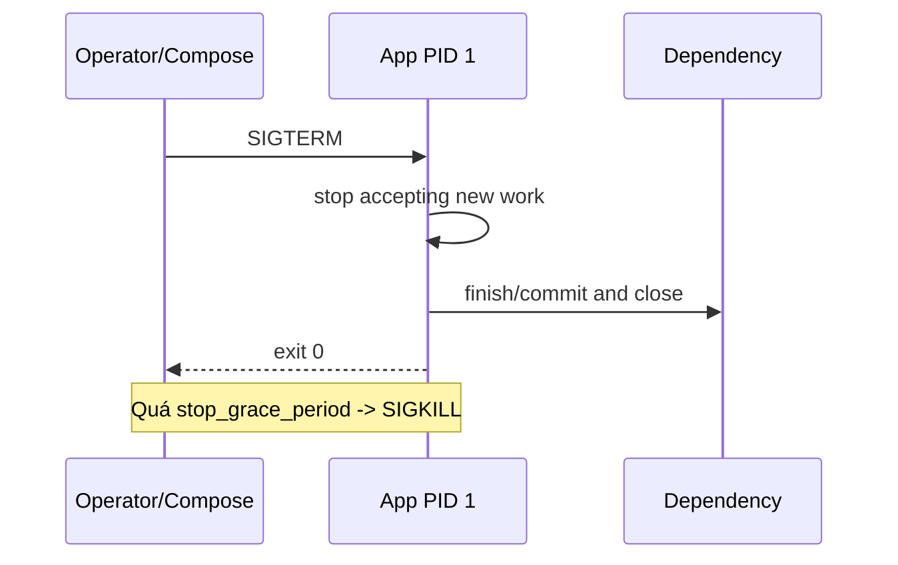
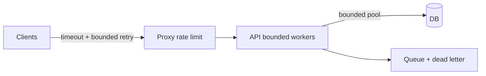

# 10 — Reliability và quản lý tài nguyên

## Container sống theo PID 1

Container không phải máy ảo nhỏ; khi PID 1 kết thúc, container dừng. App cần:

- Handle SIGTERM, ngừng nhận request mới, hoàn tất request đang xử lý, đóng DB/queue rồi exit trước deadline.
- Reap child process hoặc dùng init nhỏ (`init: true`/`--init`) khi cần.
- Ghi state quan trọng ra persistent/external service trước exit.
- Có startup idempotent; recreate bất kỳ lúc nào không làm hỏng data.



Test graceful shutdown khi có request/job thật, không chỉ container rảnh.

## Restart policy không phải chữa mọi lỗi

| Policy | Ý nghĩa điển hình | Khi dùng |
|---|---|---|
| `no` | Không tự restart | One-shot/test hoặc supervisor ngoài quản lý |
| `on-failure[:N]` | Restart khi exit non-zero | Job/service muốn giới hạn retry |
| `unless-stopped` | Restart trừ khi operator stop | Service một host |
| `always` | Cố restart kể cả sau daemon restart | Service một host; hiểu hành vi manual stop |

Crash loop có thể tấn công dependency và che root cause. Cần backoff trong app, alert, log/exit reason; migration lỗi không nên restart vô hạn.

`restart` khác healthcheck: unhealthy container không tự restart chỉ vì health status trong standalone Engine/Compose. Cần orchestration/monitoring hoặc app tự exit theo chiến lược đã thiết kế; tránh external watchdog gây loop khó hiểu.

## Liveness, readiness và startup

- Liveness: process còn khả năng tiến triển? Fail nên restart.
- Readiness: instance có nhận traffic được? Fail nên rút khỏi routing, không nhất thiết kill.
- Startup: cho app khởi động chậm thời gian trước khi liveness khắt khe.

Docker healthcheck có một trạng thái health tổng quát, không đầy đủ ba probe như một số orchestrator. Thiết kế endpoint nội bộ rẻ, timeout ngắn; liveness không nên fail chỉ vì downstream tạm lỗi. Readiness có thể kiểm tra dependency thiết yếu nhưng cần tránh fan-out đắt.

```yaml
healthcheck:
  test: ["CMD", "/app/server", "healthcheck"]
  interval: 10s
  timeout: 2s
  retries: 3
  start_period: 20s
```

Tool dùng trong healthcheck phải có trong image; hoặc app binary tự cung cấp subcommand để không cài curl.

## CPU, RAM, swap và OOM

Mặc định container có thể dùng tài nguyên host theo scheduler/kernel. Luôn đo trước khi đặt limit:

```bash
docker run --memory=256m --memory-swap=256m --cpus=0.50 --pids-limit=100 IMAGE
docker stats --no-stream
docker inspect C --format 'oom={{.State.OOMKilled}} exit={{.State.ExitCode}} error={{.State.Error}}'
```

- Memory limit quá thấp gây OOM/GC thrash; quá cao để một app hạ host.
- `--memory-swap` semantics phụ thuộc kết hợp với memory và host swap; đọc tài liệu, test trên host thật.
- CPU quota (`--cpus`) giới hạn thời gian CPU; CPU shares là trọng số khi contention, không phải hard reservation.
- PID limit giảm fork bomb; file descriptor/ulimit cũng cần xem xét.
- I/O constraints phụ thuộc block device/driver/platform.

Compose local có các thuộc tính runtime như `mem_limit`, `cpus`, `pids_limit`; support/semantics có thể khác deploy orchestrator. Dùng `docker compose config` và `docker inspect` để xác nhận limit thực sự áp dụng.

## Capacity và backpressure

Container limit không thay queue/backpressure. App phải giới hạn concurrency, connection pool, request/body, timeout và retry budget. Retry mọi tầng không jitter có thể tạo retry storm.



## Dependency và shutdown order

Compose khởi động/dừng theo dependency model, nhưng node crash không cho thứ tự đẹp. App phải chịu được dependency biến mất. Migration schema nên tương thích hai chiều trong rollout/rollback (expand → migrate/backfill → contract), không buộc code cũ chết ngay.

## Failure drills

1. `docker kill --signal=TERM` khi đang xử lý request; đo thời gian drain.
2. Giới hạn memory thấp có chủ đích ở lab; quan sát events, OOMKilled và exit.
3. Dừng database 30 giây; xem API timeout/reconnect, không treo vô hạn.
4. Làm healthcheck fail nhưng process còn sống; ghi rõ ai sẽ hành động.
5. Reboot test host/daemon trong môi trường an toàn; xác minh restart và data.

## Tự kiểm tra

1. Vì sao `always` không thay thế backoff/alert?
2. Unhealthy có tự động restart trong standalone Docker không?
3. CPU shares và CPU quota khác nhau thế nào?
4. Vì sao liveness gọi mọi downstream có thể tạo cascading restart?

## Nguồn chính thức

- [Resource constraints](https://docs.docker.com/engine/containers/resource_constraints/)
- [Restart policies](https://docs.docker.com/engine/containers/start-containers-automatically/)
- [Dockerfile HEALTHCHECK](https://docs.docker.com/reference/dockerfile/#healthcheck)
