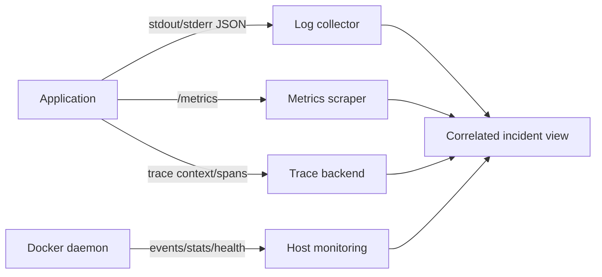

# 11 — Observability: log, metric, event và health

Monitoring trả lời câu hỏi đã dự đoán; observability giúp điều tra trạng thái chưa dự đoán qua nhiều tín hiệu. Docker cung cấp container logs/stats/events/inspect; ứng dụng vẫn phải phát telemetry có ngữ nghĩa business.



## Logging đúng cách

App ghi event log ra stdout, diagnostic/error ra stderr; không ghi file tùy ý trong container trừ khi collector/rotation được thiết kế. Structured JSON fields nên có `timestamp`, `level`, `service`, `event`, `request_id`/`trace_id`, latency/status; không log password/token/PII.

```bash
docker logs --since 15m --tail 200 -f <container>
docker inspect -f '{{.HostConfig.LogConfig.Type}}' <container>
docker info --format '{{.LoggingDriver}}'
```

Default `json-file` có thể tăng vô hạn nếu không rotation. Docker khuyến nghị `local` cho nhiều trường hợp standalone vì có rotation/format hiệu quả; hoặc cấu hình `json-file` limits:

```yaml
logging:
  driver: local
  options:
    max-size: "10m"
    max-file: "3"
```

Đổi daemon default chỉ áp dụng container tạo mới; phải recreate để nhận config. Remote logging driver blocking có thể ảnh hưởng app khi backend chậm; non-blocking có buffer và có thể drop log. Chọn theo yêu cầu mất log vs availability và alert khi drop.

## Metrics

`docker stats` giúp triage nhanh CPU, memory, network, block I/O, PID nhưng không phải time-series dài hạn:

```bash
docker stats --no-stream
docker system df -v
```

Thu cả:

- **Runtime/host**: CPU throttle, working set/RSS, OOM, disk/inode, network errors, restart.
- **Application RED**: request Rate, Errors, Duration.
- **Resource USE**: Utilization, Saturation, Errors.
- **Business**: queue depth, orders processed, sync lag… nhưng kiểm soát cardinality.

Không dùng user ID/request ID làm metric label không giới hạn; cardinality sẽ phá backend. Đặt SLI/SLO trước alert, ví dụ tỷ lệ request thành công và latency p95; alert theo symptom/user impact hơn CPU đơn độc.

Lab [07-observability](../../CodeSample/docker/07-observability/README.md) cho Prometheus scrape API metrics và JSON logs.

## Events, inspect và health

```bash
docker events --since 30m \
  --filter type=container \
  --filter container=<name>
docker inspect <name> --format '{{json .State}}'
docker inspect <name> --format '{{json .State.Health}}'
```

Events hỗ trợ timeline create/start/die/oom/health; không coi daemon event buffer là audit store lâu dài. Collector phải persist ra ngoài nếu cần lịch sử/compliance.

Health status là tín hiệu cục bộ; route/alert/restart action phải được hệ thống khác quyết định. Kiểm tra output healthcheck có giới hạn và có thể chứa dữ liệu, nên không in secret.

## Distributed tracing

Container không tự sinh trace. App/proxy phải propagate context (ví dụ W3C Trace Context), tạo spans và export tới collector. Trace đặc biệt hữu ích khi request qua proxy → API → DB/queue. Sampling cần giữ errors/slow traces phù hợp và bảo vệ PII.

## Dashboard/runbook tối thiểu

Dashboard service:

- Request rate/error/latency, saturation/concurrency.
- Container restart/OOM/health, CPU/memory/PID.
- Dependency latency/error/pool/queue.
- Deploy annotation theo image digest.
- Disk free/inode và log drop/collector health.

Mỗi alert link runbook: ý nghĩa, user impact, dashboard/log query, lệnh read-only, mitigation an toàn, escalation/owner. Alert “container down” cần phân biệt deploy chủ đích, job complete và crash.

## Tự kiểm tra

1. Vì sao chỉ `docker logs` không đủ observability?
2. Log driver blocking và non-blocking đổi trade-off nào?
3. Vì sao request ID không phù hợp làm metric label?
4. Bạn correlate deploy mới với error spike bằng evidence nào?

## Nguồn chính thức

- [Configure logging drivers](https://docs.docker.com/engine/logging/configure/)
- [Local logging driver](https://docs.docker.com/engine/logging/drivers/local/)
- [docker stats](https://docs.docker.com/reference/cli/docker/container/stats/)
- [docker events](https://docs.docker.com/reference/cli/docker/system/events/)
