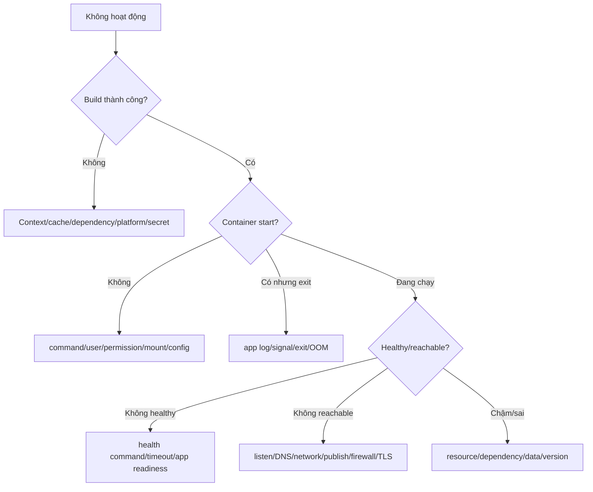

# 12 — Debugging Docker theo runbook

## Nguyên tắc: khoanh tầng, giữ bằng chứng

Không bắt đầu bằng restart/prune. Ghi thời điểm, context, command/config, image digest, container state, recent deploy và phạm vi ảnh hưởng. Tạo timeline từ logs/events/metrics. Phân biệt:



## Bộ lệnh read-only đầu tiên

```bash
docker context show
docker version
docker info
docker compose config
docker compose ps -a
docker compose logs --since 15m --tail 300
docker inspect <container>
docker events --since 30m
docker stats --no-stream
docker system df -v
```

Sau đó đặt query cụ thể với format thay vì đọc JSON mù:

```bash
docker inspect C --format 'image={{.Image}} status={{.State.Status}} exit={{.State.ExitCode}} oom={{.State.OOMKilled}} error={{.State.Error}}'
docker inspect C --format 'user={{.Config.User}} cmd={{json .Config.Cmd}} entrypoint={{json .Config.Entrypoint}}'
docker inspect C --format 'mounts={{json .Mounts}} networks={{json .NetworkSettings.Networks}}'
```

## Triệu chứng → giả thuyết → bằng chứng

| Triệu chứng | Giả thuyết thường gặp | Evidence ưu tiên |
|---|---|---|
| `exec format error` | Sai architecture hoặc script CRLF/shebang | image platform, `file`, Dockerfile, line endings |
| `permission denied` | USER/mode/UID/GID/noexec/SELinux | user, mounts/options, host label/audit log |
| `command not found` | CMD/ENTRYPOINT/PATH/shell thiếu | inspect command, image filesystem, exec vs shell |
| Exit 137 | OOM hoặc SIGKILL | `OOMKilled`, events, host kernel log, limits |
| Restart loop | App/config/dependency fail, policy | logs trước exit, exit code, health, resolved config |
| Host không gọi được | App bind loopback, map sai, firewall | listen, `docker port`, network inspect, host test |
| Service name không resolve | Không chung network/sai alias | Compose config, network inspect, DNS test từ peer |
| Data “mất” | Recreate không volume/mount nhầm/project name đổi | mounts, volumes, Compose project, history deploy |
| Disk đầy | Logs/images/cache/volumes | `system df -v`, host disk/inode, logging config |
| Build dùng code cũ | Context/.dockerignore/cache/sai Dockerfile | plain progress, context, `--no-cache-filter`, labels |

## Build debug

```bash
docker buildx build --progress=plain --target build .
docker buildx history logs   # nếu môi trường/buildx hỗ trợ
docker build --no-cache-filter <stage> .
```

Không dùng `--no-cache` vĩnh viễn; nó có thể che Dockerfile cache kém. Kiểm tra build context path và `.dockerignore`, secret/SSH mount, proxy/CA, base platform/digest. Reproduce bằng exact Git commit + build args không nhạy cảm.

## Runtime debug image tối giản

`docker exec` chỉ hoạt động khi container chạy và binary/shell tồn tại. Các lựa chọn:

- `docker debug` nếu môi trường hỗ trợ.
- Ephemeral toolbox chia sẻ `--network container:C` hoặc `--pid container:C` trong lab/được phê duyệt.
- Build target `debug` riêng từ cùng source/digest lineage.
- Đọc `/proc`, logs, metrics từ host theo quyền cho phép.

Không cài `curl`, editor, SSH trực tiếp vào production container đang chạy; thay đổi writable layer làm mất reproducibility/evidence.

## Network debug theo hop

1. Process listen `0.0.0.0:PORT`/đúng protocol?
2. Local call trong namespace?
3. Peer cùng network resolve/call?
4. Host published port?
5. Remote client qua firewall/load balancer/TLS?

DNS thành công không chứng minh TCP/TLS/app thành công. `curl: connection refused` thường khác timeout: refused có đường tới host nhưng không listener/reject; timeout gợi ý drop/routing hoặc app treo, nhưng phải xác minh.

## Storage debug an toàn

Trước khi sửa permission/xóa volume: inspect exact mount source/destination/options; xác nhận Compose project; snapshot/backup nếu data quan trọng. Dùng helper read-only để liệt kê. Không chạy recursive `chown` trên host path chưa xác minh.

## Lab và postmortem

Làm [09-debugging-lab](../../CodeSample/docker/09-debugging-lab/README.md) mà không mở file fixed trước. Ghi:

- User impact và timeline.
- Ba giả thuyết ban đầu, evidence loại/khẳng định từng cái.
- Root cause và contributing factors.
- Fix, validation, prevention (test/lint/monitor/runbook).

## Tự kiểm tra

1. Vì sao restart ngay có thể làm mất evidence hoặc che root cause?
2. Exit 137 cần phân biệt hai nguyên nhân chính nào?
3. Debug image không shell bằng những cách nào không sửa production image?
4. “Connection refused” và timeout định hướng giả thuyết khác nhau ra sao?

## Nguồn chính thức

- [Docker Engine troubleshooting](https://docs.docker.com/engine/daemon/troubleshoot/)
- [docker debug](https://docs.docker.com/reference/cli/docker/debug/)
- [Build cache invalidation](https://docs.docker.com/build/cache/invalidation/)
- [Networking](https://docs.docker.com/engine/network/)
