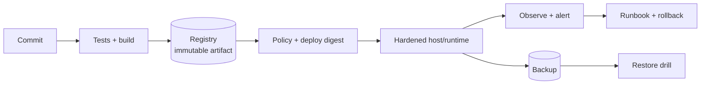

# 13 — Production patterns

## Production-ready là hệ thống, không phải một Compose file

## Golden path cho image/service

- Multi-stage minimal image, trusted/patched base, non-root.
- Build một lần; test/scan/SBOM/provenance/sign; promote đúng digest.
- Runtime config/secret ngoài image; validate required config khi start.
- Read-only rootfs, cap drop, no-new-privileges, network segmentation.
- CPU/RAM/PID limits, graceful stop, restart policy, health semantics.
- Structured stdout/stderr log với rotation; metrics/traces và deploy annotation.
- Persistent data có owner, backup off-host, restore test và capacity alert.

## Deploy một host bằng Compose

Một quy trình an toàn tối thiểu:

1. CI push image immutable và ghi digest.
2. Host pull đúng digest trước; verify policy/signature theo công cụ tổ chức.
3. Render/validate `docker compose ... config`; kiểm tra secret/config/migration compatibility.
4. Backup/checkpoint nếu migration có rủi ro.
5. Chạy migration one-shot idempotent, theo expand/contract.
6. `up -d --no-build --wait`; smoke test từ trong và ngoài.
7. Quan sát error/latency/resource trong soak window.
8. Rollback về digest trước nếu threshold vi phạm; rollback schema cần được thiết kế trước.

Compose recreate thường có khoảng gián đoạn cho một replica. Muốn zero/low downtime cần reverse proxy, hai project/blue-green hoặc orchestrator; tránh tự chế phức tạp mà không test connection draining và port switching.

## Dev/prod khác nhau có chủ đích

| Dev | Production |
|---|---|
| Build local, bind source/watch | Pull image digest, không source bind |
| Debug profile/tools | Minimal runtime, debug target riêng |
| Fake/local secret | Secret manager/file ACL + rotation |
| Port expose tiện lợi | Chỉ proxy port cần thiết, host firewall |
| Dữ liệu disposable | Backup/restore, RPO/RTO |
| Log ngắn hạn | Central retention/redaction/rotation |

Giữ base Compose gần nhau để giảm drift, dùng override rõ và test resolved model. Sample: [05-compose-production](../../CodeSample/docker/05-compose-production/README.md).

## Migration tương thích rollout/rollback

Pattern expand/contract:

1. **Expand**: thêm column/table/index theo cách code cũ vẫn chạy.
2. Deploy code đọc/ghi cả schema nếu cần; backfill có rate limit/checkpoint.
3. Chuyển traffic/read path và xác minh.
4. **Contract** ở release sau khi không còn consumer cũ.

Migration destructive cùng release làm rollback image vô dụng. Backup không thay compatibility, và restore cả DB có thể vi phạm RPO.

## Host/daemon operations

- OS/kernel/Engine patch cadence và staging/canary; maintenance/rollback plan.
- Docker data-root disk/inode alert, log rotation, build cache/unused image retention có owner.
- Daemon socket/API locked down; least privilege SSH, firewall, audit.
- `live-restore` có thể giữ container khi daemon unavailable/upgrade trong một số tình huống, nhưng không thay HA và có giới hạn; test đúng environment.
- Backup daemon config và Compose manifests, nhưng không copy mù live data-root như backup ứng dụng.

## Khi nào rời Compose?

Chuyển sang orchestrator khi yêu cầu gồm nhiều node, self-healing khi host chết, scheduler/bin-packing, autoscaling, declarative rolling update, service discovery/load balancing cấp cluster, policy/secret integration hoặc nhiều đội/tenant. Kubernetes thêm nhiều năng lực nhưng cũng thêm control plane, networking/storage/policy/observability complexity. Hãy quyết định theo SLO, scale và năng lực vận hành—not theo xu hướng.

Compose vẫn hợp cho dev, CI integration, edge/single-server và app nhỏ chấp nhận recovery thủ công/VM failover.

## Disaster recovery

Viết và diễn tập:

- Host mất hoàn toàn: provision host mới từ code/IaC, cài runtime, pull digest, restore secret/config/data.
- Registry unavailable: replication/cache/retained approved artifact, không tự build source trên prod.
- Credential leak: revoke/rotate, rebuild nếu credential từng bake vào layer, audit pulls/deploys.
- Bad release: rollback digest + schema compatibility.
- Corrupt data: restore point phù hợp RPO, replay log nếu có, verify app/business invariants.

## Production readiness review

Trước go-live yêu cầu evidence, không tick theo cảm giác:

- Architecture/data-flow/trust-boundary diagram.
- Image digest + build provenance + scan triage.
- Inspect evidence user/caps/mount/network/limits/log config.
- Load/failure/graceful shutdown test.
- Dashboard/alerts/on-call/runbooks.
- Backup **restore** report và RPO/RTO.
- Deploy/rollback/migration rehearsal.

## Tự kiểm tra

1. Vì sao “build once, promote many” giảm rủi ro?
2. Rollback image có thể thất bại vì schema change như thế nào?
3. `live-restore` không giải quyết các failure nào?
4. Hãy nêu ba yêu cầu khiến Kubernetes hợp lý hơn Compose một host.

## Nguồn chính thức

- [Use Compose in production](https://docs.docker.com/compose/how-tos/production/)
- [Live restore](https://docs.docker.com/engine/daemon/live-restore/)
- [Docker Build attestations](https://docs.docker.com/build/metadata/attestations/)
- [Docker Engine security](https://docs.docker.com/engine/security/)
