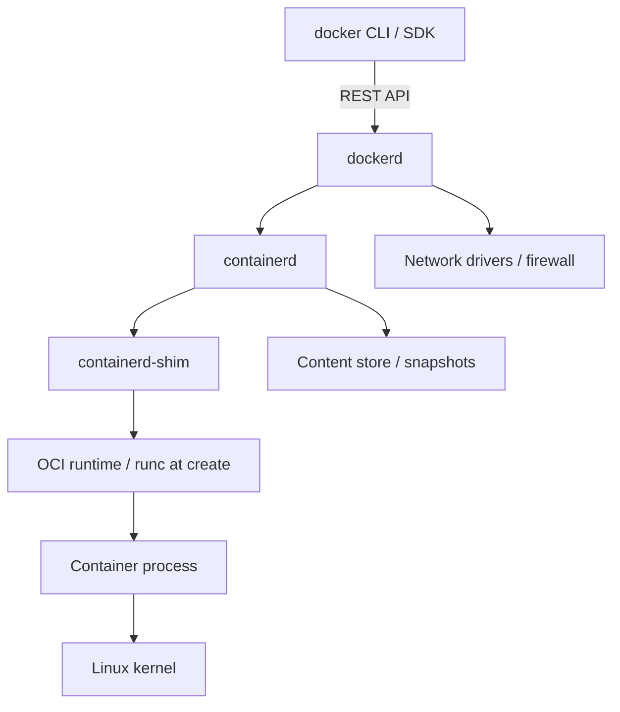
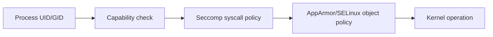

# 14 — Internals Linux và OCI

Mục tiêu của internals không phải gọi lệnh kernel mỗi ngày, mà để giải thích đúng symptom: vì sao PID khác, localhost khác, root vẫn bị hạn chế, memory OOM, mount copy-up hoặc signal không tới app.

## Control plane và data plane cục bộ



Mô hình có thể khác theo platform/config/version; xem `docker info`. OCI image spec chuẩn hóa package format; OCI runtime spec mô tả `config.json`/lifecycle. Docker thêm UX, API, build, network, volume và quản lý lifecycle quanh OCI primitives.

Shim giúp process container tiếp tục độc lập hơn với daemon/runtime create process và giữ stdio/exit status. Không suy ra rằng mọi container chết khi CLI đóng; detached process do daemon quản lý.

## Namespaces: cùng kernel, góc nhìn khác

| Namespace | Cô lập | Symptom giúp giải thích |
|---|---|---|
| PID | Process tree/IDs | PID 1 trong container không nhất thiết PID 1 host |
| mount | Mount table/root filesystem | Mount trong container không tự xuất hiện host namespace |
| network | Interface, route, port, firewall view | Mỗi container có `localhost` riêng |
| UTS | Hostname/domain | Container hostname khác host |
| IPC | SysV IPC/POSIX queues | App không thấy IPC ngoài namespace |
| user | UID/GID mapping | Root container có thể map thành unprivileged host UID |
| cgroup | View cgroup hierarchy | Process thấy giới hạn/nhóm riêng tùy mode |

Trên native Linux lab an toàn:

```bash
docker run -d --name ns-lab alpine sleep 1d
docker inspect ns-lab --format '{{.State.Pid}}'
# Trên host có quyền: lsns -p <HOST_PID>
docker exec ns-lab sh -c 'echo container-pid=$$; cat /proc/1/status | head'
docker rm -f ns-lab
```

Docker Desktop giấu Linux namespaces trong VM; lệnh host Windows/macOS không quan sát trực tiếp như native Linux.

## cgroups v2

Cgroup accounting/limits áp dụng cho process tree: memory, CPU, PID và I/O controller tùy host. Với cgroup v2, memory pressure/OOM, `cpu.max`, `pids.max` nằm trong unified hierarchy. Docker flags là abstraction; đừng sửa file cgroup thủ công cho container do Docker quản lý.

`docker stats` có cách tính cache/usage khác raw files/platform; dùng đồng nhất metric definition khi đặt alert. OOM có thể ở container cgroup hoặc host, vì vậy correlate state/events/kernel telemetry.

## Capabilities, seccomp và LSM

Unix root truyền thống được chia thành capabilities. Container root mặc định không có tất cả; `CAP_SYS_ADMIN` đặc biệt rộng. Seccomp lọc syscalls; AppArmor/SELinux (LSM) kiểm soát access theo policy/label. Ba cơ chế bổ sung nhau:



Thứ tự thực tế của kernel checks phức tạp hơn sơ đồ; đây là conceptual layers, không phải trace chính xác.

## Layer filesystem và copy-on-write

Storage driver/snapshotter ghép lower read-only layers và upper writable layer. Khi sửa file từ lower, dữ liệu có thể **copy-up** vào upper; xóa dùng whiteout để che file lower. Hậu quả:

- Ghi file lớn trong writable layer có overhead và làm container stateful.
- Xóa ở Dockerfile instruction sau không thu hồi byte layer trước.
- Nhiều container chia sẻ lower image layers nhưng upper layer độc lập.
- Directly sửa Docker data-root là unsupported và dễ corruption.

`overlay2`/containerd snapshotter cụ thể tùy daemon/platform; kiểm tra `docker info`, không hard-code assumption trong runbook.

## Packet path bridge

App bind socket trong network namespace → veth → Linux bridge → route/firewall/NAT host → NIC. Inbound published port đi ngược qua host rules. Embedded DNS chỉ có ý nghĩa trên network thích hợp. Host firewall tools có thể tương tác rules Docker; thay iptables/nftables mù dễ bypass/chặn ngoài ý muốn.

## Process model và time

Container không ảo hóa kernel clock như VM đầy đủ; timezone thường là user-space config, host clock/NTP vẫn nền. Hostname, `/etc/hosts`, DNS được runtime dựng. Kernel version `uname` phản ánh shared kernel, không phải distro release trong `/etc/os-release`.

## OCI hooks, devices và runtimes khác

Runtime config có mounts, namespaces, capabilities, rlimits, devices và hooks. GPU thường cần vendor runtime/device/plugin; không chỉ “cài driver trong image”—kernel driver ở host phải tương thích. Alternative sandbox runtimes có thể tăng isolation nhưng integration/performance/feature khác; chọn theo threat model và platform.

## Tự kiểm tra

1. Vì sao `uname -r` trong Ubuntu và Alpine container trên cùng host giống nhau?
2. Copy-up/whiteout giải thích image bloat và “file đã xóa vẫn tốn chỗ” thế nào?
3. Namespace và cgroup giải quyết hai nhóm vấn đề khác nhau nào?
4. Vì sao cài GPU user-space library trong image chưa đủ?

## Nguồn chính thức

- [Docker overview — underlying technology](https://docs.docker.com/get-started/docker-overview/)
- [Docker storage drivers](https://docs.docker.com/engine/storage/drivers/)
- [OCI Runtime Specification](https://github.com/opencontainers/runtime-spec)
- [OCI Image Specification](https://github.com/opencontainers/image-spec)
- [containerd](https://containerd.io/docs/)
