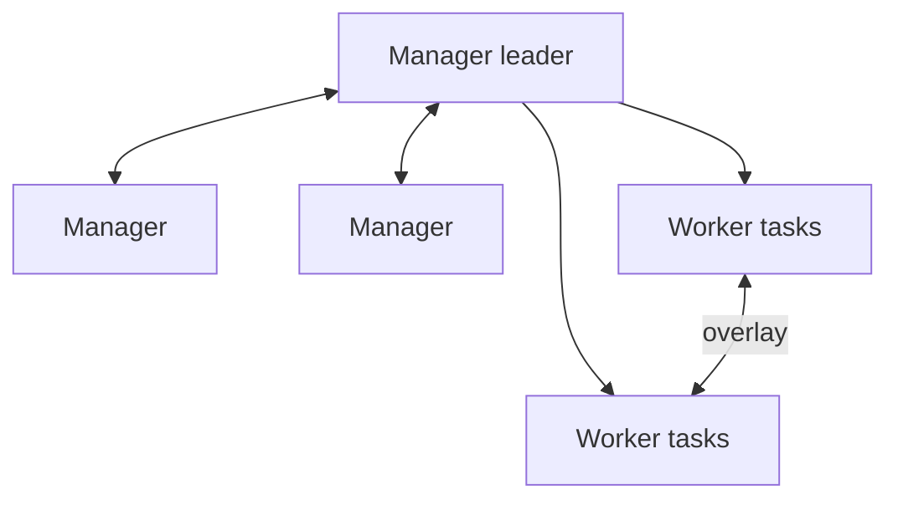

# 15 — Vận hành daemon, context, registry và Swarm

## Daemon configuration có kiểm soát

Vị trí/cách cấu hình khác Linux, rootless và Docker Desktop. Với Engine Linux thường dùng `/etc/docker/daemon.json`; Docker Desktop chỉnh qua Settings/API do sản phẩm quản lý. Ví dụ baseline **chỉ để thảo luận**, không copy đè production:

```json
{
  "live-restore": true,
  "log-driver": "local",
  "log-opts": { "max-size": "10m", "max-file": "3" },
  "userland-proxy": false
}
```

Mỗi option có compatibility/impact. Quy trình:

1. Lưu config hiện tại và inventory containers/network/storage.
2. Đọc reference đúng platform; tránh cùng option vừa CLI flag vừa JSON gây conflict.
3. Validate config (`dockerd --validate --config-file=...` nếu package hỗ trợ).
4. Test staging/canary, lên maintenance/rollback plan.
5. Reload/restart đúng option và xác minh `docker info`; config log mới chỉ vào container mới.

Không mở `insecure-registries` để chữa CA lỗi production; cài đúng CA/trust chain và TLS.

## Context và remote daemon

```bash
docker context ls
docker context create prod-readonly --docker host=ssh://operator@host
docker --context prod-readonly info
```

Tên “readonly” chỉ là tên, không cấp quyền read-only. Quyền thật do account/daemon authorization quyết định. SSH context giảm việc expose TCP API; automation cần known-host verification, key rotation, least privilege và audit. Với TCP, dùng mutual TLS và firewall/authorization.

Luôn hiện context trong prompt/runbook trước lệnh mutation. Sai context là nguồn incident phổ biến.

## Registry operations

Production registry checklist:

- TLS + trusted CA, SSO/token ngắn hạn, RBAC theo namespace/repository.
- Immutable release tag hoặc deploy digest; retention không xóa digest đang deploy/rollback.
- Garbage collection theo quy trình registry, không đoán từ Docker host.
- Replication/backup và restore test metadata + blobs.
- Scan, signature/attestation storage và audit pulls/pushes.
- Quota/capacity/latency/error metrics; HA theo SLO.

Registry mirror/cache tăng tốc nhưng có trust/staleness/failure behavior cần rõ. Air-gap workflow dùng `save/load` hoặc OCI tooling được duyệt, kèm digest/signature verification; không chuyển tar không xác thực qua USB rồi chạy.

## Disk và garbage collection

```bash
docker system df -v
docker buildx du
docker container ls -a --filter status=exited
docker image ls --digests
docker volume ls
```

Tạo retention theo owner:

- Stopped container giữ bao lâu để postmortem?
- Image rollback giữ bao nhiêu release?
- Builder cache TTL/size nào để cân disk và CI time?
- Anonymous/orphan volume xác nhận bằng metadata nào?
- Log rotation/central retention?

Prune là mutation; preview/inventory, loại trừ data và chạy canary. Không trực tiếp xóa file trong Docker data-root.

## Upgrade và availability

- Đọc release notes/deprecations; backup config và app data đúng cách.
- Test image/network/volume/plugin/runtime/GPU/rootless workloads đại diện.
- Drain/stop hoặc dùng `live-restore` nếu phù hợp; hiểu rằng daemon mất quản lý/network operations trong thời gian unavailable và live restore không cứu host reboot/kernel failure.
- Xác minh version/context, start/restart, health, logs, network, volume và rollback sau nâng cấp.

## Plugin và storage/network ngoài

Volume/network/logging authorization plugins chạy với đặc quyền/ảnh hưởng lớn. Quản lý source, signature/version, compatibility, upgrade/rollback và failure mode. Nếu plugin backend unavailable, app fail-fast hay treo? Có timeout, alert và data consistency plan không?

## Docker Swarm: cần biết dù không luôn chọn

Swarm mode tích hợp orchestration vào Engine: manager giữ desired state/Raft, worker chạy task; service có replicas/global mode, rolling update/rollback, secrets/configs, routing mesh và overlay network.



Lab an toàn chỉ trên cluster/VM dành riêng:

```bash
docker swarm init
docker service create --name web --replicas 3 --publish 8080:80 nginx:alpine
docker service ps web
docker service update --image nginx:alpine web
docker service rollback web
```

Không chạy `swarm init` trên host production ngoài kế hoạch. Manager quorum cần số lẻ và backup/restore state đúng; autolock key phải lưu an toàn. Overlay cần ports/control plane firewall chính xác. `docker stack deploy` dùng Compose file nhưng không hỗ trợ toàn bộ Compose CLI features/interpolation giống local Compose; render/validate riêng.

Chọn Swarm khi muốn orchestrator tích hợp, đơn giản hơn và tính năng đáp ứng yêu cầu; chọn Kubernetes khi ecosystem/policy/autoscaling/storage/network/multi-team requirements phù hợp hơn. Không giả định file Compose chuyển nguyên xi sang Kubernetes.

## Tự kiểm tra

1. Vì sao đặt tên context “readonly” không tạo read-only authorization?
2. Những artifact nào phải giữ để rollback image/daemon/registry?
3. Vì sao không xóa trực tiếp Docker data-root khi disk đầy?
4. Swarm manager quorum và worker có vai trò khác nhau thế nào?

## Nguồn chính thức

- [Daemon configuration](https://docs.docker.com/engine/daemon/)
- [Protect daemon access](https://docs.docker.com/engine/security/protect-access/)
- [Docker contexts](https://docs.docker.com/engine/manage-resources/contexts/)
- [Live restore](https://docs.docker.com/engine/daemon/live-restore/)
- [Swarm mode](https://docs.docker.com/engine/swarm/)
