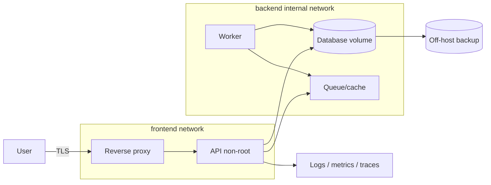

# 16 — Capstone: đưa một dự án thật lên Docker

## Đề bài

Chọn ứng dụng có ít nhất: reverse proxy, API, relational database và một worker/cache/queue tùy chọn. Dev chạy bằng Compose; production target một host hoặc mô tả rõ orchestrator handoff. Không dùng sample nguyên xi—thay business endpoint, schema và failure modes bằng dự án của bạn.

Baseline tham khảo: [05-compose-production](../../CodeSample/docker/05-compose-production/README.md).

## Kiến trúc bắt buộc



Nếu một component không cần, viết ADR (Architecture Decision Record) giải thích bỏ/chọn phương án khác.

## Deliverables

1. **Source**: Dockerfile multi-stage, `.dockerignore`, Compose base + dev/prod override, pinned application dependencies.
2. **Diagrams**: component/data flow, trust boundary, network và deploy/rollback sequence.
3. **Build evidence**: image size/history, cache timing, multi-platform plan, SBOM/provenance/scan triage.
4. **Runtime evidence**: user/caps/read-only/mount/network/limit/logging/health từ `docker inspect`.
5. **Data**: migration strategy, backup automation, restore report vào volume/database mới, RPO/RTO.
6. **Operations**: dashboard, 4 alerts có runbook, deploy/rollback guide, secret rotation guide.
7. **Tests**: unit/integration/smoke/load và 6 failure drills.
8. **Decision record**: vì sao Docker/Compose phù hợp, giới hạn và trigger chuyển Kubernetes/Swarm.

## Acceptance tests

### Build

```bash
docker compose build --check       # nếu builder hỗ trợ build checks
docker compose build
docker compose config --quiet
```

- Sửa source không download lại toàn bộ dependency.
- Build context không chứa `.git`, secret, output thừa.
- Final image không compiler/package cache/credential; process non-root.
- Image gắn revision/source labels và immutable release identity.

### Runtime

- `docker compose up -d --wait` thành công từ máy sạch có secret/config hợp lệ.
- Chỉ proxy publish port; DB/cache không truy cập trực tiếp từ host/network ngoài.
- Rootfs read-only, `cap_drop: ALL`, no-new-privileges; app vẫn hoạt động.
- CPU/RAM/PID limits có mặt trong inspect và chịu load dự kiến.
- SIGTERM khi có traffic drain trước grace deadline.
- Logs JSON không secret; rotation hoạt động; metrics có RED signals.

### Data và resilience

- Recreate toàn stack mà data đúng còn lại.
- Restore backup sang instance mới và ứng dụng verify business invariants.
- Database down/up: API timeout có hạn, reconnect không cần recreate thủ công.
- Bad migration bị chặn/rollback theo plan; code version trước còn tương thích.
- Disk/log pressure và OOM phát alert với evidence.

### Deploy

- Production dùng image digest đã kiểm thử, `--no-build`.
- Có preflight, smoke test, soak thresholds và rollback tự/ban tự động rõ.
- Người khác làm theo runbook trên host mới và phục hồi trong RTO.

## Sáu failure drill bắt buộc

| Drill | Quan sát | Điều kiện qua |
|---|---|---|
| Kill API PID 1 | stop signal, restart, error rate | Drain/recover trong SLO |
| Dừng DB | timeout, pool, retry, readiness | Không treo/retry storm; tự reconnect |
| Memory pressure | working set, OOM/events | Alert và root cause rõ |
| Bind/publish sai port | logs, inspect, network hop | Khoanh vùng dưới 15 phút |
| Secret sai/rotate | startup validation, redaction | Fail closed, không log secret, recover documented |
| Restore data | backup artifact, checksum/invariant | Restore vào fresh target đạt RPO/RTO |

Không chạy chaos trên production nếu chưa được phê duyệt; lab/staging trước.

## Rubric 100 điểm

| Nhóm | Điểm | Không đạt nếu |
|---|---:|---|
| Build/reproducibility | 15 | Secret trong layer, final image chứa build tool không cần |
| Network/data design | 15 | DB publish vô cớ, không restore test |
| Security | 20 | Root/privileged/socket mount không có justification |
| Reliability/resource | 15 | Không graceful stop/limit/retry budget |
| Observability | 15 | Chỉ có raw logs, không alert/runbook |
| Delivery/rollback | 10 | Deploy mutable tag, rollback chưa thử |
| Explanation/evidence | 10 | Chỉ tick checklist, không chứng minh |

Điều kiện tốt nghiệp: ≥ 80, không có lỗi “không đạt” nghiêm trọng, và một người khác tái hiện build/deploy/restore từ tài liệu.

## Review cuối

Trả lời không tra cứu: “Một request đi từ client đến database qua những namespace/network/TLS/auth nào; artifact nào chứng minh code đang chạy; state nằm đâu; process có quyền gì; khi host mất thì phục hồi ra sao?” Nếu không trả lời bằng evidence, quay lại bài tương ứng.
