# Docker chuyên sâu — mục lục và bản đồ kiến thức

> Mục tiêu: từ người mới có thể container hóa ứng dụng đến mức tự thiết kế, bảo mật, quan sát và xử lý sự cố một workload Docker chạy thật. Tài liệu dùng lệnh `docker compose` (Compose V2), không dùng lệnh `docker-compose` cũ.

Không có giáo trình nào có thể bảo đảm bao phủ mọi plugin, driver của nhà cung cấp hay mọi lỗi kernel. Bộ tài liệu này bao phủ **năng lực Docker cốt lõi và production**; checklist và capstone giúp bạn phát hiện lỗ hổng trước khi làm dự án thật.

## Cách học

1. Đọc theo thứ tự, tự dự đoán kết quả trước khi chạy lệnh.
2. Làm lab trong `CodeSample/docker`; không chỉ copy/paste, hãy chủ động làm hỏng rồi quan sát.
3. Trả lời phần “Tự kiểm tra” mà không mở tài liệu.
4. Chỉ đánh dấu checklist khi giải thích được *vì sao*, chạy được và debug được.
5. Hoàn thành capstone với một ứng dụng của chính bạn.

Yêu cầu: Docker Desktop hoặc Docker Engine đang chạy, Docker Compose V2, Git, terminal. Trên Windows/macOS, Linux container thực tế chạy trong VM; vì vậy một số bài về namespace, iptables, AppArmor/SELinux cần một Linux host/VM để quan sát đầy đủ.

## Roadmap gợi ý 12 tuần

```mermaid
flowchart LR
  A[Tuần 1\nMental model + CLI] --> B[Tuần 2\nImage + Dockerfile]
  B --> C[Tuần 3\nBuildKit + registry]
  C --> D[Tuần 4\nNetwork]
  D --> E[Tuần 5\nStorage]
  E --> F[Tuần 6\nCompose]
  F --> G[Tuần 7\nSecurity]
  G --> H[Tuần 8\nReliability]
  H --> I[Tuần 9\nObservability]
  I --> J[Tuần 10\nDebugging]
  J --> K[Tuần 11\nProduction + internals]
  K --> L[Tuần 12\nCapstone + review]
```

Mỗi tuần 6–10 giờ: 40% đọc/ghi chú, 50% lab, 10% tự kiểm tra. Nếu đã có kinh nghiệm, dùng [00-roadmap.md](00-roadmap.md) để kiểm tra đầu vào và rút ngắn phần đã thành thạo.

## Danh sách bài học

| Bài | Kết quả chính | Lab liên quan |
|---|---|---|
| [00 — Roadmap và cách đánh giá](00-roadmap.md) | Chọn lộ trình, tiêu chí “biết sâu” | Tất cả sample |
| [01 — Mental model và kiến trúc](01-mental-model-va-kien-truc.md) | Phân biệt image/container/VM, hiểu client–daemon–runtime | [01-first-container](../../CodeSample/docker/01-first-container/README.md) |
| [02 — CLI và vòng đời container](02-cli-va-vong-doi-container.md) | Run/stop/exec/logs/inspect, PID 1 và signal | [01-first-container](../../CodeSample/docker/01-first-container/README.md) |
| [03 — Image, layer và registry](03-image-layer-registry.md) | Tag/digest/layer, pull/push/save/load | [02-buildkit-go](../../CodeSample/docker/02-buildkit-go/README.md) |
| [04 — Dockerfile chuẩn](04-dockerfile-thuc-chien.md) | Dockerfile có cache tốt, nhỏ, non-root | [02-buildkit-go](../../CodeSample/docker/02-buildkit-go/README.md) |
| [05 — BuildKit, buildx và supply chain](05-buildkit-buildx.md) | Cache mount, multi-stage/platform, secret, SBOM/provenance | [02-buildkit-go](../../CodeSample/docker/02-buildkit-go/README.md), [08-build-secret](../../CodeSample/docker/08-build-secret/README.md) |
| [06 — Networking chuyên sâu](06-networking-chuyen-sau.md) | DNS, bridge/NAT/port, network drivers, debug | [03-networking-lab](../../CodeSample/docker/03-networking-lab/README.md) |
| [07 — Storage và dữ liệu](07-storage-va-du-lieu.md) | Volume/bind/tmpfs, quyền, backup/restore | [04-storage-backup](../../CodeSample/docker/04-storage-backup/README.md) |
| [08 — Docker Compose](08-compose-tu-dev-den-prod.md) | Model nhiều service, health dependency, override/profile | [05-compose-production](../../CodeSample/docker/05-compose-production/README.md) |
| [09 — Security](09-security-hardening.md) | Least privilege, secret, seccomp/rootless, supply chain | [06-security-hardening](../../CodeSample/docker/06-security-hardening/README.md) |
| [10 — Reliability và tài nguyên](10-reliability-va-tai-nguyen.md) | Graceful stop, health, restart, CPU/RAM/PID | [06-security-hardening](../../CodeSample/docker/06-security-hardening/README.md) |
| [11 — Observability](11-observability.md) | Log/metric/event/health và rotation | [07-observability](../../CodeSample/docker/07-observability/README.md) |
| [12 — Debugging theo runbook](12-debugging-runbook.md) | Khoanh vùng build/start/network/data/resource | [09-debugging-lab](../../CodeSample/docker/09-debugging-lab/README.md) |
| [13 — Production patterns](13-production-patterns.md) | Golden path, deploy bất biến, backup, CI/CD | [05-compose-production](../../CodeSample/docker/05-compose-production/README.md) |
| [14 — Internals Linux/OCI](14-internals-linux-oci.md) | Namespace/cgroup/overlayfs/containerd/runc | Các lab 01–06 |
| [15 — Vận hành daemon và registry](15-van-hanh-daemon-registry.md) | Context, TLS/SSH, daemon.json, GC, upgrade | Lab tự chọn |
| [16 — Capstone dự án thật](16-capstone-du-an-that.md) | Thiết kế và chứng minh một hệ thống production-ready | [05-compose-production](../../CodeSample/docker/05-compose-production/README.md) làm baseline |
| [17 — Cheat sheet và ma trận quyết định](17-cheat-sheet.md) | Tra nhanh lệnh và chọn đúng công cụ | Tất cả sample |

## Coverage checklist

### Nền tảng và runtime

- [ ] Giải thích image bất biến, container writable layer, registry, repository, tag và digest.
- [ ] Vẽ được đường đi `CLI → dockerd API → containerd → OCI runtime → Linux process`.
- [ ] Giải thích namespace, cgroup, capability; container không phải VM và không phải security boundary tuyệt đối.
- [ ] Quản lý trọn vòng đời container, signal/PID 1, exit code, attach/exec/logs/inspect/events.
- [ ] Phân biệt Linux containers trên Linux với Docker Desktop dùng VM.

### Build và phân phối

- [ ] Viết Dockerfile đúng `CMD`/`ENTRYPOINT`, `COPY`/`ADD`, `ARG`/`ENV`, `USER`, `WORKDIR`, `HEALTHCHECK`, `.dockerignore`.
- [ ] Tối ưu cache/layer/context; dùng multi-stage, cache/bind/secret/SSH mounts.
- [ ] Dùng buildx cho multi-platform và hiểu emulation so với native/cross-compile.
- [ ] Tag theo phiên bản, pin base image theo digest khi cần tái lập; push/pull/inspect manifest.
- [ ] Sinh/đọc SBOM và provenance; biết scan, ký/xác minh và policy là các lớp riêng biệt.

### Network và storage

- [ ] Giải thích bridge, veth, embedded DNS, NAT/published port, `EXPOSE` không tự publish.
- [ ] Chọn bridge/host/none/overlay/macvlan/ipvlan theo tình huống và nêu trade-off.
- [ ] Debug DNS, route, bind address, port collision, proxy/TLS và host firewall.
- [ ] Chọn writable layer/volume/bind/tmpfs; xử lý UID/GID, read-only mount và mount che dữ liệu.
- [ ] Thực hiện backup **và restore test**; hiểu consistency của database.

### Compose và production

- [ ] Dùng services/networks/volumes/configs/secrets, healthcheck và dependency condition.
- [ ] Hiểu interpolation, precedence, profiles, merge/override, project name và orphan resources.
- [ ] Cấu hình non-root, read-only rootfs, drop capabilities, no-new-privileges, secret file.
- [ ] Đặt CPU/RAM/PID, restart policy, stop grace period; phân biệt liveness/readiness.
- [ ] Log ra stdout/stderr, rotation, structured log; thu metric và theo dõi events/OOM.
- [ ] Triển khai theo digest, rollback, migration, backup, patch, GC và runbook sự cố.
- [ ] Biết ngưỡng Compose một host và khi nào chuyển sang orchestrator như Kubernetes.

## Bộ code sample

| Sample | Dùng để học | Lệnh bắt đầu |
|---|---|---|
| [01-first-container](../../CodeSample/docker/01-first-container/README.md) | Container/image/port/read-only content | `docker compose up --build` |
| [02-buildkit-go](../../CodeSample/docker/02-buildkit-go/README.md) | Multi-stage, cache, non-root, multi-platform | `docker build -t deep-docker/go-api .` |
| [03-networking-lab](../../CodeSample/docker/03-networking-lab/README.md) | DNS và phân đoạn frontend/backend | `docker compose up -d` |
| [04-storage-backup](../../CodeSample/docker/04-storage-backup/README.md) | Named volume, backup, restore | `docker compose up -d` |
| [05-compose-production](../../CodeSample/docker/05-compose-production/README.md) | API + PostgreSQL + migration + proxy | `docker compose up --build` |
| [06-security-hardening](../../CodeSample/docker/06-security-hardening/README.md) | Runtime least privilege | `docker compose up --build` |
| [07-observability](../../CodeSample/docker/07-observability/README.md) | JSON log, metric, Prometheus, health | `docker compose up --build` |
| [08-build-secret](../../CodeSample/docker/08-build-secret/README.md) | BuildKit secret không nằm trong image | Xem README |
| [09-debugging-lab](../../CodeSample/docker/09-debugging-lab/README.md) | Điều tra port/bind/health | `docker compose -f compose.broken.yaml up --build` |

## Nguồn chính thức nền

- [Docker Get started](https://docs.docker.com/get-started/)
- [Docker Engine manuals](https://docs.docker.com/engine/)
- [Dockerfile reference](https://docs.docker.com/reference/dockerfile/)
- [Docker Build](https://docs.docker.com/build/)
- [Compose specification](https://docs.docker.com/reference/compose-file/)
- [OCI Runtime Specification](https://github.com/opencontainers/runtime-spec) và [OCI Image Specification](https://github.com/opencontainers/image-spec)

Các link sâu hơn nằm trong từng bài. Tài liệu được viết theo hành vi/khái niệm ổn định thay vì khẳng định một số phiên bản Engine cố định; luôn kiểm tra `docker version`, `docker info`, `docker compose version` trên môi trường thực tế.
