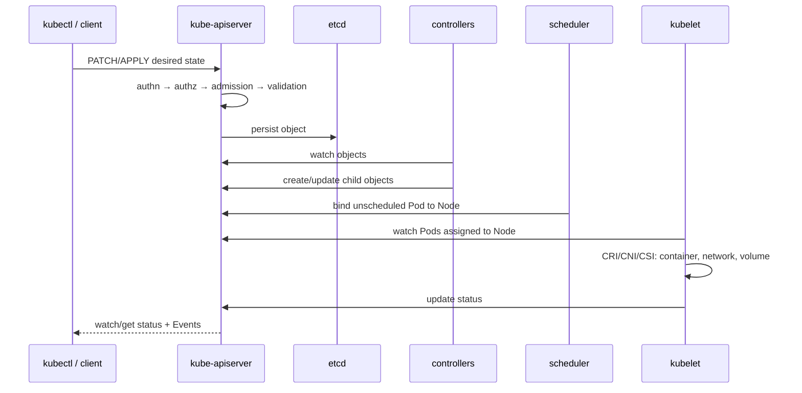
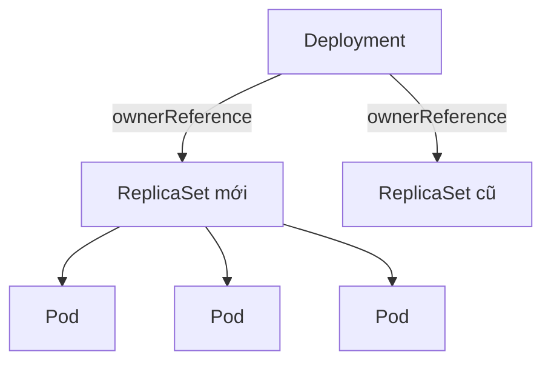

# 01 — Kiến trúc, Kubernetes API và reconciliation

## Mental model quan trọng nhất

Kubernetes là một hệ thống điều khiển phân tán. Bạn khai báo **desired state** qua API; các controller quan sát **current state**, thực hiện hành động và lặp lại cho đến khi hội tụ. `kubectl apply` thành công chỉ có nghĩa API chấp nhận object, không có nghĩa ứng dụng đã sẵn sàng.



## Thành phần và trách nhiệm

### Control plane

- `kube-apiserver`: cổng vào duy nhất tới Kubernetes API; xác thực, phân quyền, admission, validation và lưu state.
- `etcd`: key-value store nhất quán chứa state của cluster. Mất etcd mà không có backup phù hợp có thể mất cluster state.
- `kube-scheduler`: chọn Node cho Pod chưa có `.spec.nodeName`; không trực tiếp chạy container.
- `kube-controller-manager`: chạy các control loop như Deployment/ReplicaSet/Node/Job controllers.
- `cloud-controller-manager`: tích hợp node, route, load balancer với cloud khi dùng cloud provider.

### Node/data plane

- `kubelet`: bảo đảm PodSpec được gán cho node đang chạy; gọi container runtime qua CRI.
- container runtime: kéo image và chạy container (`containerd`, CRI-O…). Docker Engine không còn là CRI runtime trực tiếp trong Kubernetes hiện đại.
- network plugin qua CNI: cấp IP, route và có thể thực thi NetworkPolicy.
- `kube-proxy` hoặc data plane thay thế: cài đặt Service forwarding bằng iptables/IPVS/eBPF tùy nền tảng.

Nguồn: [Kubernetes Components](https://kubernetes.io/docs/concepts/overview/components/) và [Cluster Architecture](https://kubernetes.io/docs/concepts/architecture/).

## Đọc một API object

```yaml
apiVersion: apps/v1        # group=apps, version=v1
kind: Deployment          # kiểu object
metadata:
  name: api
  namespace: deep-k8s
  labels:                 # dùng để select/group
    app.kubernetes.io/name: sample-api
  annotations:            # metadata không dùng để select
    example.com/owner: platform-team
spec:                     # desired state do người/controller khai báo
  replicas: 3
status: {}                # observed state do hệ thống cập nhật; không viết tay
```

Các khái niệm cần phân biệt:

- **GVK** (`group/version/kind`) mô tả kiểu trong manifest; **GVR** (`group/version/resource`) là endpoint REST, ví dụ `apps/v1/deployments`.
- Object namespaced (`Pod`, `Deployment`, `Service`) có phạm vi namespace; object cluster-scoped (`Node`, `Namespace`, `ClusterRole`, `StorageClass`) không có.
- `labels` dành cho selection và tổ chức; `annotations` giữ metadata công cụ/người dùng. Selector của workload là hợp đồng quan trọng và thường immutable.
- `generation` tăng khi desired spec đổi; `status.observedGeneration` cho biết controller đã xử lý generation nào.
- `resourceVersion` dùng cho optimistic concurrency/watch, không phải số phiên bản ứng dụng.
- `uid` phân biệt hai object trùng tên được tạo ở hai thời điểm.

```powershell
kubectl api-resources
kubectl api-resources --namespaced=false
kubectl explain deployment --api-version=apps/v1
kubectl get deployment sample-api -n deep-k8s -o yaml
kubectl get --raw /apis/apps/v1 | Select-Object -First 1
```

Nguồn: [Kubernetes API concepts](https://kubernetes.io/docs/reference/using-api/api-concepts/) và [Objects](https://kubernetes.io/docs/concepts/overview/working-with-objects/).

## Reconciliation, ownership và garbage collection

Deployment controller tạo ReplicaSet; ReplicaSet controller tạo Pod. Quan hệ được ghi trong `metadata.ownerReferences`.



- Xóa owner có thể kéo theo dependent bằng garbage collection, tùy propagation policy.
- **Finalizer** chặn xóa vật lý cho đến khi controller hoàn tất cleanup. Object có `deletionTimestamp` nhưng không biến mất thường là finalizer/controller lỗi; không gỡ finalizer mù quáng.
- Controller phải idempotent: reconcile nhiều lần vẫn dẫn về cùng desired state.
- Event là dữ liệu ngắn hạn về hành động/lỗi; không phải audit log bền vững.

## API request pipeline

1. Client gửi HTTPS với credentials.
2. Authentication xác định identity (user, group, ServiceAccount).
3. Authorization (thường RBAC) kiểm tra verb/resource/subresource/namespace.
4. Mutating admission có thể sửa request.
5. Schema/defaulting/validation kiểm tra object.
6. Validating admission có thể từ chối.
7. API server persist vào etcd, trả response và phát watch event.

Thứ tự admission chi tiết là triển khai nội bộ; điều quan trọng là mutation xảy ra trước validation cuối. Webhook lỗi/timeout có thể nằm trên critical path của toàn cluster.

## Declarative apply và ownership field

- `kubectl create` tạo object; chạy lần hai thường lỗi AlreadyExists.
- `kubectl apply` khai báo và merge; dùng Git làm source of truth.
- Server-Side Apply theo dõi field manager trong `managedFields`; conflict là tín hiệu hai actor cùng sở hữu một field.
- `kubectl edit`/`patch` hữu ích khi incident nhưng dễ gây config drift; phải backport thay đổi về Git.
- Không trộn nhiều công cụ quản lý cùng field nếu không có ownership rõ ràng.

```powershell
kubectl apply --server-side --field-manager=platform -k CodeSample/kubernetes/overlays/dev
kubectl get deploy sample-api -n deep-k8s -o jsonpath='{.metadata.managedFields[*].manager}'
kubectl diff -k CodeSample/kubernetes/overlays/dev
```

Nguồn: [Server-Side Apply](https://kubernetes.io/docs/reference/using-api/server-side-apply/).

## CRD và Operator: khi nào cần

CRD mở rộng API bằng custom resource; operator là controller reconcile custom resource đó.

Dùng khi domain có vòng đời lặp lại, state machine rõ và cần tự động hóa liên tục, ví dụ provision database, rotate certificate, restore backup. Không tạo CRD chỉ để lưu một file config hoặc bọc một Deployment một lần; chi phí gồm API compatibility, controller HA, retries, status/conditions, upgrade và disaster recovery.

## Lab: theo dấu một reconciliation

```powershell
kubectl apply -k CodeSample/kubernetes/overlays/dev
kubectl get deploy,rs,pod -n deep-k8s --show-labels
kubectl describe deployment sample-api -n deep-k8s
kubectl get pods -n deep-k8s -o jsonpath='{range .items[*]}{.metadata.name}{" owner="}{.metadata.ownerReferences[0].kind}{"/"}{.metadata.ownerReferences[0].name}{"\n"}{end}'
kubectl scale deployment sample-api -n deep-k8s --replicas=2
kubectl get events -n deep-k8s --sort-by='.metadata.creationTimestamp'
kubectl apply -k CodeSample/kubernetes/overlays/dev
```

Quan sát: scale tay tạo drift; lần apply sau đưa replica về khai báo trong overlay. Ghi controller nào tạo/xóa từng object.

### Inject lỗi

Xóa một Pod và watch:

```powershell
kubectl get pods -n deep-k8s
kubectl delete pod -n deep-k8s -l app.kubernetes.io/name=sample-api
kubectl get pods -n deep-k8s --watch
```

Giải thích vì sao Pod mới có tên/UID khác nhưng Deployment vẫn đạt desired replicas.

## Câu hỏi tự kiểm tra

1. API server trả 201 nhưng Pod vẫn Pending: những controller/thành phần nào còn phải làm việc?
2. Scheduler hay kubelet chịu trách nhiệm tạo container? Chứng minh bằng status/Event nào?
3. Vì sao sửa `status` bằng tay không phải cách sửa ứng dụng?
4. Finalizer khác ownerReference thế nào?
5. Khi nào Server-Side Apply báo conflict và tại sao force-conflict nguy hiểm?

Đạt bài khi có thể trả lời không nhìn tài liệu và chỉ ra field/command làm bằng chứng.
