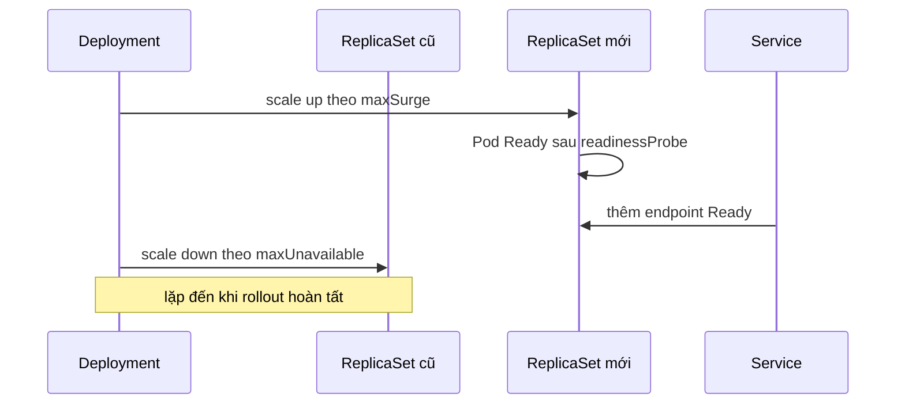

# 02 — Pod, workload controller và vòng đời ứng dụng

## Pod không phải “máy ảo nhỏ”

Pod là đơn vị schedule nhỏ nhất, chứa một hoặc nhiều container chia sẻ network namespace (cùng IP/localhost) và có thể chia sẻ volume. Pod là **disposable**: controller thay Pod lỗi bằng Pod mới, không “hồi sinh” cùng UID.

### Thành phần trong Pod

- App container: tiến trình chính.
- Init container: chạy tuần tự tới thành công trước app containers; hợp với migrate/check dependency ngắn hạn, nhưng phải idempotent.
- Sidecar: chức năng phụ gắn với vòng đời Pod như proxy/log shipper; tăng resource và coupling nên chỉ dùng khi locality/lifecycle thực sự cần.
- Ephemeral container: chèn tạm để debug, không có probe/resource guarantees như app container và không tự restart.
- Volume: dữ liệu/chia sẻ file trong Pod; `emptyDir` mất khi Pod rời node hoặc bị xóa.

Mẫu ambassador/adapter/sidecar hữu ích nhưng đừng nhét mọi service vào một Pod. Hai thành phần chỉ nên cùng Pod khi cần chung fate, localhost/volume và scale cùng nhau.

## Chọn workload đúng

| Workload | Dùng khi | Không dùng khi |
|---|---|---|
| Deployment | HTTP API/stateless worker; Pod hoán đổi được; rolling update | Cần identity/storage riêng ổn định |
| StatefulSet | Identity mạng/ordinal/PVC riêng; ordering cần thiết | Chỉ vì app “có database client” |
| DaemonSet | Một Pod trên mỗi node phù hợp: agent log, CNI, CSI, node exporter | Muốn N replicas bất kỳ hoặc scale theo traffic |
| Job | Tác vụ hữu hạn, retry tới completion | Service chạy liên tục |
| CronJob | Tạo Job theo lịch; cleanup/backup định kỳ | Scheduler nghiệp vụ cần exactly-once tuyệt đối |
| Pod trần | Debug ngắn hạn/static manifest đặc biệt | Production workload cần self-healing/rollout |

Nguồn chính thức mô tả lựa chọn ở [Workload Management](https://kubernetes.io/docs/concepts/workloads/controllers/); StatefulSet chỉ hợp khi cần stable identity/ordering/storage, theo [StatefulSets](https://kubernetes.io/docs/concepts/workloads/controllers/statefulset/).

## Deployment và rolling update



Các trường production cần hiểu:

- `strategy.rollingUpdate.maxSurge`: số Pod vượt desired tạm thời; cần capacity.
- `maxUnavailable`: số Pod có thể không available; với replica=1 và giá trị không phù hợp dễ downtime.
- `minReadySeconds`: Pod phải Ready liên tục trước khi được coi Available.
- `progressDeadlineSeconds`: phát hiện rollout không tiến triển, nhưng Kubernetes không tự rollback Deployment.
- `revisionHistoryLimit`: số ReplicaSet cũ giữ cho rollback.
- `pod-template-hash`: thay Pod template tạo ReplicaSet mới; đổi ConfigMap ngoài template không tự rollout.

```powershell
kubectl set image deployment/sample-api api=sample-api:v2 -n deep-k8s
kubectl rollout status deployment/sample-api -n deep-k8s --timeout=2m
kubectl rollout history deployment/sample-api -n deep-k8s
kubectl rollout undo deployment/sample-api -n deep-k8s
```

Trong GitOps, không dùng `set image` như source of truth; commit image digest/tag vào Git rồi để reconciler áp dụng.

## StatefulSet không biến database thành HA

StatefulSet cung cấp:

- tên ổn định `db-0`, `db-1`; DNS ổn định với headless Service;
- `volumeClaimTemplates` tạo PVC riêng;
- create/delete/update có ordering tùy `podManagementPolicy` và update strategy.

Nó không tự cung cấp replication, quorum, leader election, backup, schema migration hay fencing. Những thứ này thuộc ứng dụng/operator/storage. Với database quan trọng, ưu tiên managed service hoặc operator đã được kiểm chứng thay vì tự ghép StatefulSet đơn giản.

## Job và CronJob: semantics thực tế

- Job có thể tạo lại Pod; code phải idempotent. Trong một số tình huống cùng task có thể chạy hơn một lần.
- `backoffLimit`, `activeDeadlineSeconds`, `ttlSecondsAfterFinished` kiểm soát retry/deadline/cleanup.
- CronJob dùng `concurrencyPolicy: Forbid|Replace|Allow`, `startingDeadlineSeconds`, history limits.
- Lịch có thể bị miss hoặc tạo hơn một Job trong edge case; nghiệp vụ cần unique key/transaction/lease để chống xử lý trùng.
- Không chạy schema migration đồng thời trong mọi replica app. Dùng pipeline/Job có lock và kế hoạch backward-compatible.

Sample: [jobs/job.yaml](../../CodeSample/kubernetes/jobs/job.yaml) và [jobs/cronjob.yaml](../../CodeSample/kubernetes/jobs/cronjob.yaml).

## Vòng đời và graceful termination

Khi Pod bị xóa/rollout:

1. API đánh dấu Pod terminating; EndpointSlice cập nhật trạng thái endpoint.
2. kubelet chạy `preStop` nếu có, rồi gửi signal dừng (thường `SIGTERM`) cho PID 1.
3. App ngừng nhận request mới, hoàn tất request đang chạy, flush và thoát.
4. Hết `terminationGracePeriodSeconds`, kubelet gửi `SIGKILL`.

Các thay đổi xảy ra bất đồng bộ; app phải chịu một khoảng race giữa routing và shutdown. Readiness phải chuyển false sớm, proxy/load balancer cần drain đúng và grace period phải lớn hơn thời gian xử lý dài hợp lý. `preStop: sleep` chỉ là biện pháp cuối, không thay app xử lý signal.

Nguồn: [Pod Lifecycle](https://kubernetes.io/docs/concepts/workloads/pods/pod-lifecycle/) và [Termination of Pods](https://kubernetes.io/docs/concepts/workloads/pods/pod-lifecycle/#pod-termination).

## Restart không phải replace

- Container restart trong cùng Pod: UID/IP/volume Pod giữ nguyên; `restartCount` tăng; do `restartPolicy` và kubelet.
- Pod replacement: UID/IP thường đổi; controller tạo object mới.
- `CrashLoopBackOff` là backoff khi container lặp crash, không phải nguyên nhân gốc. Xem `state.waiting.reason`, `lastState.terminated`, exit code, logs previous và Events.

```powershell
kubectl get pod -n deep-k8s -o wide
kubectl describe pod <pod> -n deep-k8s
kubectl logs <pod> -c api -n deep-k8s --previous
kubectl get pod <pod> -n deep-k8s -o jsonpath='{.status.containerStatuses[0]}'
```

## Lab

### 1. Rollout có quan sát

```powershell
kubectl apply -k CodeSample/kubernetes/overlays/dev
kubectl rollout status deploy/sample-api -n deep-k8s
kubectl get rs,pod -n deep-k8s --watch
```

Ở terminal khác, sửa annotation template để tạo rollout:

```powershell
kubectl patch deployment sample-api -n deep-k8s --type merge -p '{"spec":{"template":{"metadata":{"annotations":{"lab/restarted":"manual-1"}}}}}'
```

Quan sát ReplicaSet mới, Ready endpoint và old Pod termination. Sau lab, `kubectl apply -k ...` để trả về source of truth.

### 2. Rollout lỗi và rollback

```powershell
kubectl set image deploy/sample-api api=invalid.example/not-found:v999 -n deep-k8s
kubectl rollout status deploy/sample-api -n deep-k8s --timeout=45s
kubectl get pods -n deep-k8s
kubectl describe pods -n deep-k8s
kubectl rollout undo deploy/sample-api -n deep-k8s
```

Giải thích vì sao các Pod cũ có thể vẫn phục vụ nếu `maxUnavailable` đúng.

### 3. Job idempotency

Apply [job.yaml](../../CodeSample/kubernetes/jobs/job.yaml), xóa Pod giữa chừng và quan sát Job tạo Pod khác. Thiết kế một idempotency key cho tác vụ “gửi hóa đơn”.

## Anti-patterns

- `latest` tag khiến node khác nhau chạy image khác nhau và rollback không xác định.
- Deployment cho database chỉ vì YAML ngắn.
- Readiness luôn true; rollout tiếp tục dù app không phục vụ được.
- `sleep infinity` để che app crash.
- CronJob mặc định `Allow` cho task không được chạy song song.
- Sidecar không có resources; làm Pod bị OOM/throttle bất ngờ.
- Dùng `kubectl delete pod` như “fix” mà không tìm nguyên nhân.

## Câu hỏi tự kiểm tra

1. Deployment quản lý Pod trực tiếp hay qua ReplicaSet?
2. Replica=1 có thể zero-downtime không? Điều kiện về surge, readiness, capacity và app là gì?
3. Khi nào init container làm rollout kẹt?
4. Vì sao CronJob không hứa exactly-once?
5. StatefulSet cung cấp gì và tuyệt đối không cung cấp gì cho database?
