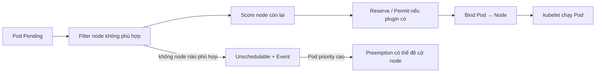

# 03 — Scheduling, resource management và disruption

## Scheduler quyết định gì?

Scheduler chọn một Node khả thi cho Pod chưa được bind. Quy trình khái niệm:



Filter xét resources, ports, volume topology, affinity, taints… Score tối ưu theo plugin/profile. `Pending` không luôn do thiếu CPU; Events là bằng chứng đầu tiên.

```powershell
kubectl describe pod <pod> -n deep-k8s
kubectl get events -n deep-k8s --field-selector reason=FailedScheduling
kubectl describe nodes
```

Nguồn: [Kubernetes Scheduler](https://kubernetes.io/docs/concepts/scheduling-eviction/kube-scheduler/) và [Scheduling framework](https://kubernetes.io/docs/concepts/scheduling-eviction/scheduling-framework/).

## Requests, limits và cách thực thi

| Field | Scheduler dùng | Runtime/kubelet dùng | Hệ quả chính |
|---|---|---|---|
| CPU request | Có | CPU shares/weight | Quyết định placement; nền cho HPA CPU utilization |
| CPU limit | Không để placement | CFS quota hoặc cơ chế runtime tương ứng | Có thể throttle, không OOM |
| Memory request | Có | QoS/eviction decisions | Placement và bảo đảm tương đối |
| Memory limit | Không để placement | cgroup hard limit | Vượt có thể `OOMKilled` |
| Ephemeral-storage request/limit | Có | eviction/accounting khi node hỗ trợ | Tránh đầy node vì logs/layers/`emptyDir` |

`100m` CPU = 0,1 core; `128Mi` là mebibyte. Đừng viết memory `400m` (0,4 byte). Limit không “đặt trước” capacity; request mới là số scheduler cộng. Tổng limits có thể overcommit.

Kubernetes mô tả rõ request được scheduler dùng và limit do kubelet/runtime thực thi trong [Resource Management](https://kubernetes.io/docs/concepts/configuration/manage-resources-containers/).

### Chọn giá trị

1. Bắt đầu bằng đo usage dưới tải đại diện, không đo idle.
2. Request gần percentile phục vụ SLO, cộng headroom hợp lý.
3. Memory limit cao hơn request đủ cho spike; OOM là failure cứng.
4. CPU limit cần cân nhắc: bảo vệ noisy neighbor nhưng throttle có thể làm tail latency xấu. Không có một quy tắc “luôn đặt” đúng cho mọi cluster.
5. Tách workload batch và latency-sensitive bằng pool/priority/policy nếu cần.
6. Theo dõi `usage/request`, throttle, working set, OOM và node saturation; hiệu chỉnh định kỳ.

## QoS và eviction

- `Guaranteed`: mọi container có CPU+memory request bằng limit tương ứng.
- `Burstable`: có ít nhất một request/limit nhưng không đạt Guaranteed.
- `BestEffort`: không container nào có CPU/memory request/limit.

Khi node pressure, kubelet dùng QoS, mức vượt request và priority trong quyết định eviction; QoS không phải lá chắn tuyệt đối. `memory.available`, disk/inode và PID pressure đều có thể gây eviction.

Phân biệt:

- OOM cgroup: container thường `OOMKilled` vì vượt memory limit.
- System OOM/node pressure: kernel/kubelet chịu áp lực node, có thể kill/evict.
- Scheduler Pending: Pod chưa từng chạy vì request/constraint không thỏa.

Nguồn: [Pod QoS Classes](https://kubernetes.io/docs/concepts/workloads/pods/pod-qos/) và [Node-pressure eviction](https://kubernetes.io/docs/concepts/scheduling-eviction/node-pressure-eviction/).

## Placement toolbox

| Cơ chế | Khi dùng | Lưu ý |
|---|---|---|
| `nodeSelector` | Điều kiện label đơn giản, bắt buộc | Dễ hiểu, ít biểu đạt |
| node affinity | Điều kiện set/required/preferred | Label node phải được quản trị/tin cậy |
| pod affinity | Đặt gần cache/peer để giảm latency | Tốn scheduler, tăng correlated failure |
| pod anti-affinity | Tách replica khỏi cùng node/zone | `required` có thể làm Pending khi topology thiếu |
| topology spread | Cân replica giữa zone/node linh hoạt | Chọn `maxSkew`, `whenUnsatisfiable`, selector đúng |
| taint/toleration | Repel mặc định; dành pool GPU/system/tenant | Toleration chỉ cho phép, không bắt buộc placement |
| priority/preemption | Critical workload nhường chỗ | Có thể làm workload khác gián đoạn; không tạo capacity |
| `nodeName` | Chẩn đoán/low-level đặc biệt | Bypass scheduler; tránh trong app manifest |

### Availability thực tế

Ba replicas trên cùng một node không chịu được node failure. Dùng topology spread theo zone và hostname, nhưng constraint phải phù hợp số zone/node/capacity. `ScheduleAnyway` ưu tiên phân tán mà vẫn chạy; `DoNotSchedule` bảo đảm cứng nhưng có thể làm Pending.

Sample: [scheduling/spread-deployment.yaml](../../CodeSample/kubernetes/scheduling/spread-deployment.yaml).

Nguồn: [Assigning Pods to Nodes](https://kubernetes.io/docs/concepts/scheduling-eviction/assign-pod-node/), [Taints and Tolerations](https://kubernetes.io/docs/concepts/scheduling-eviction/taint-and-toleration/) và [Topology Spread Constraints](https://kubernetes.io/docs/concepts/scheduling-eviction/topology-spread-constraints/).

## Disruption và PodDisruptionBudget

- **Voluntary:** drain node, cluster autoscaler scale-down, admin xóa Pod qua Eviction API.
- **Involuntary:** node crash, OOM, network partition, hardware failure.

PDB giới hạn voluntary disruptions thông qua Eviction API; không bảo vệ khỏi node crash, direct Pod delete, Deployment rollout hay ứng dụng crash. `minAvailable`/`maxUnavailable` sai có thể chặn drain và upgrade. Với một replica, PDB `minAvailable: 1` có thể khiến bảo trì không tiến triển.

Nguồn: [Disruptions](https://kubernetes.io/docs/concepts/workloads/pods/disruptions/).

## Namespace guardrails

- `LimitRange`: default/min/max request/limit từng Pod/container/PVC.
- `ResourceQuota`: tổng CPU/memory/storage/object count trong namespace.
- Quota không tự tạo capacity và không tối ưu requests.
- Khi quota yêu cầu requests/limits mà manifest thiếu, admission từ chối; đọc lỗi API.

## GPU, device và Dynamic Resource Allocation

GPU thường được quảng bá dạng extended resource và request bằng số nguyên; device plugin/vendor stack phải tương thích driver. DRA là miền đang phát triển theo feature state/version. Trước production phải kiểm tra feature gate, API version, scheduler/kubelet skew và vendor support; không dựa trên manifest alpha từ tài liệu `main` cho cluster cũ.

## Lab 1: Pod không schedulable

```powershell
kubectl apply -f CodeSample/kubernetes/scheduling/impossible-pod.yaml
kubectl describe pod impossible -n deep-k8s
kubectl get events -n deep-k8s --sort-by='.lastTimestamp'
kubectl delete -f CodeSample/kubernetes/scheduling/impossible-pod.yaml
```

Trước khi `describe`, dự đoán message dựa trên request và capacity từ `kubectl describe nodes`.

## Lab 2: taint/toleration

Chỉ dùng worker `deep-k8s-worker2`, không taint control plane:

```powershell
kubectl taint node deep-k8s-worker2 workload=batch:NoSchedule
kubectl get nodes -o custom-columns=NAME:.metadata.name,TAINTS:.spec.taints
kubectl apply -f CodeSample/kubernetes/scheduling/batch-pod.yaml
kubectl get pod batch-demo -n deep-k8s -o wide
kubectl delete -f CodeSample/kubernetes/scheduling/batch-pod.yaml
kubectl taint node deep-k8s-worker2 workload=batch:NoSchedule-
```

Giải thích vì sao toleration không đảm bảo Pod sẽ vào worker2; sample kết hợp node affinity để diễn đạt cả “cho phép” và “phải chọn”.

## Lab 3: resource failure

```powershell
kubectl top pods -n deep-k8s
kubectl describe pod <pod> -n deep-k8s
kubectl get pod <pod> -n deep-k8s -o jsonpath='{.status.containerStatuses[*].lastState}'
```

`kubectl top` cần Metrics Server; nếu local cluster chưa có, đây là cơ hội phân biệt core API với metrics API. Không cài add-on ngẫu nhiên chỉ để lệnh hết lỗi; đọc bài autoscaling trước.

## Câu hỏi tự kiểm tra

1. Pod request 2 CPU trên cluster còn tổng 4 CPU nhưng mỗi node chỉ còn 1 CPU có schedule được không?
2. CPU limit và memory limit thất bại khác nhau thế nào?
3. Toleration có “hút” Pod vào tainted node không?
4. PDB bảo vệ và không bảo vệ loại disruption nào?
5. Vì sao anti-affinity bắt buộc có thể làm giảm availability trong cluster thiếu capacity?
