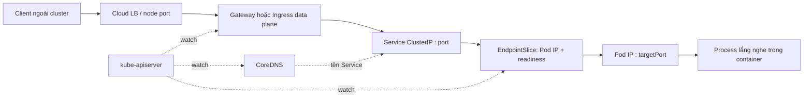
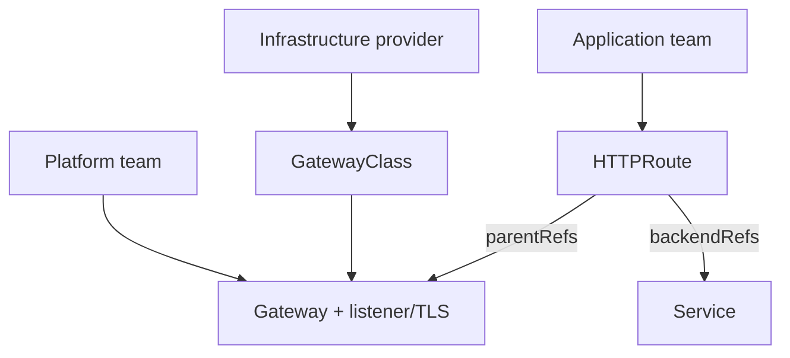

# 04 — Networking, Service, DNS, Ingress và Gateway API

## Mô hình mạng Kubernetes

Mặc định về mặt khái niệm:

- Mỗi Pod có IP riêng trong cluster; container cùng Pod nói chuyện qua `localhost`.
- Pod có thể giao tiếp trực tiếp với Pod khác không cần NAT, trừ khi policy cố ý giới hạn.
- IP Pod ngắn hạn; Service tạo endpoint logic ổn định trước một tập Pod thay đổi.
- CNI cài đặt Pod network; data plane Service có thể do kube-proxy hoặc implementation khác cung cấp.

Đây là mô hình API, không bắt buộc một công nghệ data plane cụ thể. Overlay/underlay, iptables/IPVS/eBPF và cloud route là chi tiết của CNI/platform.

Nguồn: [Services, Load Balancing, and Networking](https://kubernetes.io/docs/concepts/services-networking/).

## Luồng request cần vẽ được



Khi debug, kiểm tra từng cạnh thay vì “restart network”.

## Service và EndpointSlice

Service selector khớp label Pod; control plane tạo/cập nhật EndpointSlice. Chỉ Pod phù hợp và ready thường được dùng làm serving endpoint.

```yaml
apiVersion: v1
kind: Service
metadata:
  name: sample-api
  namespace: deep-k8s
spec:
  selector:
    app.kubernetes.io/name: sample-api
  ports:
    - name: http
      port: 80          # cổng ổn định của Service
      targetPort: http  # named containerPort, giảm lỗi khi đổi số cổng
```

### Chọn Service type

| Type | Khi dùng | Rủi ro/lưu ý |
|---|---|---|
| `ClusterIP` | Kết nối nội bộ; mặc định | Chỉ routable trong cluster/network tích hợp |
| Headless (`clusterIP: None`) | Client cần thấy từng endpoint, StatefulSet discovery | Client phải tự load-balance/failover đúng |
| `NodePort` | Building block/bare-metal lab, expose cổng mọi node | Quản lý port/firewall, không giàu routing L7 |
| `LoadBalancer` | Cloud/provider cấp LB cho một Service | Chi phí mỗi LB, behavior phụ thuộc provider |
| `ExternalName` | DNS CNAME tới tên ngoài cluster | Không proxy; HTTP Host/TLS/SNI có thể không khớp |

Service không tự retry request, không bảo đảm sticky state và không thay API gateway. `sessionAffinity: ClientIP` có giới hạn; ứng dụng nên stateless nếu có thể.

```powershell
kubectl get service sample-api -n deep-k8s -o yaml
kubectl get endpointslices -n deep-k8s -l kubernetes.io/service-name=sample-api -o wide
kubectl port-forward service/sample-api 8080:80 -n deep-k8s
```

Nguồn: [Service](https://kubernetes.io/docs/concepts/services-networking/service/).

## DNS service discovery

Service `sample-api` trong namespace `deep-k8s` có tên chuẩn:

```text
sample-api.deep-k8s.svc.cluster.local
```

Suffix cluster có thể khác. Pod cùng namespace thường gọi `sample-api`; namespace khác gọi `sample-api.deep-k8s`. Resolver search list và `ndots` có thể tạo nhiều query trước khi thử tên absolute; với external FQDN nhạy latency có thể thêm dấu chấm cuối nếu phù hợp.

Debug từ ephemeral Pod:

```powershell
kubectl run net-debug --rm -it --restart=Never -n deep-k8s --image=registry.k8s.io/e2e-test-images/agnhost:2.53 -- /bin/sh
# trong Pod: cat /etc/resolv.conf; nslookup sample-api; wget -qO- http://sample-api/
```

Nếu image tag trên không có cho kiến trúc của bạn, dùng version tương thích từ Kubernetes test images hoặc ephemeral debug image đã được tổ chức phê duyệt. Production image không nên chứa tool debug chỉ vì tiện.

Nguồn: [DNS for Services and Pods](https://kubernetes.io/docs/concepts/services-networking/dns-pod-service/).

## Ingress và Gateway API

### Ingress

Ingress là API HTTP/HTTPS routing, nhưng **Ingress resource không làm gì nếu không có Ingress controller**. Annotation và tính năng nâng cao phụ thuộc controller. Ingress API stable nhưng đã frozen; Kubernetes khuyến nghị Gateway cho phát triển mới, dù Ingress không có kế hoạch bị loại bỏ.

Sample: [networking/ingress.yaml](../../CodeSample/kubernetes/networking/ingress.yaml).

### Gateway API

Gateway API là họ CRD cài thêm, tách vai trò:



- `GatewayClass`: implementation/controller.
- `Gateway`: listener, address, TLS, policy attach point do platform quản lý.
- `HTTPRoute`/`GRPCRoute`/các route khác: rule do app team quản lý.
- `ReferenceGrant`: cho phép tham chiếu chéo namespace một cách rõ ràng.

Chọn Gateway khi cần role separation, portable routing model, header/weight/traffic policy giàu hơn và controller hỗ trợ. Không apply [gateway-api.yaml](../../CodeSample/kubernetes/networking/gateway-api.yaml) trước khi cài Gateway API CRDs/controller và thay `gatewayClassName` phù hợp.

Nguồn: [Ingress](https://kubernetes.io/docs/concepts/services-networking/ingress/) và [Gateway API](https://kubernetes.io/docs/concepts/services-networking/gateway/).

## TLS ở đâu?

Các lựa chọn:

- TLS terminate tại edge Gateway/Ingress: vận hành certificate tập trung; traffic trong cluster plaintext trừ khi mã hóa tiếp.
- Re-encrypt tới backend: bảo vệ hop nội bộ nhưng tăng certificate/config/CPU.
- Pass-through: app sở hữu TLS; mất một số L7 routing/observability ở gateway.
- mTLS service-to-service: xác thực hai chiều, thường cần app/library/mesh; không mặc định từ Kubernetes.

Xác định trust boundary, certificate owner, rotation, SNI/hostname và nơi có thể đọc plaintext. “Có HTTPS ngoài cluster” không đồng nghĩa mọi hop được mã hóa.

## NetworkPolicy

NetworkPolicy là allow-list L3/L4, additive. Không policy chọn Pod ⇒ mặc định allow. Khi một Pod bị isolate cho ingress/egress, traffic chỉ được phép nếu tổng các policy allow; policy không có rule deny ưu tiên.

Điều kiện bắt buộc: CNI phải thực thi NetworkPolicy. Object có thể được API chấp nhận nhưng không có hiệu lực nếu plugin không hỗ trợ.

Chiến lược:

1. Default deny ingress + egress.
2. Allow DNS egress rõ ràng.
3. Allow đúng caller → destination port.
4. Allow external dependency theo khả năng CNI/policy; IP allow-list cho dịch vụ động có trade-off.
5. Test cả positive lẫn negative; quan sát policy drops nếu CNI cung cấp.

Selector gotcha:

```yaml
from:
  - namespaceSelector:
      matchLabels:
        kubernetes.io/metadata.name: frontend
    podSelector:
      matchLabels:
        app: web
```

Trong cùng một item, namespace **AND** pod selector. Hai item `- namespaceSelector` và `- podSelector` là **OR** và rộng hơn nhiều.

Sample: [networking/network-policies.yaml](../../CodeSample/kubernetes/networking/network-policies.yaml). Nguồn: [Network Policies](https://kubernetes.io/docs/concepts/services-networking/network-policies/).

## Debug theo tầng

| Tầng | Câu hỏi | Lệnh/bằng chứng |
|---|---|---|
| App | Process có listen đúng `0.0.0.0:8080`? | log, `kubectl exec`/ephemeral debug |
| Pod | Pod IP trực tiếp có trả lời? Ready? | `get pod -o wide`, probe status |
| Endpoint | Service selector có endpoint đúng port? | `get endpointslice -l kubernetes.io/service-name=...` |
| Service | `port`/`targetPort`/protocol đúng? | `get svc -o yaml` |
| DNS | tên resolve đúng IP? search domain? | `nslookup`, `/etc/resolv.conf`, CoreDNS logs |
| Policy | ingress và egress hai phía được allow? | NetworkPolicy selectors, CNI observability |
| Edge | controller có nhận route? address/condition? | status/Events/log controller |
| TLS | cert, SNI, chain, expiry đúng? | client TLS diagnostics/controller status |

## Lab

```powershell
kubectl apply -k CodeSample/kubernetes/overlays/dev
kubectl get svc,endpointslice,pod -n deep-k8s -o wide
kubectl port-forward svc/sample-api -n deep-k8s 8080:80
curl.exe http://localhost:8080/
```

Inject lỗi selector:

```powershell
kubectl patch svc sample-api -n deep-k8s --type merge -p '{"spec":{"selector":{"app.kubernetes.io/name":"does-not-exist"}}}'
kubectl get endpointslices -n deep-k8s -l kubernetes.io/service-name=sample-api
kubectl apply -k CodeSample/kubernetes/overlays/dev
```

Kết luận bằng EndpointSlice, không chỉ bằng “curl timeout”.

## Câu hỏi tự kiểm tra

1. Service chọn Deployment hay chọn Pod? Field nào quyết định?
2. Ingress resource, Ingress controller và external load balancer khác nhau thế nào?
3. Vì sao NetworkPolicy default-deny egress thường làm DNS hỏng?
4. Gateway API tách ownership platform/app ra sao?
5. Service có endpoint nhưng vẫn timeout: liệt kê ít nhất năm giả thuyết theo tầng.
