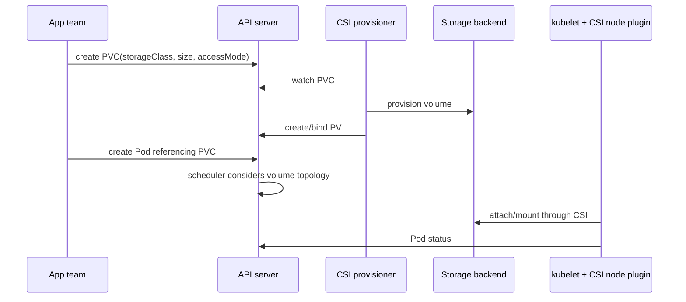
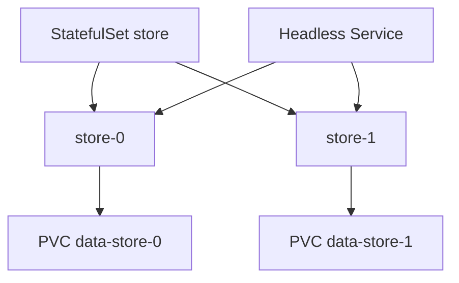

# 05 — Storage, PV/PVC/CSI và workload có trạng thái

## Bắt đầu từ semantics dữ liệu

Trước YAML, trả lời:

- Dữ liệu có mất được không? RPO/RTO là bao nhiêu?
- Một hay nhiều Pod cần ghi? Cùng node, cùng zone hay đa zone?
- Filesystem hay raw block? Latency/IOPS/throughput/dung lượng?
- Ai backup, restore, encrypt, rotate key, expand và xóa?
- Ứng dụng có replication/quorum/application-consistent snapshot không?

Kubernetes cung cấp orchestration và abstraction; không tự biến một volume thành database HA.

## Các loại volume

| Loại | Vòng đời | Khi dùng |
|---|---|---|
| image/container writable layer | Theo container | Không lưu dữ liệu cần giữ |
| `emptyDir` | Theo Pod; giữ qua container restart, mất khi Pod bị xóa/rời node | scratch, cache, chia sẻ giữa containers; có thể tính ephemeral storage |
| projected/config/secret | Theo nguồn API và Pod | Cấu hình/credential read-only |
| generic ephemeral volume | Theo Pod nhưng provision qua PVC/CSI | Scratch cần storage class/size/topology |
| PVC/PV | Độc lập với Pod tùy reclaim | Dữ liệu cần giữ qua Pod replacement |
| `hostPath` | File trên một node | Chỉ lab/node agent đặc biệt; không portable, rủi ro bảo mật |

## Từ PVC đến disk



- `PersistentVolume` (PV): cluster-scoped representation của storage.
- `PersistentVolumeClaim` (PVC): namespaced request by workload/team.
- `StorageClass`: provisioner, parameters, reclaim policy, binding mode và expansion policy.
- CSI controller/node components thực hiện provision/attach/mount/snapshot tùy driver.

Nguồn: [Persistent Volumes](https://kubernetes.io/docs/concepts/storage/persistent-volumes/) và [Storage Classes](https://kubernetes.io/docs/concepts/storage/storage-classes/).

## Access mode và topology

- `ReadWriteOnce` (RWO): volume có thể mount read-write bởi node; không có nghĩa “chỉ một Pod” trong mọi trường hợp.
- `ReadOnlyMany` (ROX): nhiều node read-only nếu driver hỗ trợ.
- `ReadWriteMany` (RWX): nhiều node read-write nếu driver/backend hỗ trợ.
- `ReadWriteOncePod` (RWOP): ràng buộc read-write một Pod, cần CSI/phiên bản hỗ trợ.

Access mode dùng cho matching/capability, không phải mọi trường hợp đều thực thi permission bên trong filesystem. Kiểm tra driver.

`volumeBindingMode: WaitForFirstConsumer` trì hoãn provision/bind cho tới khi scheduler biết topology của Pod, tránh tạo disk ở zone A trong khi Pod buộc ở zone B. Tránh `nodeName` vì bypass scheduler và có thể để PVC Pending.

## Reclaim, expansion và xóa dữ liệu

- `Delete`: xóa PVC/PV có thể xóa volume backend; phù hợp dữ liệu tái tạo được, nhưng cần guardrail.
- `Retain`: giữ backend sau khi release; cần quy trình reclaim thủ công và chống rò dữ liệu.
- Expansion: StorageClass phải `allowVolumeExpansion`; chỉ tăng, không shrink; filesystem có thể cần Pod mount/restart tùy driver.
- Finalizer bảo vệ thứ tự xóa; không gỡ finalizer khi chưa hiểu trạng thái backend.

Production nên bật backup độc lập; reclaim `Retain` không phải backup.

## StatefulSet với PVC

`volumeClaimTemplates` tạo một PVC cho mỗi ordinal. Khi Pod `db-0` được thay, nó dùng lại PVC tương ứng. Xóa/scale StatefulSet có semantics PVC riêng theo retention policy/phiên bản; luôn kiểm tra trước khi xóa.

Sample lab [storage/statefulset.yaml](../../CodeSample/kubernetes/storage/statefulset.yaml) dùng PVC và HTTP file server đơn giản để quan sát identity, **không phải database production**.



## Snapshot, backup và DR

VolumeSnapshot API chỉ làm việc với CSI driver có snapshot support và các snapshot objects là CRD/cần controller. Snapshot storage-level có thể crash-consistent, chưa chắc application-consistent.

Một kế hoạch backup hợp lệ gồm:

1. Quiesce/database-native dump hoặc operator workflow phù hợp.
2. Dữ liệu + Kubernetes manifests/CRD + encryption keys/config cần thiết.
3. Bản sao ở failure domain/account/region khác theo threat model.
4. Retention, immutability, access control và audit.
5. Restore test định kỳ đo RPO/RTO; checksum/business validation sau restore.

Replica không phải backup: xóa nhầm/ransomware/corruption có thể replicate ngay. Snapshot cùng account/region không đủ cho mọi thảm họa.

Nguồn: [Volume Snapshots](https://kubernetes.io/docs/concepts/storage/volume-snapshots/).

## Failure modes thường gặp

| Hiện tượng | Kiểm tra |
|---|---|
| PVC `Pending` | default/đúng StorageClass, provisioner logs, quota, access mode, topology |
| Pod `Pending` với PVC bound | volume node affinity/zone, attachment limit, scheduling constraints |
| `ContainerCreating` lâu | Events `FailedMount`/`FailedAttachVolume`, CSI node/plugin, secret/permission |
| Multi-attach error | RWO volume còn attach node cũ, fencing/force detach rủi ro split-brain |
| Permission denied | `runAsUser`, `fsGroup`, driver/fs ownership, root-squash |
| Đầy disk | PVC capacity, filesystem inode, app compaction, expansion và alert |
| Xóa PVC không xong | finalizer, controller/backend status; không force tùy tiện |

```powershell
kubectl get pvc,pv -A
kubectl describe pvc <claim> -n <ns>
kubectl get storageclass
kubectl get volumeattachments.storage.k8s.io
kubectl get events -n <ns> --sort-by='.metadata.creationTimestamp'
```

## Lab local

Kiểm tra kind cluster có default StorageClass; kind mặc định có thể không cung cấp dynamic provisioner như managed cloud. Sample dùng static `hostPath` PV chỉ để học binding trên single-node target, không dùng production.

```powershell
kubectl apply -f CodeSample/kubernetes/storage/local-pv-pvc.yaml
# Bootstrap directory chỉ cho kind lab; manifest này cố ý dùng hostPath/root trong namespace baseline.
kubectl apply -f CodeSample/kubernetes/storage/prepare-local-volume.yaml
kubectl wait --for=jsonpath='{.status.phase}'=Succeeded pod/prepare-local-volume -n storage-lab --timeout=60s
kubectl get pv
kubectl get pvc -n storage-lab
kubectl apply -f CodeSample/kubernetes/storage/pvc-consumer.yaml
kubectl exec -n storage-lab pvc-consumer -- cat /data/history
kubectl delete pod pvc-consumer -n storage-lab
kubectl apply -f CodeSample/kubernetes/storage/pvc-consumer.yaml
kubectl exec -n storage-lab pvc-consumer -- cat /data/history
```

Trước cleanup, đọc `persistentVolumeReclaimPolicy`. Sample là dữ liệu lab có thể xóa; production phải có xác nhận/backup.

## Khi nào giữ database ngoài cluster?

Ưu tiên managed database khi team chưa có năng lực operator/on-call/storage/backup, hoặc cần SLA/cloud integration cao. Chạy trong cluster hợp khi có yêu cầu portability/on-prem, operator trưởng thành, đội sở hữu data plane và đã test failure/upgrade/restore. So sánh theo failure domain, operational burden, compliance, latency, cost và exit plan, không theo xu hướng.

## Câu hỏi tự kiểm tra

1. PVC khác PV và StorageClass ở ownership/vòng đời nào?
2. RWO có luôn ngăn hai Pod ghi cùng volume không?
3. Vì sao `WaitForFirstConsumer` quan trọng với multi-zone?
4. Xóa StatefulSet có chắc xóa PVC không? Bạn kiểm tra ở đâu?
5. Chứng minh một snapshot có thể restore và app-consistent bằng cách nào?
