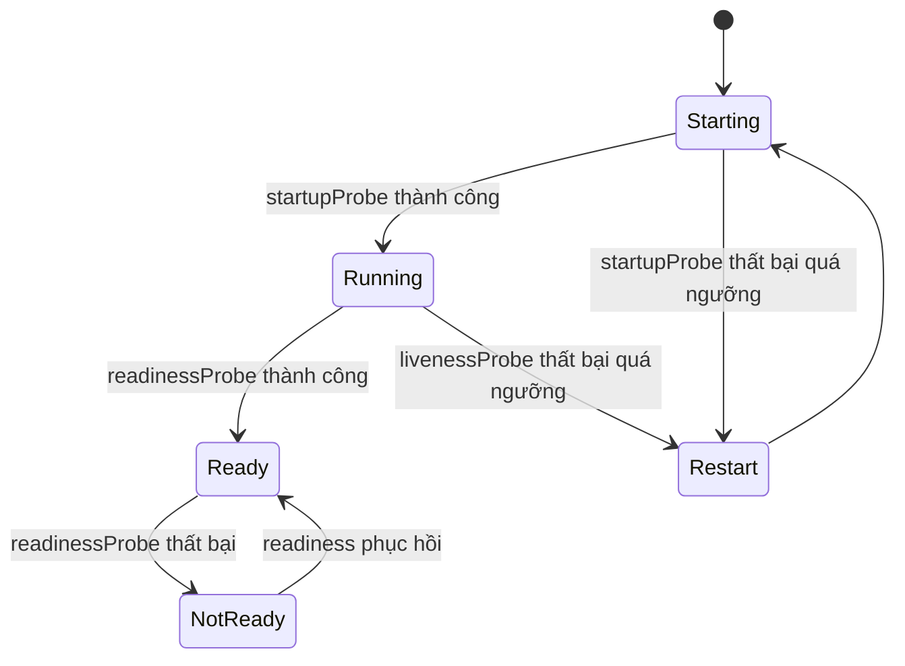

# 06 — ConfigMap, Secret, probes và lifecycle hooks

## Tách image khỏi runtime configuration

Image nên immutable; cùng digest đi qua các môi trường, khác nhau bằng config được kiểm soát. Phân loại:

- ConfigMap: cấu hình không bí mật như feature flag, endpoint, log level.
- Secret: credential/token/key cần bảo mật.
- Downward API: metadata Pod như name, namespace, labels, resource requests.
- ServiceAccount projected token: danh tính workload khi gọi API; không dùng secret token dài hạn nếu không cần.

Nguồn: [ConfigMaps](https://kubernetes.io/docs/concepts/configuration/configmap/) và [Secrets](https://kubernetes.io/docs/concepts/configuration/secret/).

## Env var hay mounted file?

| Cách | Ưu | Nhược/semantics update |
|---|---|---|
| `env`/`envFrom` | App đơn giản, snapshot rõ lúc start | Không cập nhật trong process; cần rollout/restart |
| Volume projection | Kubelet cập nhật file eventual; hợp hot reload | App phải watch/reload an toàn; `subPath` không nhận update tự động |
| CSI/external provider | Secret không nhất thiết persist như core Secret, tích hợp KMS/vault | Thêm controller/provider, failure mode/rotation riêng |

Config thay mà Pod template không đổi thì Deployment không tự rollout. Pattern phổ biến: generator thêm hash vào tên hoặc checksum annotation trong Pod template. Không để hai version app đọc schema config không tương thích trong rolling update; config phải backward-compatible.

Sample Kustomize generator ở [base/kustomization.yaml](../../CodeSample/kubernetes/base/kustomization.yaml) và giá trị ghi đè ở [overlays/dev/kustomization.yaml](../../CodeSample/kubernetes/overlays/dev/kustomization.yaml).

## Secret không mặc định là “vault”

- `data` chỉ base64 encode, không mã hóa.
- Secret mặc định có thể được lưu unencrypted trong etcd nếu cluster chưa bật encryption at rest.
- Người có quyền tạo Pod trong namespace thường có thể mount và đọc Secret dù không có verb `get secret` trực tiếp.
- Env var có thể lọt vào crash dump/debug output; file có permission/rotation semantics khác nhưng app vẫn phải bảo vệ sau khi đọc.

Checklist:

1. Không commit Secret plaintext/base64; sample chỉ dùng placeholder vô hại.
2. Encrypt at rest với provider/KMS và có kế hoạch rotate key.
3. RBAC least privilege; hạn chế `list`/`watch` Secret.
4. Mỗi workload chỉ mount secret nó cần, vào đúng container.
5. External secret store khi threat model yêu cầu; theo dõi sync/expiry/failure.
6. Short-lived credential và workload identity nếu nền tảng hỗ trợ.
7. Redact log, tracing, command line, Helm dry-run và support bundle.

Nguồn: [Good practices for Kubernetes Secrets](https://kubernetes.io/docs/concepts/security/secrets-good-practices/).

## Ba probe, ba câu hỏi khác nhau



- `startupProbe`: app đã hoàn tất khởi động chưa? Khi có, liveness/readiness chờ nó pass.
- `readinessProbe`: có nên nhận traffic mới lúc này không? Fail thì remove khỏi Service endpoints, không restart.
- `livenessProbe`: process có mắc kẹt và restart là cách phục hồi đúng không? Fail thì kubelet restart container.

### Thiết kế endpoint

- Liveness chỉ kiểm tra health nội tại có thể chữa bằng restart; không phụ thuộc database/DNS bên ngoài. Nếu DB down mà mọi replica tự restart, bạn tạo restart storm.
- Readiness có thể phản ánh dependency bắt buộc, nhưng cân nhắc fail toàn bộ fleet khiến không có endpoint và che degradation. Dùng circuit breaker/degraded mode khi phù hợp.
- Startup budget = `failureThreshold × periodSeconds`; đặt theo worst-case có đo.
- `timeoutSeconds`, thresholds và period phải dựa trên SLO/latency; probe quá dày gây tải.
- HTTP/gRPC/TCP/exec kiểm tra mức khác nhau. TCP connect thành công chưa chứng minh app logic healthy.
- Probe đi từ kubelet tới Pod; bind app vào loopback-only có thể làm probe fail.

Kubernetes xác định Pod readiness fail thì không nhận traffic qua Service, còn liveness/startup fail quá ngưỡng kích hoạt restart; xem [official probe guide](https://kubernetes.io/docs/tasks/configure-pod-container/configure-liveness-readiness-startup-probes/).

## Container lifecycle hooks và signals

- `postStart`: chạy gần lúc container start nhưng không có guarantee chạy trước ENTRYPOINT; không dùng cho ordering quan trọng.
- `preStop`: chạy trước signal dừng, thời gian tính trong termination grace; hook treo ăn hết budget.
- App phải xử lý signal ở PID 1, ngừng nhận việc mới, drain và thoát trước grace period.
- Không dùng hook để thay một workflow durable; hook có semantics failure/retry hạn chế.

Sample app [app/main.go](../../CodeSample/kubernetes/app/main.go) xử lý `SIGTERM` và có probe endpoints.

## Lab 1: quan sát config snapshot

```powershell
kubectl apply -k CodeSample/kubernetes/overlays/dev
kubectl get configmap -n deep-k8s
kubectl exec deploy/sample-api -n deep-k8s -- printenv APP_MESSAGE
```

Image distroless của sample không có shell/`printenv`, nên lệnh trên dự kiến thất bại — đây là security trade-off đúng. Quan sát config qua `GET /` hoặc `kubectl get deploy -o yaml`; khi cần shell, dùng ephemeral debug container được phê duyệt thay vì thêm shell vào production image.

Sửa literal `APP_MESSAGE` trong overlay, chạy `kubectl diff -k`, apply và quan sát tên ConfigMap hash + rollout.

## Lab 2: readiness khác liveness

```powershell
kubectl port-forward svc/sample-api -n deep-k8s 8080:80
curl.exe -i http://localhost:8080/readyz
curl.exe -i http://localhost:8080/livez
```

Patch readiness sang path sai và quan sát Pod Running nhưng `READY 0/1`, EndpointSlice không còn serving endpoint; restart count không tăng. Sau đó patch liveness sai và quan sát restart count. Cuối lab apply lại overlay.

## Anti-patterns

- Cùng endpoint kiểm tra sâu mọi dependency cho cả liveness/readiness.
- `initialDelaySeconds: 300` thay startupProbe, làm phát hiện deadlock chậm vĩnh viễn.
- Mount ConfigMap bằng `subPath` rồi kỳ vọng hot reload.
- Đổi ConfigMap nhưng không rollout/reload app.
- Secret base64 trong Git và gọi đó là mã hóa.
- Một Secret lớn dùng chung cả namespace; blast radius cao.
- Log toàn bộ environment khi startup.

## Câu hỏi tự kiểm tra

1. Khi ConfigMap env var đổi, process đang chạy thấy giá trị mới không?
2. Vì sao liveness phụ thuộc database là nguy hiểm?
3. Readiness fail ảnh hưởng Service endpoints và container restart thế nào?
4. Quyền create Pod có liên quan gì đến Secret exfiltration?
5. `subPath` thay đổi update semantics ra sao?
