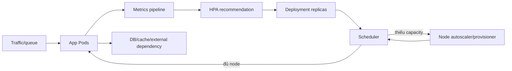

# 07 — Autoscaling, resilience và capacity

## Scale không tạo ra kiến trúc chịu tải

Autoscaling là control loop có độ trễ. Nó cần metric phản ánh nhu cầu, capacity để schedule, ứng dụng scale ngang được, dependency chịu tải và policy tránh dao động. HPA không sửa memory leak, slow query, lock contention hay database bottleneck.



## Horizontal Pod Autoscaler

Mô hình đơn giản:

```text
desiredReplicas = ceil(currentReplicas × currentMetric / desiredMetric)
```

Controller còn xét tolerance, missing metrics, Pod readiness, stabilization và policies. Với nhiều metrics, nó tính từng metric và thường chọn recommendation lớn nhất; lỗi metric có thể chặn scale-down để thận trọng.

### Chọn metric

| Metric | Hợp khi | Sai lệch thường gặp |
|---|---|---|
| CPU utilization | CPU tỷ lệ với throughput | Request sai làm phần trăm vô nghĩa; I/O-bound không phản ánh tải |
| Memory | Working set tăng theo load và giảm khi scale | Cache/leak không giảm khi thêm replica |
| Requests/second | Service đồng đều, request cost gần nhau | Request nặng/nhẹ khác nhau |
| In-flight/concurrency | Latency gắn với concurrent work | Cần metric tin cậy theo Pod |
| Queue depth/lag | Async consumer | Scale-up/bootstrap delay, poison messages, partition limit |
| External business metric | Demand ngoài cluster | Cardinality, delay, outage metrics adapter |

CPU utilization cần CPU request cho containers liên quan. Metrics Server cung cấp `metrics.k8s.io` và là add-on, không tự có trong core cluster. Custom/external metric cần adapter.

Nguồn: [Horizontal Pod Autoscaling](https://kubernetes.io/docs/concepts/workloads/autoscaling/horizontal-pod-autoscale/) và [Autoscaling Workloads](https://kubernetes.io/docs/concepts/workloads/autoscaling/).

## HPA behavior

Sample [autoscaling/hpa.yaml](../../CodeSample/kubernetes/autoscaling/hpa.yaml) dùng `autoscaling/v2`:

- `minReplicas` phải đủ baseline/SLO và tolerate failure.
- `maxReplicas` bảo vệ downstream/cost nhưng cũng là giới hạn capacity; alert khi chạm max.
- scale-up nhanh theo burst; scale-down có stabilization để tránh flapping.
- Đừng vừa để Git/Kustomize liên tục ghi `spec.replicas` vừa để HPA sở hữu field đó. Production overlay không khai báo replicas khi HPA quản lý, hoặc GitOps ignore field theo tool.
- Startup/readiness cần tránh metric spike/warm-up làm feedback loop xấu.

## VPA và node autoscaling

- VPA khuyến nghị/điều chỉnh requests, đôi khi cần evict/recreate Pod tùy mode/khả năng in-place và phiên bản.
- HPA theo CPU utilization và VPA cùng sửa CPU request có thể tương tác: request đổi làm utilization ratio đổi. Tách metric hoặc ownership.
- Node autoscaling thêm/bớt node dựa trên unschedulable Pods và policy/provider, không trực tiếp nhìn traffic.
- DaemonSet overhead, system reserved, volume topology, taint/affinity, quota và cloud quota đều ảnh hưởng capacity.
- Scale-down là voluntary disruption; PDB, local storage, do-not-evict annotations/policy và long termination có thể chặn.

Không có một Node Autoscaler API duy nhất bảo đảm giống nhau trên mọi platform; đọc tài liệu distribution/provider.

## Capacity và resilience

### Minimum viable availability

- Ít nhất 2+ replicas nếu SLO cần sống qua một Pod failure; 3+ để vừa disruption vừa giữ redundancy tốt hơn.
- Spread qua hostname/zone và đủ capacity ở mỗi failure domain.
- PDB cho maintenance, rolling strategy cho app update.
- Request đủ đúng để scheduler và node scaling có tín hiệu.
- Readiness bảo đảm traffic chỉ vào instance sẵn sàng.
- Graceful shutdown để request không rơi khi scale-down.
- Load test cả scale-up latency và downstream saturation.

### Headroom

Nếu node chỉ được tạo sau khi burst bắt đầu, tổng thời gian = metric delay + HPA sync + Pod scheduling + image pull + startup + readiness; nếu thiếu node cộng thời gian provision/join. Với SLO nghiêm, cần baseline replicas, overprovisioning hoặc predictive/scheduled scaling.

## PDB, HPA và rollout tương tác

- HPA đổi desired replicas; PDB phần trăm được làm tròn theo semantics API.
- Deployment rollout không bị PDB chặn theo cách drain bị chặn; dùng `maxUnavailable`/`maxSurge`.
- PDB quá chặt có thể chặn node drain/upgrade/autoscaler scale-down.
- HPA scale-down gọi workload scale, không phải Eviction API nên PDB không phải giới hạn chung cho scale-down ứng dụng.

Sample [autoscaling/pdb.yaml](../../CodeSample/kubernetes/autoscaling/pdb.yaml).

## Lab HPA local

### 1. Kiểm tra metrics API

```powershell
kubectl get apiservice v1beta1.metrics.k8s.io
kubectl top pods -n deep-k8s
```

Nếu không có, cài Metrics Server từ [repository chính thức](https://github.com/kubernetes-sigs/metrics-server) theo release tương thích cluster. Kind dùng certificate node không luôn hợp production trust; nếu phải dùng option insecure cho lab, ghi rõ đó chỉ là local và không copy sang production.

### 2. Apply và tạo tải

```powershell
kubectl apply -k CodeSample/kubernetes/overlays/dev
kubectl apply -f CodeSample/kubernetes/autoscaling/hpa.yaml
kubectl get hpa -n deep-k8s --watch
```

Tạo Pod load tạm bằng debug image được phê duyệt rồi lặp HTTP tới Service. Quan sát metric, desired/current replicas, Pending Pod và node capacity. Không kỳ vọng tăng ngay; ghi timeline từng control loop.

### 3. Failure drill

- Đặt CPU request cao gấp 10 và dự đoán HPA utilization thay đổi dù usage giống nhau.
- Đặt `maxReplicas: 2`, tăng tải và quan sát SLO/metric khi chạm trần.
- Làm readiness fail lúc scale-up; quan sát HPA xử lý not-yet-ready Pods.
- Sau lab, xóa HPA trước khi overlay dev tiếp tục quản lý replicas.

## Anti-patterns

- Scale CPU nhưng không có requests.
- HPA và pipeline/GitOps tranh chấp replicas.
- `maxReplicas` rất cao trong khi database connection pool nhân theo Pod.
- Scale on queue depth nhưng mỗi Pod chỉ xử lý một partition cố định.
- `minReplicas: 1` cho service có HA SLO.
- Không alert HPA `ScalingLimited`, metrics missing, Pending replicas hoặc chạm quota.
- Load test chỉ steady-state, không đo cold start/scale-down.

## Câu hỏi tự kiểm tra

1. Usage 400m, request 200m và target 80% nghĩa là gì?
2. Tại sao tăng request có thể làm HPA scale xuống dù traffic không đổi?
3. Pod Pending vì thiếu node: HPA và node autoscaler mỗi cái chịu trách nhiệm gì?
4. PDB có ngăn HPA scale-down không?
5. Tổng latency scale-out gồm những giai đoạn nào và giảm bằng cách nào?
