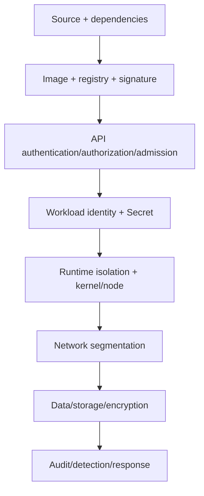

# 08 — Security, RBAC, Pod Security và policy

## Threat model theo lớp



Không có một checkbox “secure Kubernetes”. Giả định một lớp có thể bị vượt và giảm blast radius bằng defense in depth.

Nguồn nền: [Kubernetes Security](https://kubernetes.io/docs/concepts/security/) và [Application Security Checklist](https://kubernetes.io/docs/concepts/security/application-security-checklist/).

## API access: authentication → authorization → admission

- Authentication xác định identity: human thường qua OIDC/cert/exec credential; workload dùng ServiceAccount projected token.
- Authorization quyết định hành động; RBAC phổ biến nhưng không phải authentication.
- Admission kiểm tra/mutate object sau authorization trước persistence.
- Audit ghi lại request theo policy; khác application log.

Tránh certificate/token dài hạn chia sẻ. Kubeconfig là credential nhạy cảm; context nhầm có thể thay cluster production.

## RBAC mental model

| Object | Scope rule | Bind tới subject | Khi dùng |
|---|---|---|---|
| Role | Một namespace | RoleBinding cùng namespace | Quyền app/team trong namespace |
| ClusterRole | Cluster-wide rule definition | RoleBinding hoặc ClusterRoleBinding | Reuse rule hoặc resource cluster-scoped |
| RoleBinding | Một namespace | User/Group/ServiceAccount | Cấp Role/ClusterRole chỉ trong namespace |
| ClusterRoleBinding | Toàn cluster | User/Group/ServiceAccount | Chỉ cho nhiệm vụ thật sự cluster-wide |

RBAC permissions là additive, không có explicit deny. Verb API (`get`, `list`, `watch`, `create`, `update`, `patch`, `delete`) khác HTTP/app verb. Subresource như `pods/log`, `pods/exec`, `deployments/scale` cần xét riêng.

```powershell
kubectl auth can-i get pods -n deep-k8s
kubectl auth can-i --list -n deep-k8s
kubectl auth can-i list secrets -n deep-k8s --as=system:serviceaccount:deep-k8s:sample-api
kubectl auth can-i create pods/exec -n deep-k8s --as=<identity>
```

Least privilege:

- RoleBinding theo namespace thay ClusterRoleBinding nếu có thể.
- Không wildcard verb/resource; CRD mới có thể vô tình nằm trong wildcard.
- Không dùng `cluster-admin` thường ngày; tránh nhóm `system:masters`.
- Quyền tạo Pod/Deployment, exec, bind/escalate/impersonate, tạo RoleBinding hoặc đọc node proxy đều là escalation paths cần review.
- Audit quyền định kỳ và xóa binding orphaned.

Nguồn: [Using RBAC Authorization](https://kubernetes.io/docs/reference/access-authn-authz/rbac/) và [RBAC Good Practices](https://kubernetes.io/docs/concepts/security/rbac-good-practices/).

## ServiceAccount

- Mỗi workload có ServiceAccount riêng nếu cần API; không dùng `default` được cấp quyền rộng.
- Nếu không gọi Kubernetes API: `automountServiceAccountToken: false`.
- Projected token có audience/expiry và rotate; app/client phải đọc lại token thay vì cache mãi.
- Workload identity cloud ánh xạ SA tới cloud role giúp tránh static cloud keys, nhưng cấu hình phụ thuộc provider.

Sample [security/service-account-rbac.yaml](../../CodeSample/kubernetes/security/service-account-rbac.yaml) chỉ cho `get/list/watch` ConfigMap trong namespace, không đọc Secret.

## Workload hardening

Baseline phổ biến cho app Linux:

```yaml
spec:
  automountServiceAccountToken: false
  securityContext:
    runAsNonRoot: true
    seccompProfile:
      type: RuntimeDefault
  containers:
    - name: api
      securityContext:
        allowPrivilegeEscalation: false
        readOnlyRootFilesystem: true
        capabilities:
          drop: ["ALL"]
```

Thêm `runAsUser`/`runAsGroup`, `fsGroup` chỉ khi image/storage semantics cần. `readOnlyRootFilesystem` đòi mount writable cho `/tmp` hoặc data path. Tránh privileged, hostPID/IPC/network, hostPath và dangerous capabilities. Sandbox runtime tăng isolation nhưng có compatibility/performance trade-off.

Nguồn: [Security Context](https://kubernetes.io/docs/tasks/configure-pod-container/security-context/) và [Linux kernel security constraints](https://kubernetes.io/docs/concepts/security/linux-kernel-security-constraints/).

## Pod Security Standards/Admission

Profiles:

- `Privileged`: gần như không hạn chế, chỉ cho system workload được kiểm soát.
- `Baseline`: chặn privilege escalation phổ biến.
- `Restricted`: hardening theo best practices hiện hành.

Pod Security Admission áp theo label namespace với mode `enforce`, `audit`, `warn`. Migration an toàn: bật warn/audit, sửa workload, rồi enforce; pin policy version để upgrade cluster không bất ngờ đổi rule, và có kế hoạch nâng pin.

Namespace sample enforce Restricted. PodSecurityPolicy đã bị loại khỏi Kubernetes từ v1.25; không học manifest PSP cũ. Nguồn: [Pod Security Standards](https://kubernetes.io/docs/concepts/security/pod-security-standards/), [Pod Security Admission](https://kubernetes.io/docs/concepts/security/pod-security-admission/).

## Network, Secret và data

- Default-deny NetworkPolicy rồi allow tối thiểu; bảo đảm CNI enforce và vẫn allow DNS/monitoring cần thiết.
- Secret encrypt at rest, RBAC nhỏ, external KMS/store khi cần; base64 không bảo mật.
- Encrypt volume/backend, TLS/mTLS theo trust boundary; quản lý certificate expiry/rotation.
- Namespace là boundary tổ chức/authorization hữu ích nhưng không luôn là hard multi-tenancy boundary. Tenant thù địch có thể cần cluster/node/runtime isolation riêng.

## Supply chain và admission

- Pin production image bằng digest hoặc verify signed provenance ở admission.
- Tạo SBOM, scan dependency/image, patch base image, tối thiểu package/shell.
- Registry immutable, least privilege pull/push, retention và audit.
- Policy-as-code có thể yêu cầu resources, probes, trusted registries, no privileged, approved labels.
- ValidatingAdmissionPolicy dùng CEL cho rule phù hợp; webhook mạnh hơn nhưng nằm trên API critical path. Thiết kế timeout, `failurePolicy`, HA, version compatibility, scope và break-glass.
- Mutation ẩn dễ làm manifest render khác runtime; ưu tiên default rõ và quan sát được.

Nguồn: [Admission Controllers](https://kubernetes.io/docs/reference/access-authn-authz/admission-controllers/) và [Validating Admission Policy](https://kubernetes.io/docs/reference/access-authn-authz/validating-admission-policy/).

## Node/control plane hardening

- API server/etcd/kubelet không public ngoài đường quản trị cần thiết; TLS và authz đúng.
- Encrypt etcd, backup bảo vệ như production Secret, rotate certificates trước expiry.
- Node OS tối thiểu, patch, audit, isolate privileged system workload; restrict metadata service/cloud credentials.
- NodeRestriction và trusted labels cho placement nhạy cảm.
- Audit log gửi ra storage bảo vệ; alert hành vi đọc Secret hàng loạt, exec vào Pod, RBAC change, anonymous access.
- Có break-glass credential offline, phê duyệt, time-bound và hậu kiểm.

## Lab

### 1. RBAC negative test

```powershell
kubectl apply -f CodeSample/kubernetes/security/service-account-rbac.yaml
kubectl auth can-i get configmaps -n deep-k8s --as=system:serviceaccount:deep-k8s:config-reader
kubectl auth can-i get secrets -n deep-k8s --as=system:serviceaccount:deep-k8s:config-reader
kubectl auth can-i create deployments -n deep-k8s --as=system:serviceaccount:deep-k8s:config-reader
```

Kết quả mong đợi: `yes`, `no`, `no`. Một security test phải chứng minh hành vi bị cấm, không chỉ happy path.

### 2. Pod Security

Namespace `deep-k8s` enforce Restricted. Apply [security/insecure-pod.yaml](../../CodeSample/kubernetes/security/insecure-pod.yaml) và đọc admission error. File cố ý không hợp lệ về policy; không “sửa” namespace sang privileged để chạy nó.

### 3. Security context

```powershell
kubectl apply -k CodeSample/kubernetes/overlays/dev
kubectl get deploy sample-api -n deep-k8s -o jsonpath='{.spec.template.spec.securityContext}'
kubectl get deploy sample-api -n deep-k8s -o jsonpath='{.spec.template.spec.containers[0].securityContext}'
```

Giải thích mỗi field chặn threat nào và compatibility trade-off gì.

## Câu hỏi tự kiểm tra

1. RoleBinding có thể bind ClusterRole nhưng quyền có scope nào?
2. Vì sao quyền create Pod có thể dẫn tới đọc Secret?
3. `runAsNonRoot` khác `allowPrivilegeEscalation: false` thế nào?
4. NetworkPolicy object tồn tại nhưng traffic vẫn thông: giả thuyết đầu tiên là gì?
5. Khi admission webhook down nên fail-open hay fail-closed? Quyết định theo loại policy và availability ra sao?
