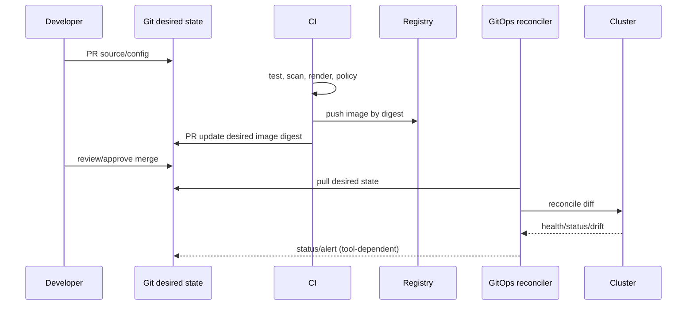
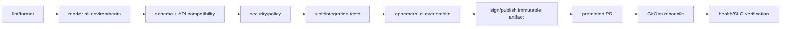

# 09 — Kustomize, Helm, CI/CD và GitOps

## Mục tiêu của packaging

Packaging không chỉ làm YAML ngắn hơn. Nó phải tạo ra manifest:

- deterministic và review được;
- khác môi trường ở đúng chỗ, không copy-paste drift;
- validate được trước khi apply;
- có provenance/version và rollback path;
- không làm lộ Secret;
- tương thích API của cluster đích.

## Raw YAML, Kustomize hay Helm?

| Công cụ | Phù hợp | Điểm mạnh | Rủi ro |
|---|---|---|---|
| Raw YAML | App nhỏ, rất ít biến thể | Rõ, ít abstraction | Copy-paste giữa môi trường |
| Kustomize | Base chung + overlay nội bộ | Patch object thật, tích hợp `kubectl -k` | Patch khó đọc nếu layering sâu |
| Helm | Sản phẩm/chart tái sử dụng, nhiều tùy chọn/release lifecycle | Template, values, package/dependency/release | Tạo “ngôn ngữ lập trình YAML”, render khác dự đoán |
| Operator | Domain lifecycle liên tục, state machine phức tạp | Reconcile nghiệp vụ sau install | Chi phí code/controller/API/upgrade lớn |

Có thể dùng Helm để package và Kustomize/post-render cho policy nhỏ, nhưng mỗi lớp làm debug khó hơn. Chọn ít abstraction nhất vẫn giải quyết reuse/ownership.

## Kustomize

Base chứa invariant; overlay chỉ khác biệt môi trường.

```text
base/
  deployment.yaml
  service.yaml
  kustomization.yaml
overlays/
  dev/kustomization.yaml
  prod/kustomization.yaml
```

```powershell
kubectl kustomize CodeSample/kubernetes/overlays/dev
kubectl diff -k CodeSample/kubernetes/overlays/dev
kubectl apply -k CodeSample/kubernetes/overlays/dev
```

Quy tắc:

- Không dùng overlay như patch stack 10 tầng; reviewer phải thấy kết quả.
- `configMapGenerator` hash tên giúp rollout khi config đổi.
- `secretGenerator` không làm dữ liệu an toàn để commit; dùng encrypted/external secret workflow.
- Dùng label chuẩn nhưng không vô tình sửa immutable selectors.
- Render từng overlay trong CI và validate output, không chỉ lint input.

Nguồn: [Declarative Management with Kustomize](https://kubernetes.io/docs/tasks/manage-kubernetes-objects/kustomization/).

## Helm chart

Chart mẫu: [CodeSample/kubernetes/chart/sample-api](../../CodeSample/kubernetes/chart/sample-api).

```powershell
helm lint CodeSample/kubernetes/chart/sample-api
helm template demo CodeSample/kubernetes/chart/sample-api --namespace deep-k8s --values CodeSample/kubernetes/chart/sample-api/values.yaml
helm upgrade --install demo CodeSample/kubernetes/chart/sample-api --namespace deep-k8s --create-namespace --wait --timeout 3m
helm test demo -n deep-k8s
helm history demo -n deep-k8s
helm rollback demo 1 -n deep-k8s
```

### Thiết kế values

- Chỉ expose knob người dùng thực sự cần; mỗi value có comment/schema.
- Quote string trong template; không quote integer/boolean field Kubernetes.
- Dùng `required`, defaults có chủ đích và `values.schema.json` để fail sớm.
- Không cho raw arbitrary YAML nếu không có threat model; value có thể gây YAML injection/privilege.
- Không hard-code namespace, release name, cluster version; dùng built-in objects đúng.
- Resource templates riêng file, label/name helper có prefix chart để tránh collision.

### Release và CRD

- `helm template` chỉ render; không chứng minh admission/controller/runtime thành công.
- Hook là resource có lifecycle riêng; migration hook phải idempotent, timeout/cleanup rõ. Hook thất bại có thể làm release rối.
- CRD trong `crds/` có install/upgrade/delete semantics đặc biệt; Helm không tự giải quyết schema/data migration. Tách lifecycle CRD/controller nếu rủi ro cao.
- `--dry-run` có thể in Secret; dùng môi trường log an toàn và tùy chọn hide-secret tương thích phiên bản Helm.
- Pin dependency/chart version và verify provenance/signature theo supply-chain policy.

Nguồn: [Helm Chart Template Guide](https://helm.sh/docs/chart_template_guide/), [Chart Best Practices](https://helm.sh/docs/chart_best_practices/) và [Helm commands](https://helm.sh/docs/helm/). Helm major có thể khác; kiểm tra docs đúng phiên bản CLI.

## GitOps

Bốn nguyên tắc OpenGitOps: desired state declarative, versioned/immutable, pulled automatically và continuously reconciled. Git không nhất thiết chứa Secret plaintext; “GitOps” cũng không chỉ là pipeline chạy `kubectl apply`.



Nguồn: [OpenGitOps Principles](https://opengitops.dev/).

### Repository và promotion

Các lựa chọn hợp lệ:

- App repo + environment config repo tách: quyền deploy/audit rõ, nhưng PR coordination.
- Monorepo: atomic change và discovery dễ, nhưng blast radius/CI scale/quyền phức tạp.
- Promotion bằng PR thay image **digest** từ dev → staging → prod; không rebuild cùng version cho mỗi môi trường.
- Environment-specific values tối thiểu: replica/capacity, host, external resource class; không fork toàn manifest.

### Drift và break-glass

- Reconciler có thể tự sửa drift hoặc chỉ cảnh báo; quyết định theo resource/risk.
- Incident cần patch tay: dùng account audited/time-bound, ghi ticket, rồi commit lại Git ngay. Nếu không, reconciler có thể revert patch.
- Pause reconciliation chỉ theo runbook, có owner/expiry; pause quên bật lại là outage chờ sẵn.
- Git rollback cấu hình không rollback database schema/dữ liệu; migration phải expand/contract và có forward recovery.

### Secret trong GitOps

Ba pattern: encrypted file (keys ngoài Git), external secret reference, secret injection tại deploy. Đánh giá bootstrap/key rotation, controller outage, eventual consistency, deletion semantics và audit. Không cho plaintext/base64 vào PR.

## Pipeline quality gates



Gate cần có:

- YAML/Helm/Kustomize render; duplicate resource/name và selector check.
- OpenAPI/schema validation cho CRD đúng version; server-side dry run trên cluster tương thích khi có.
- Deprecated/removed API scan trước cluster upgrade.
- Policy: resources, probes, security context, trusted registry, NetworkPolicy/PDB theo tier.
- Image scan, SBOM, signature/provenance, digest pin.
- `kubectl diff`/tool diff hiển thị cho reviewer; secret redaction.
- Smoke/contract test sau deploy; progressive delivery nếu blast radius yêu cầu.

## API/version awareness

```powershell
kubectl api-versions
kubectl explain horizontalpodautoscaler --api-version=autoscaling/v2
kubectl get --raw /metrics | Select-String apiserver_requested_deprecated_apis
```

Không dựa chỉ vào manifest trong repo: Helm chart có thể render API khác theo `.Capabilities`, controller/CRD có conversion, client khác vẫn gọi deprecated endpoint. Kết hợp static scan, API server metric/audit và staging rehearsal. Nguồn: [Deprecated API Migration Guide](https://kubernetes.io/docs/reference/using-api/deprecation-guide/).

## Lab

1. Render dev và prod overlays, diff output; giải thích mọi khác biệt.
2. Đổi `APP_MESSAGE`, xác nhận ConfigMap hash và Pod template reference cùng đổi.
3. `helm lint` + `helm template`; đưa value chứa dấu `:`/newline và kiểm tra template quote an toàn.
4. Cố tình đổi live Deployment, quan sát `kubectl diff`; mô tả GitOps reconciler sẽ xử lý theo mode nào.
5. Viết PR description gồm blast radius, rollback, config/data compatibility, verification và owner.

## Câu hỏi tự kiểm tra

1. Kustomize generator hash giải quyết vấn đề rollout config thế nào?
2. `helm lint` khác server-side admission validation ra sao?
3. Vì sao rollback manifest không bảo đảm rollback database?
4. CI push và GitOps pull khác nhau về drift reconciliation nào?
5. CRD upgrade cần xem thêm gì ngoài Helm chart version?
