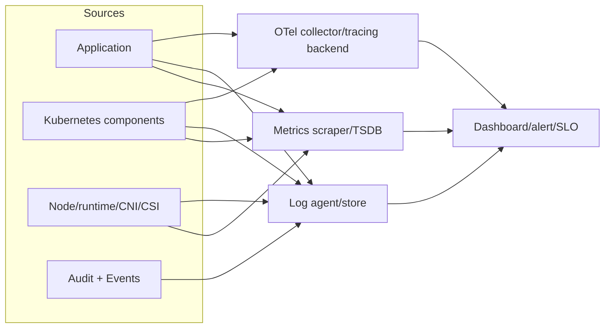
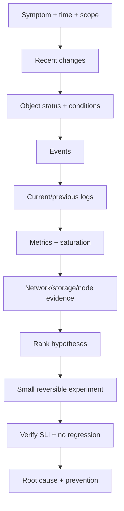

# 10 — Observability, SLO và debugging có phương pháp

## Signals không phải mục tiêu

Metrics, logs và traces giúp suy ra trạng thái nội bộ; Events và audit bổ sung ngữ cảnh Kubernetes/security. Mục tiêu là trả lời nhanh:

- Người dùng có bị ảnh hưởng không? Mức nào, từ khi nào?
- Blast radius theo route/version/zone/tenant là gì?
- Bottleneck/failure nằm ở app, dependency, workload, node hay control plane?
- Thay đổi nào gần thời điểm bắt đầu?

Nguồn: [Kubernetes Observability](https://kubernetes.io/docs/concepts/cluster-administration/observability/) và [Monitoring, Logging, Debugging](https://kubernetes.io/docs/tasks/debug/).

## Kiến trúc tín hiệu



### Bốn lớp metric không được nhầm

- Metrics Server/resource metrics: CPU/memory gần hiện tại cho HPA và `kubectl top`; không phải long-term monitoring.
- Component metrics: API server, scheduler, controller, kubelet, etcd… thường Prometheus format.
- Object-state metrics: chuyển status/metadata object thành metric (thường qua add-on như kube-state-metrics).
- Application/business metrics: request rate, errors, latency, queue lag, checkout success.

## SLI/SLO và alert

Cho HTTP service:

- Availability SLI = good requests / valid requests.
- Latency SLI = requests dưới threshold / valid requests.
- SLO ví dụ 99,9% good trong rolling 30 ngày; error budget = 0,1%.

Alert ưu tiên symptom và burn rate, không chỉ CPU cao. CPU 90% mà SLO tốt có thể chỉ là hiệu suất; error rate cao với CPU thấp vẫn nghiêm trọng. Có alert capacity/cause để điều tra nhưng paging phải actionable.

Golden signals: latency, traffic, errors, saturation. Thêm change/deployment markers và dependency SLIs.

## Metrics hygiene

- Counter cho tổng tăng dần; gauge cho giá trị hiện tại; histogram cho distribution/quantile server-side.
- Không dùng user ID/request ID làm label: cardinality bùng nổ và chi phí cao.
- Label ổn định như method, normalized route, status class, version, cluster/namespace.
- Alert missing telemetry riêng; “không có metric” không đồng nghĩa khỏe.
- Record scrape/remote-write lag, retention, HA và capacity của monitoring stack.

Sample app expose Prometheus text ở `/metrics`: [app/main.go](../../CodeSample/kubernetes/app/main.go).

## Logging

- App ghi stdout/stderr, structured JSON nếu stack hỗ trợ; node agent thu và chuyển tập trung.
- Có timestamp, severity, service/version, trace ID, request ID, normalized operation; không log Secret/token/PII.
- Log exception một lần tại ownership boundary; tránh mỗi tầng ghi cùng stack trace.
- Multiline/rotation/backpressure/drop/retention là failure modes cần monitor.
- `kubectl logs` chỉ xem log còn trên node/container; `--previous` quan trọng khi crash restart.

Kubernetes không tự cung cấp cluster-level log store; node log cần rotate. Xem [Logging Architecture](https://kubernetes.io/docs/concepts/cluster-administration/logging/).

## Tracing

Trace nối request xuyên services/queues, tìm critical path và tail latency. Cần context propagation, sampling có chủ đích, redaction và span attributes cardinality thấp. Sampling 1% có thể bỏ sự cố hiếm; tail/error sampling có trade-off buffering/cost.

Control plane tracing phụ thuộc version/feature state; không bật production theo docs `main` mà chưa kiểm tra overhead/compatibility. Xem [System Component Traces](https://kubernetes.io/docs/concepts/cluster-administration/system-traces/).

## Debugging workflow



Không thay đổi 5 thứ cùng lúc. Ghi timestamp/timezone, command và output quan trọng.

### Command ladder

```powershell
kubectl config current-context
kubectl get deploy,rs,pod,svc,endpointslice -n deep-k8s -o wide
kubectl get events -n deep-k8s --sort-by='.metadata.creationTimestamp'
kubectl describe pod <pod> -n deep-k8s
kubectl logs <pod> -c api -n deep-k8s --since=15m --timestamps
kubectl logs <pod> -c api -n deep-k8s --previous --timestamps
kubectl get pod <pod> -n deep-k8s -o yaml
kubectl top pod,node
kubectl auth can-i get pods/log -n deep-k8s
```

`Events` có retention và aggregation; centralize nếu cần lịch sử. `describe` là view tiện, YAML/JSON giúp kiểm tra field/condition chính xác.

## Từ symptom đến bằng chứng

| Symptom | Bằng chứng ưu tiên | Nguyên nhân hay gặp |
|---|---|---|
| `Pending` | FailedScheduling Events, PVC, requests/affinity/taint | thiếu capacity, constraint, PVC/topology |
| `ImagePullBackOff` | Events, image ref, pull secret, registry/DNS | tag/digest sai, auth/rate limit/network |
| `CrashLoopBackOff` | lastState/exit code, `logs --previous`, probe | app exit, config, permission, liveness |
| `OOMKilled` | lastState reason, memory working set/limit | leak/spike/limit thấp/node OOM |
| Running `0/1` | readiness/startup conditions, endpoint | probe path/timeout/dependency |
| Service timeout | EndpointSlice, direct Pod request, DNS/policy | selector/port/listen/policy/CNI |
| PVC Pending/mount fail | PVC/PV/StorageClass/Events/CSI | provisioner/topology/attach/permission |
| Rollout stuck | Deployment conditions, new RS/Pod Events | image/probe/quota/capacity/admission |
| Node NotReady | Node conditions/lease, kubelet/runtime/network | disk/memory/PID pressure, host/network |
| API slow | apiserver latency/inflight, etcd latency, webhooks | overload, etcd, admission, network |

## Distroless và ephemeral debug

Production image mẫu không có shell. Dùng:

```powershell
kubectl debug -it pod/<pod> -n deep-k8s --target=api --image=registry.k8s.io/e2e-test-images/agnhost:2.53 -- /bin/sh
kubectl debug node/<node> -it --image=registry.k8s.io/e2e-test-images/agnhost:2.53
```

Ephemeral container cần RBAC và có thể tiếp cận namespace/process/network nhạy cảm; audit và dùng image trusted. Nó không restart và không nên thành sidecar thường trực. Nguồn: [Debug Running Pods](https://kubernetes.io/docs/tasks/debug/debug-application/debug-running-pod/).

## Incident practice

Runbook mẫu: [observability/incident-runbook.md](../../CodeSample/kubernetes/observability/incident-runbook.md).

Vai trò tối thiểu cho incident lớn: incident commander, operations, communications, scribe. Ưu tiên giảm tác động rồi mới root cause; giữ evidence. Sau đó blameless postmortem với timeline, contributing factors, detection gap, action owner/deadline và kiểm chứng.

## Lab game day

Một người inject ngẫu nhiên, người debug không xem diff:

1. Service selector sai.
2. Image không tồn tại.
3. Readiness path sai.
4. CPU request không fit node.
5. NetworkPolicy thiếu DNS egress.
6. ConfigMap key sai.

Timebox 15 phút/case. Artifact bắt buộc: symptom, scope, ba giả thuyết đầu, evidence loại/chấp nhận từng giả thuyết, fix, verification và prevention.

## Câu hỏi tự kiểm tra

1. Metrics Server khác Prometheus/long-term TSDB thế nào?
2. Vì sao high-cardinality label nguy hiểm?
3. CrashLoopBackOff là nguyên nhân hay cơ chế? Bằng chứng root cause ở đâu?
4. `kubectl logs --previous` giải quyết trường hợp nào?
5. Alert nào nên page: CPU cao hay SLO burn? Khi nào cần cả hai?
