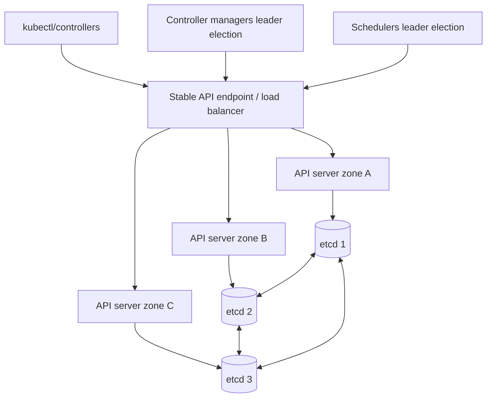
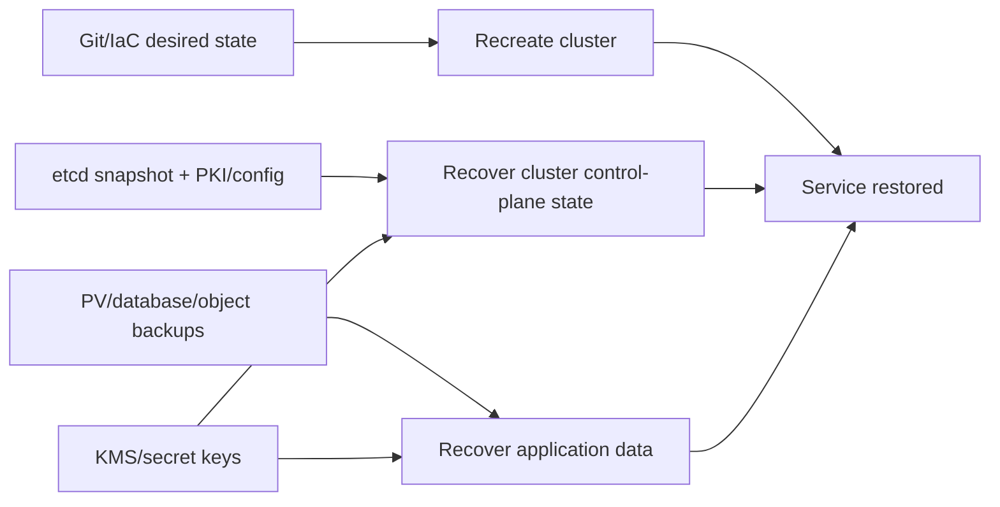

# 11 — Cluster operations, HA, upgrade và disaster recovery

## Shared responsibility trước công nghệ

Với managed Kubernetes, provider thường sở hữu một phần control plane, nhưng bạn vẫn sở hữu workload, IAM/RBAC, node pool ở mức nào đó, add-ons, data, upgrade compatibility và DR. Lập bảng RACI cho:

- API/control plane SLA và etcd backup;
- node OS/runtime/kubelet patch;
- CNI/CSI/CoreDNS/Ingress/Gateway/cert manager;
- workload/data backup;
- identity/audit/encryption keys;
- upgrade, incident, capacity và cost.

Không giả định “managed” nghĩa là provider restore được dữ liệu ứng dụng.

## HA control plane



- Nhiều API server active; scheduler/controller-manager thường leader-elect cho loop không chạy trùng.
- etcd dùng quorum; số member lẻ (thường 3 hoặc 5) tối ưu failure tolerance. 2 member không chịu lỗi tốt hơn 1 về quorum.
- Stacked etcd đặt etcd cùng control-plane node: ít hạ tầng, failure domain coupling.
- External etcd: tách failure, nhiều máy/vận hành hơn.
- Phân tán qua zone chỉ có giá trị nếu load balancer, network, storage, DNS và capacity cũng chịu zone failure.

Nguồn: [HA Topology](https://kubernetes.io/docs/setup/production-environment/tools/kubeadm/ha-topology/), [Creating HA Clusters with kubeadm](https://kubernetes.io/docs/setup/production-environment/tools/kubeadm/high-availability/) và [Running in Multiple Zones](https://kubernetes.io/docs/setup/best-practices/multiple-zones/).

## Node lifecycle

```powershell
kubectl cordon <node>
kubectl drain <node> --ignore-daemonsets --delete-emptydir-data --timeout=10m
# bảo trì/upgrade và kiểm chứng kubelet/runtime/node Ready
kubectl uncordon <node>
```

Đừng copy flags mù quáng:

- `--delete-emptydir-data` xác nhận chấp nhận mất ephemeral data.
- DaemonSet không bị drain như workload thường.
- Static/mirror Pod, unmanaged Pod, PDB, finalizer, local PV và unhealthy Pod có thể chặn.
- Drain lần lượt theo failure domain; kiểm tra capacity/surge trước.
- `uncordon` chỉ sau health validation.

Nguồn: [Safely Drain a Node](https://kubernetes.io/docs/tasks/administer-cluster/safely-drain-node/).

## Upgrade là một dự án compatibility

### Inventory trước upgrade

- Kubernetes current/target patch/minor và support window.
- kubelet/kube-proxy/kubectl skew; OS/kernel/cgroup/container runtime.
- CNI, CSI, DNS, ingress/gateway, metrics, admission webhooks, operators/CRDs.
- Deprecated API usage từ warnings, audit và `apiserver_requested_deprecated_apis`.
- Feature gates/component flags/config APIs thay đổi.
- Workload PDB/topology/capacity và maintenance window/SLO.
- Backup/restore đã test, rollback/forward-fix decision points.

### Quy tắc

- Đọc version-skew policy đúng target; deployment tool/provider có thể chặt hơn.
- Đi từng minor, không skip minor với kubeadm; lên latest patch current rồi latest patch target được hỗ trợ.
- Control plane trước, node pools sau theo documented order; canary node pool khi platform hỗ trợ.
- Upgrade staging giống production và replay critical tests/traffic.
- API downgrade/etcd/data semantics khiến “rollback binary” không luôn đơn giản; xác định point of no return.

Nguồn: [Version Skew Policy](https://kubernetes.io/releases/version-skew-policy/), [Upgrading kubeadm clusters](https://kubernetes.io/docs/tasks/administer-cluster/kubeadm/kubeadm-upgrade/) và [Deprecation Policy](https://kubernetes.io/docs/reference/using-api/deprecation-policy/).

### Feature gate/deprecation awareness

| State | Kỳ vọng | Production action |
|---|---|---|
| Alpha | thường off, có thể đổi/xóa nhanh | Chỉ sandbox; có exit plan |
| Beta | thường on nhưng semantics/API còn có thể đổi | Risk review, pin/monitor, test upgrade |
| GA | stable API/behavior theo policy | Vẫn kiểm tra flags/gate bị no-op/removed |
| Deprecated | còn hoạt động một thời gian kèm warning | Inventory owner và migrate trước target removal |
| Removed/not served | request thất bại | Chặn upgrade nếu còn client/manifest dùng |

Feature state của từng trang thuộc phiên bản docs đang xem. Đừng suy từ bài này cho cluster khác.

## Certificate và credential lifecycle

- Inventory CA/server/client cert, ServiceAccount signing keys, webhook/aggregated API cert, kubeconfig và external LB cert.
- Alert trước expiry đủ xa cho maintenance.
- Rotate có overlap để client cũ/mới cùng trust; SA signing key rotation có thứ tự.
- Backup private key phải encrypt và kiểm soát truy cập; không ghi vào ticket/log.
- Với kubeadm, dùng lệnh/cấu hình đúng version; managed cluster theo provider.

## Backup/restore layers



Ba lớp không thay nhau:

- Git/IaC tạo lại desired resources nhưng không có live data.
- etcd snapshot giữ Kubernetes state, gồm Secrets; phải bảo vệ/restore đúng version/quorum.
- App/data backup cần database-native consistency, volume/object data và keys.

Đặt RPO/RTO theo business; thiết kế backup frequency/restore automation đáp ứng. DR plan phải bao gồm DNS/traffic switch, external dependencies, identity, registry artifact, quotas và communications.

Nguồn: [Operating etcd clusters](https://kubernetes.io/docs/tasks/administer-cluster/configure-upgrade-etcd/).

## Restore test, không chỉ backup success

Game day [operations/dr-game-day.md](../../CodeSample/kubernetes/operations/dr-game-day.md):

1. Chọn scope: namespace/app, node pool, control plane, zone hay region.
2. Chốt RPO/RTO và last known good backup.
3. Restore vào isolated environment; không ghi đè production.
4. Validate API objects, secrets/identity, data checksum/schema và business transactions.
5. Đo thời gian từng phase, missing dependency/manual step.
6. Dọn môi trường theo quy trình an toàn; cập nhật runbook/action owner.

## Cluster capacity và lifecycle hygiene

- System-reserved/kube-reserved, eviction thresholds, log/image GC và disk/inode alerts.
- Node pools theo workload/failure domain; taint system/GPU/sensitive nodes.
- Quota cloud, subnet IP, max Pods/node, volume attach limit có thể hết trước CPU.
- Cert/add-on/image/OS EOL calendar; không để upgrade dồn nhiều lớp một lần.
- API Priority and Fairness, admission webhook latency và etcd size/latency là control-plane capacity signals.
- Large cluster có limits/tuning riêng; benchmark với object churn/watch/cardinality thực.

## Local node maintenance lab

Cluster kind có hai workers. Apply app rồi chọn worker đang chạy Pod:

```powershell
kubectl apply -k CodeSample/kubernetes/overlays/prod
kubectl get pods -n deep-k8s -o wide
kubectl cordon deep-k8s-worker
kubectl drain deep-k8s-worker --ignore-daemonsets --delete-emptydir-data --timeout=5m
kubectl get pods -n deep-k8s -o wide
kubectl uncordon deep-k8s-worker
```

Nếu PDB/capacity chặn, không force ngay. Đọc error, tính available replicas và kiểm tra node còn lại. Local cluster không chứng minh multi-zone HA.

## Câu hỏi tự kiểm tra

1. Vì sao ba control-plane node cùng một rack/zone chưa phải HA đúng nghĩa?
2. Etcd snapshot có chứa dữ liệu PVC/database không?
3. PDB chặn drain: ba phương án an toàn và trade-off là gì?
4. Tại sao upgrade phải inventory cả webhook/CNI/CSI/operator?
5. GitOps repo, etcd backup và data backup khôi phục ba thứ khác nhau nào?
