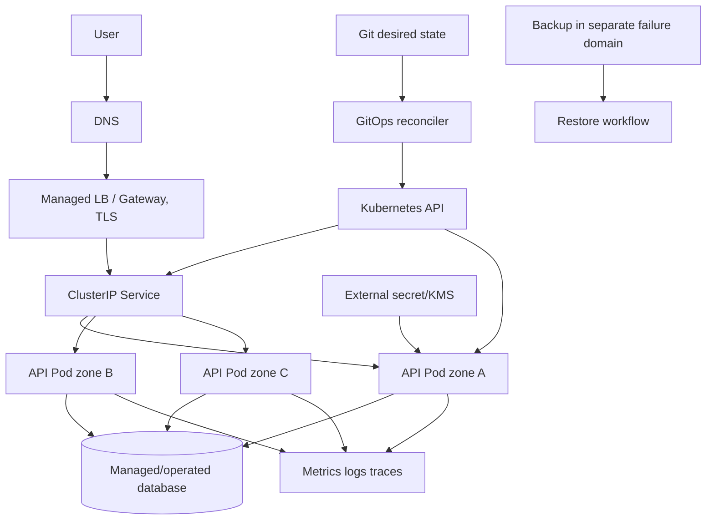

# 12 — Capstone production và anti-patterns

## Đề bài capstone

Đưa `sample-api` từ laptop tới một thiết kế production có:

- ít nhất dev/staging/prod, artifact cùng digest được promote;
- stateless HTTP API, config không bí mật và một external dependency giả lập;
- SLO availability/latency, capacity và cost guardrail;
- safe rollout/rollback, HPA, PDB, topology spread;
- NetworkPolicy default deny, Restricted Pod Security, least-privilege RBAC;
- metrics/log/trace correlation và alert/runbook;
- backup/restore cho state dependency, cluster/add-on upgrade plan;
- GitOps desired state, policy gates và audited break-glass.

Không cần mua cloud để hoàn thành phần local; những khả năng cloud/multi-zone phải có design + rehearsal plan và ghi rõ chưa được chứng minh.

## Kiến trúc tham chiếu

Đây không phải blueprint bắt buộc. Mỗi mũi tên cần owner, auth, encryption, timeout/retry, observability và failure behavior.

## Deliverables

1. Architecture diagram + data/request/deploy flows.
2. ADR: cluster model, Gateway/Ingress, storage/database, secret strategy, autoscaling metric.
3. Rendered manifests cho mọi môi trường và policy/test reports.
4. SLO + dashboard/alerts + capacity assumptions.
5. Deployment/rollback/migration/runbook và break-glass.
6. Threat model + RBAC matrix + data classification.
7. Upgrade compatibility matrix và deprecation inventory.
8. RPO/RTO, backup evidence và restore test report.
9. Game-day timeline và postmortem ít nhất ba failure.
10. Cost model: baseline/peak replicas, nodes/LB/storage/log retention/egress.

## Acceptance test

### Build/delivery

- Image reproducible, minimal, non-root; scan/SBOM/signature/digest evidence.
- Render dev/prod deterministic; schema/deprecation/policy checks pass.
- PR cho thấy diff; deploy có health verification; rollback/forward-fix diễn tập.
- Không có Secret plaintext trong Git/log/render artifact.

### Runtime

- Pod có requests/limits theo đo đạc, startup/readiness/liveness đúng semantics.
- Rollout vẫn phục vụ khi một Pod mới không Ready.
- App xử lý SIGTERM và request drain trong grace period.
- Replicas spread; drain một worker không vi phạm SLO trong điều kiện thiết kế.
- HPA scale theo load có timeline; max capacity/downstream guardrail rõ.

### Network/security

- Service/EndpointSlice/DNS trace được; TLS trust boundary rõ.
- Default-deny policy có positive/negative tests và DNS allow.
- Restricted PSA pass; no privilege escalation/capabilities; read-only root FS.
- ServiceAccount không mount token nếu không cần; `auth can-i` chứng minh denied paths.

### Operations

- Dashboard phân biệt app/workload/node/control plane; alert dựa SLO.
- Debug sáu lỗi phổ biến trong 15 phút/case với evidence.
- Upgrade rehearsal trên staging; add-on/CRD/webhook compatibility rõ.
- Restore data vào isolated environment trong RTO và validate business state.

## Game day bắt buộc

| Failure | Tín hiệu kỳ vọng | Cách giảm tác động | Prevention |
|---|---|---|---|
| Image bad/không pull | rollout stuck, Pod Events | pause/rollback/forward fix | digest, pre-pull/smoke/policy |
| Readiness sai | 0 endpoints/new Pods unready | rollback config | contract test probe |
| Node mất | NodeReady, reschedule | replicas/spread/capacity | multi-zone + headroom |
| DNS/NetworkPolicy | lookup/connection fail | policy fix có review | negative/positive network tests |
| DB latency | app latency/errors, pool saturation | circuit breaker/load shed | SLO/capacity/query tuning |
| Metrics pipeline mất | HPA unknown/observability gap | safe baseline/manual guarded scale | HA/alert missing telemetry |
| Secret hết hạn | auth errors | rotate/rollback credential | expiry alert/short-lived identity |
| PVC/zone attach | Pod Pending/mount Event | failover theo data design | topology/backup/operator tests |
| Admission webhook down | API writes timeout/deny | break-glass/failure policy | HA/timeout/scope/monitor |
| Deprecated API upgrade | object/client request fail | stop/rollback phase nếu còn an toàn | audit/static scan/staging |

## Production anti-pattern catalog

### API và ownership

- Quản lý Pod trần; mất self-healing/rollout.
- Sửa live bằng `kubectl edit` nhưng không backport Git; drift quay lại.
- Hai operator/tool cùng sở hữu field; reconcile war.
- Wildcard labels/selectors hoặc selector khác Pod label; Service không endpoint.
- Gỡ finalizer để “hết kẹt” khi backend cleanup chưa xong.
- Dùng beta/alpha API không có compatibility/exit plan.

### Image và workload

- Tag `latest`/mutable; rollout và rollback không reproducible.
- Nhiều process không liên quan trong một Pod; scale/failure coupling.
- Database trong Deployment vì “có volume là đủ”.
- Init container phụ thuộc mạng vô hạn; rollout kẹt.
- Migration chạy trong mọi replica; race và schema break.
- `preStop: sleep` thay app signal handling.

### Resources/scheduling

- Không requests; scheduler/HPA/capacity sai.
- Copy limit giống nhau cho mọi service không qua load test.
- Ba replicas cùng node/zone; false HA.
- Required anti-affinity không có đủ topology/capacity; outage thành Pending.
- Toleration được hiểu nhầm là placement guarantee.
- PDB `minAvailable: 100%`; node upgrade không drain được.

### Probes/config

- Liveness gọi toàn bộ downstream; restart storm khi dependency lỗi.
- TCP probe cho app có deadlock logic; false healthy.
- ConfigMap đổi nhưng không reload/rollout.
- Secret base64 commit Git; credential leak.
- Log environment/request headers chứa token.
- Readiness chỉ kiểm tra process, nhận traffic trước warm-up.

### Network

- Expose mỗi service bằng public LoadBalancer không threat/cost review.
- Apply Ingress không cài controller rồi kỳ vọng route.
- Dùng controller-specific annotation mà không pin/test migration.
- Default deny egress nhưng quên DNS.
- Tưởng NetworkPolicy được enforce mà CNI không hỗ trợ.
- Dùng Pod IP trực tiếp làm service discovery.

### Storage/data

- `hostPath` cho data production multi-node.
- Xem replica hoặc `Retain` là backup.
- Snapshot chưa restore-test/application-quiesce.
- Force detach RWO trong partition không fencing; split-brain.
- PVC/backup/KMS cùng failure domain.
- Xóa namespace trước khi hiểu reclaim/finalizer.

### Security

- `cluster-admin` cho app/CI; blast radius toàn cluster.
- ServiceAccount default mount token mọi Pod.
- Privileged/hostPath/hostNetwork để “sửa permission/network”.
- Root filesystem writable và capabilities mặc định không cần thiết.
- Namespace được xem là hard isolation cho tenant thù địch.
- Admission webhook fail/timeout không có break-glass.

### Delivery/observability

- Helm template quá tổng quát, cho arbitrary YAML injection.
- Hook migration không idempotent/không timeout.
- GitOps auto-prune resource stateful không protection/review.
- Dashboard chỉ CPU/memory, không có user SLI.
- Page mọi warning/CPU spike; alert fatigue.
- High-cardinality labels từ user/request ID; telemetry outage vì chính telemetry.

### Operations

- Upgrade cluster trước rồi mới scan removed APIs.
- Upgrade control plane, runtime, CNI, CSI cùng một maintenance không canary.
- Single control plane/etcd cho production nhưng tuyên bố HA.
- Backup job xanh nhưng chưa từng restore.
- Không theo dõi certificate, disk/inode, subnet IP, cloud quota.
- Force drain/PDB/delete khi chưa đọc error và tính availability.

## Review rubric 100 điểm

| Miền | Điểm | Fail ngay nếu |
|---|---:|---|
| API/workload correctness | 12 | Pod trần, selector sai, mutable image |
| Availability/scaling | 14 | Không probe/resources/rollout strategy |
| Networking | 10 | Không trace path hoặc public exposure vô chủ |
| Storage/data | 10 | Không RPO/RTO/restore evidence cho critical data |
| Security | 16 | Secret trong Git, cluster-admin app, privileged không justification |
| Delivery/GitOps | 12 | Không render/validate/rollback path |
| Observability/incident | 12 | Không SLI/alert/runbook |
| Operations/upgrade/DR | 14 | Không compatibility inventory/backup restore test |

Pass từ 80, đồng thời không có “fail ngay”. 90+ yêu cầu game day, cost model và mọi trade-off có evidence.

## Câu hỏi kết thúc

1. Nếu traffic tăng 10× trong 60 giây, bottleneck/control-loop nào phản ứng theo thứ tự?
2. Nếu mất một zone, control plane, app, data, ingress và telemetry còn gì?
3. Nếu Git/registry/secret store không truy cập được, workload đang chạy và deploy mới ra sao?
4. Rollback app version cũ gặp schema mới thế nào? Thiết kế expand/contract ra sao?
5. Bạn có thể tái tạo cluster và phục hồi business service chỉ từ artifact nào, trong bao lâu?
