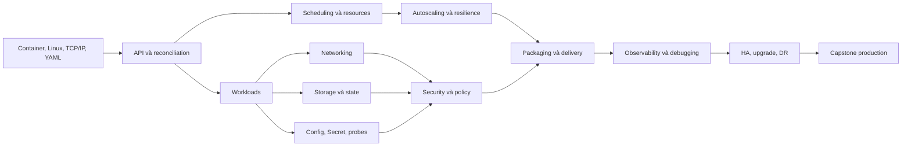

# Kubernetes chuyên sâu: lộ trình và chỉ mục

Tài liệu này hướng tới năng lực **thiết kế, triển khai, vận hành và xử lý sự cố Kubernetes trong dự án thật**, không chỉ ghi nhớ lệnh `kubectl`. Kubernetes và hệ sinh thái thay đổi liên tục, vì vậy “không bỏ sót” ở đây được hiểu là: phủ đủ các miền kiến thức cốt lõi, có checklist kiểm chứng, và biết cách kiểm tra API/tính năng theo đúng phiên bản cluster.

> Tên thư mục `Lessions` được giữ theo yêu cầu của repository. Nội dung dùng thuật ngữ chính xác là Kubernetes.

## Cách học hiệu quả

1. Học tuần tự từ bài `00` đến `12`; mỗi bài phải làm lab và tự giải thích được “vì sao”.
2. Dùng cluster local trong [CodeSample/kubernetes](../../CodeSample/kubernetes/README.md), không chỉ đọc manifest.
3. Trước mỗi thay đổi, chạy `kubectl diff`; sau thay đổi, kiểm tra Events, trạng thái rollout, log và metric.
4. Cố ý làm hỏng hệ thống trong lab, lập giả thuyết, thu thập bằng chứng rồi mới sửa.
5. Đánh dấu năng lực trong [13-coverage-checklist.md](13-coverage-checklist.md). Không đánh dấu chỉ vì đã đọc.

## Bản đồ kiến thức



## Các bài học

| Bài | Chủ đề | Kết quả đầu ra chính | Sample liên quan |
|---|---|---|---|
| [00](00-roadmap-prerequisites.md) | Roadmap, tiền đề, môi trường | Kế hoạch 14 tuần, cluster local chạy được | [Hướng dẫn lab](../../CodeSample/kubernetes/README.md) |
| [01](01-architecture-api-objects.md) | Kiến trúc, API, object | Giải thích reconciliation và đọc object như dữ liệu API | [base](../../CodeSample/kubernetes/base) |
| [02](02-workloads-lifecycle.md) | Pod và workload controllers | Chọn đúng Deployment/StatefulSet/DaemonSet/Job | [deployment.yaml](../../CodeSample/kubernetes/base/deployment.yaml), [jobs](../../CodeSample/kubernetes/jobs) |
| [03](03-scheduling-resources.md) | Scheduler, requests/limits, placement | Dự đoán Pod đặt ở đâu và vì sao bị Pending/evict | [scheduling](../../CodeSample/kubernetes/scheduling) |
| [04](04-networking-services-gateway.md) | Mạng, DNS, Service, Ingress/Gateway | Theo dấu packet và chọn đúng cách expose | [networking](../../CodeSample/kubernetes/networking) |
| [05](05-storage-stateful.md) | Volume, PV/PVC, CSI, backup | Thiết kế stateful workload và vòng đời dữ liệu | [storage](../../CodeSample/kubernetes/storage) |
| [06](06-config-secrets-probes.md) | Config, Secret, probe, lifecycle | Cấu hình/rotate an toàn và probe đúng ngữ nghĩa | [base](../../CodeSample/kubernetes/base) |
| [07](07-autoscaling-resilience.md) | HPA/VPA/node scaling, PDB | Scale có kiểm soát, chịu lỗi và rollout an toàn | [autoscaling](../../CodeSample/kubernetes/autoscaling) |
| [08](08-security-rbac-policies.md) | IAM, RBAC, Pod Security, policy | Least privilege và defense in depth | [security](../../CodeSample/kubernetes/security) |
| [09](09-packaging-delivery-gitops.md) | Kustomize, Helm, GitOps | Build/render/validate/reconcile cấu hình | [overlays](../../CodeSample/kubernetes/overlays), [chart](../../CodeSample/kubernetes/chart) |
| [10](10-observability-debugging.md) | Metrics, logs, traces, debug | Điều tra sự cố theo tín hiệu và runbook | [observability](../../CodeSample/kubernetes/observability) |
| [11](11-cluster-operations-ha-upgrade-dr.md) | Node/control plane, HA, upgrade, DR | Lập kế hoạch vận hành/upgrade/khôi phục | [operations](../../CodeSample/kubernetes/operations) |
| [12](12-production-project-antipatterns.md) | Capstone và anti-patterns | Hoàn thành production readiness review | [toàn bộ project mẫu](../../CodeSample/kubernetes/README.md) |
| [13](13-coverage-checklist.md) | Checklist bao phủ | Tự audit lỗ hổng kiến thức và bằng chứng | — |

## Roadmap theo cấp độ

| Cấp | Thời lượng gợi ý | Có thể làm được |
|---|---:|---|
| Nền tảng | Tuần 1–3 | Đọc API object, deploy stateless app, debug Pod cơ bản |
| Thực chiến | Tuần 4–7 | Networking, storage, probes, autoscaling, zero-downtime rollout |
| Production | Tuần 8–11 | RBAC/policy, GitOps, observability, SLO và incident response |
| Chuyên sâu | Tuần 12–14 | HA, upgrade, DR, capacity/cost, capstone và game day |

Chi tiết lịch học và tiêu chí qua môn nằm ở [00-roadmap-prerequisites.md](00-roadmap-prerequisites.md).

## Quy tắc phiên bản bắt buộc

Không sao chép YAML từ blog cũ rồi áp thẳng vào production.

```powershell
kubectl version
kubectl api-versions
kubectl api-resources
kubectl explain deployment.spec.strategy
kubectl get --raw /version
```

- Đọc tài liệu đúng minor version từ bộ chọn phiên bản trên trang Kubernetes.
- API `alpha` có thể tắt/mất; `beta` có thể đổi; chỉ ưu tiên API stable (`v1`) cho production nếu có.
- Kiểm tra release notes, deprecated API, CRD/controller/CNI/CSI compatibility và [version-skew policy](https://kubernetes.io/releases/version-skew-policy/) trước upgrade.
- Không skip minor version khi upgrade bằng kubeadm; đi từng minor và lên patch mới nhất của minor đích theo [hướng dẫn upgrade chính thức](https://kubernetes.io/docs/tasks/administer-cluster/kubeadm/kubeadm-upgrade/).
- Feature gate có vòng đời Alpha → Beta → GA hoặc bị loại bỏ; trạng thái mặc định có thể đổi. Tra [feature gates](https://kubernetes.io/docs/reference/command-line-tools-reference/feature-gates/) và [deprecation policy](https://kubernetes.io/docs/reference/using-api/deprecation-policy/) theo phiên bản.

## Chuẩn hoàn thành

Bạn chỉ nên tự nhận “am hiểu sâu” khi có bằng chứng cho cả bốn tầng:

- **Giải thích:** vẽ được luồng request từ `kubectl` đến API server, etcd, controller, scheduler, kubelet.
- **Xây dựng:** tự viết manifest có resources, probe, security context, PDB, NetworkPolicy và rollout strategy phù hợp.
- **Vận hành:** debug được `Pending`, `CrashLoopBackOff`, `OOMKilled`, DNS lỗi, PVC Pending, rollout treo.
- **Thiết kế:** nêu được trade-off về availability, consistency, cost, blast radius, upgrade và recovery.

Nguồn nền tảng: [Kubernetes Concepts](https://kubernetes.io/docs/concepts/), [API overview](https://kubernetes.io/docs/reference/using-api/), [Production environment](https://kubernetes.io/docs/setup/production-environment/).
