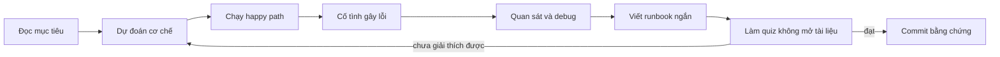

# Roadmap 24 tuần: Docker → Kubernetes production

## Cách dùng roadmap

Nhịp tiêu chuẩn là **8–12 giờ/tuần**: 30% đọc và vẽ lại, 50% lab, 20% quiz/runbook. Nhịp tăng tốc 18–22 giờ/tuần có thể gộp mỗi hai tuần thành một, nhưng không bỏ learning gate. Nếu đã có kinh nghiệm, dùng bài đánh giá đầu vào để nhảy module; vẫn phải nộp bằng chứng thực hành.

Mỗi phiên học nên theo vòng lặp:

## Giai đoạn và đầu ra

| Tuần | Trọng tâm | Đầu ra bắt buộc | Gate |
|---:|---|---|---|
| 1 | Linux process, filesystem, signals, permissions | Vẽ process tree; demo PID/mount/network namespace | Giải thích container khác VM ở đâu |
| 2 | Namespace, cgroup, capabilities, seccomp; OCI | Giới hạn CPU/RAM; quan sát OOM; đọc OCI image layout | Dự đoán đúng isolation/resource behavior |
| 3 | Image, container lifecycle, registry | Build/run/inspect/exec/logs/copy/tag/push | Không nhầm image với container |
| 4 | Dockerfile chuẩn, layer và cache | Multi-stage image; giảm size/build time có số đo | Build tái lập, non-root, signal đúng |
| 5 | Docker networking | Bridge/DNS/port mapping; debug 5 lỗi kết nối | Vẽ packet path host → container |
| 6 | Docker storage | Bind/volume/tmpfs; backup/restore; permission lab | Chọn đúng storage theo lifecycle dữ liệu |
| 7 | Compose, health, dependency, profiles | Stack app + DB; override dev; health/restart | Recreate không làm mất dữ liệu |
| 8 | Docker security, supply chain, operations | SBOM/scan/signing concept; daemon/rootless; runbook | Threat-model image/build/runtime/host |
| 9 | Từ Compose sang orchestrator | Viết yêu cầu SLO, scale, state, rollout của capstone | Biết khi nào **không** cần Kubernetes |
| 10 | K8s architecture, API, desired state | Vẽ request path; inspect object/managedFields/events | Giải thích reconciliation và eventual convergence |
| 11 | Pod, Deployment, ReplicaSet, Job/CronJob | Rollout/rollback; Job idempotent; failure drills | Chọn đúng workload controller |
| 12 | ConfigMap, Secret, probes, lifecycle | Rotation simulation; startup/readiness/liveness lab | Không dùng liveness che lỗi dependency |
| 13 | Requests/limits, scheduling, QoS | Pending/Evicted/OOMKilled drills; affinity/taint | Dự đoán scheduler và eviction |
| 14 | Service, DNS, EndpointSlice, Ingress/Gateway | Debug DNS/selector/port; expose HTTP | Phân tách L4/L7 và control/data plane |
| 15 | CNI, NetworkPolicy, traffic behavior | Default-deny rồi mở tối thiểu; trace packet path | Chứng minh policy bằng test dương/âm |
| 16 | PV/PVC/StorageClass/StatefulSet | Stateful DB lab; expansion/snapshot/restore plan | Nêu đúng RWO/RWX và zone constraints |
| 17 | RBAC, ServiceAccount, Pod Security | Least-privilege role; securityContext; audit bằng `auth can-i` | Threat-model tenant/workload/node |
| 18 | Autoscaling, disruption và availability | HPA + PDB + topology spread; capacity math | Biết PDB không tạo capacity |
| 19 | Observability và troubleshooting | Golden signals; logs/metrics/traces map; incident drill | Debug theo evidence, không restart mò |
| 20 | Packaging và delivery | Kustomize base/overlays; Helm values; GitOps model | Render/validate/diff trước deploy |
| 21 | Cluster lifecycle và HA | etcd backup/restore tabletop; upgrade/version-skew plan | Có rollback và failure-domain plan |
| 22 | Production design | Multi-zone, ingress/DNS/TLS, quota, cost, tenancy | Review theo SLO/RTO/RPO/security |
| 23 | Capstone implementation | Compose local + K8s dev/prod overlay + CI policy | Pass smoke, failure, security checks |
| 24 | Game day và interview | Incident report, architecture defense, mock interview | ≥80% quiz và rubric capstone đạt |

## Bốn learning gate

### Gate A — Container practitioner (sau tuần 4)

- Tự viết Dockerfile multi-stage, non-root, `.dockerignore`, exec-form `ENTRYPOINT`/`CMD`.
- Giải thích cache invalidation và chứng minh cải thiện bằng timing/layer inspection.
- Process nhận `SIGTERM`, graceful shutdown và trả exit code đúng.
- Phân biệt namespace isolation với security boundary tuyệt đối.

### Gate B — Docker production-ready (sau tuần 8)

- Triển khai được stack Compose có healthcheck, volume, network segmentation, resource/safety controls.
- Khôi phục dữ liệu từ backup vào volume mới.
- Debug được DNS, bind address, published port, file permission, OOM và crash loop.
- Có threat model và không để secret trong image/history/repository.

### Gate C — Kubernetes application operator (sau tuần 16)

- Tự viết Deployment/Service/ConfigMap/Secret reference/probes/resources từ file trống.
- Debug `Pending`, `CrashLoopBackOff`, `ImagePullBackOff`, Service không có endpoint và DNS lỗi.
- Thực hiện rollout/rollback; hiểu controller nào sở hữu object nào.
- Chạy được workload stateful và giải thích giới hạn consistency/backup.

### Gate D — Production engineer (sau tuần 24)

- Bảo vệ thiết kế dựa trên SLO, failure domains, capacity, RTO/RPO và threat model.
- Chứng minh least privilege bằng RBAC + runtime hardening + network isolation.
- Có dashboard/alert/runbook; hoàn thành một game day có timeline và postmortem.
- Lập được upgrade plan theo supported releases, skew/deprecation và rollback constraints.

## Nhánh học theo vai trò

| Vai trò | Phần phải học sâu thêm | Bài có thể học sau |
|---|---|---|
| Application developer | Dockerfile/cache, Compose, probes, resources, rollout, config, Service, debug | Tự dựng control plane/etcd internals |
| DevOps/SRE | Toàn bộ, đặc biệt observability, capacity, HA/DR, upgrade, incident | Operator development nếu chưa cần CRD |
| Platform engineer | Multi-tenancy, policy, supply chain, CNI/CSI, admission, GitOps, fleet lifecycle | Chi tiết framework ứng dụng |
| Security engineer | OCI provenance, build isolation, RBAC, Pod Security, admission, runtime/node threats | Tuning ứng dụng không liên quan |

## Capstone: dịch vụ “Visits API”

Capstone trong [CodeSample/capstone](CodeSample/capstone/README.md) là baseline, không phải đáp án cuối. Bạn phải mở rộng nó qua các vòng:

1. Chạy API + PostgreSQL bằng Compose; chứng minh persistence sau recreate.
2. Build image có metadata, non-root, graceful shutdown; đo cache và size.
3. Deploy Kubernetes, thêm probes/resources/rollout; thu thập evidence.
4. Tạo overlay dev/prod, PDB/HPA/network policy và secret injection phù hợp.
5. Tạo lỗi: DB down, sai secret, OOM, readiness fail, selector sai, DNS fail.
6. Viết SLO, dashboard/alert outline, runbook, backup/restore và postmortem.
7. Trình bày quyết định: vì sao Kubernetes đáng dùng hoặc vì sao Compose đủ.

## Nhịp ôn để không quên

- Sau 1 ngày: trả lời lại 5 câu “vì sao”, không nhìn note.
- Sau 1 tuần: làm lại lab từ folder trống.
- Sau 1 tháng: failure drill có giới hạn thời gian.
- Sau mỗi minor Kubernetes: đọc release/deprecation notes, cập nhật compatibility matrix.
- Mỗi quý: rebuild capstone từ base image mới, scan lại và diễn tập restore.

