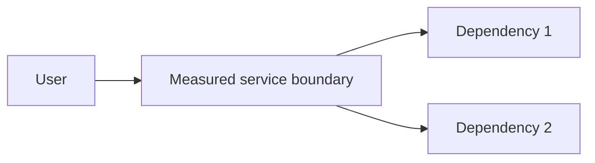

# SLO - <Service / critical journey>

## Metadata

| Trường | Giá trị |
|---|---|
| Service / owner | `<service> / <team>` |
| Tier / users | `<tier> / <internal|external users>` |
| Effective date | `<YYYY-MM-DD>` |
| Window | `<rolling 28 days / calendar month>` |
| Review cadence | `<monthly/quarterly>` |
| Dashboard | `<link>` |
| Alert policy | `<link>` |
| Runbook | `<link>` |

## Mục đích dịch vụ

- User outcome: `<người dùng làm được gì>`
- Critical journeys: `<create order, read profile...>`
- Hậu quả khi không đạt: `<business/user impact>`
- Out of scope: `<admin/batch/test traffic...>`

## Dependency và responsibility boundary



Ghi rõ SLI đo end-to-end hay chỉ service boundary. Dependency failure có ảnh hưởng người dùng vẫn thường phải được tính vào SLO, trừ khi contract nói khác và được business owner đồng ý.

## SLI specification

### SLI 1 - Availability

```text
good events = valid requests đáp ứng expected result/status
valid events = tất cả request thuộc critical journey, trừ exclusion đã định nghĩa
SLI = good events / valid events
```

| Thuộc tính | Định nghĩa |
|---|---|
| Data source/query | `<metric/log/synthetic query + version>` |
| Good event | `<status/result>` |
| Bad event | `<5xx, timeout, invalid business result...>` |
| Valid event | `<route/method/tenant/filter>` |
| Exclusions | `<bot/load test/invalid input, có lý do>` |
| Missing telemetry | `<tính là bad, alert riêng, hoặc policy khác>` |

### SLI 2 - Latency

```text
SLI = valid requests hoàn thành dưới <threshold> / total valid requests
```

Đừng chỉ dùng average. Chọn threshold theo user/business journey và đo tại điểm gần người dùng nhất có thể.

### SLI bổ sung nếu cần

- Freshness: `<data/event mới trong N phút>`
- Correctness: `<business invariant/checksum>`
- Durability: `<accepted writes không mất>`
- Batch completion: `<job hoàn tất trước deadline>`

## Objectives

| Journey/SLI | Target | Window | Minimum traffic | Lý do/consumer expectation |
|---|---:|---|---:|---|
| `<availability>` | `<99.x%>` | `<28d>` | `<n events>` | `<...>` |
| `<latency under N ms>` | `<99.x%>` | `<28d>` | `<n events>` | `<...>` |

Không chọn `99.99%` vì nghe tốt. Tính kiến trúc, on-call và chi phí cần để đạt mục tiêu.

## Error budget

```text
error budget fraction = 1 - SLO target
allowed bad events = valid events × error budget fraction
allowed bad time (chỉ khi time-based) = window × error budget fraction
burn rate = tốc độ tiêu budget quan sát / tốc độ tiêu đều cho cả window
```

| SLI | Budget đầu window | Consumed | Remaining | Forecast exhaustion |
|---|---:|---:|---:|---|
| `<...>` | `<events/minutes>` | `<...>` | `<...>` | `<date/never>` |

## Error budget policy

| Remaining/burn state | Delivery policy | Required action |
|---|---|---|
| Healthy | Release bình thường | Theo change policy |
| At risk | Giảm change risk | Reliability review, fix top contributor |
| Exhausted | Dừng feature change không thiết yếu | Service owner + product quyết định exception |
| Security/legal emergency | Có thể vượt policy | Emergency change + audit/post-review |

Policy cần được product và engineering đồng sở hữu; SRE không đơn phương “cấm deploy”.

## Alerting

| Alert | Window/burn | Severity | User impact | Runbook |
|---|---|---|---|---|
| Fast burn | `<short + long confirmation>` | `<page>` | `<...>` | `<link>` |
| Slow burn | `<longer windows>` | `<ticket/page>` | `<...>` | `<link>` |
| Telemetry missing | `<duration>` | `<...>` | Không biết SLO | `<link>` |

Alert phải có duration/for, labels owner/service/environment, dashboard và runbook. Test firing, routing, silence và recovery notification.

## Planned maintenance và exclusions

- Planned maintenance có tính vào SLO không: `<yes/no + business approval>`
- Exclusion list: `<precise filters>`
- Ai có quyền thay exclusion: `<owner/review>`
- Audit query để phát hiện exclusion che lỗi: `<link>`

Không thay query/exclusion giữa window để làm SLO đẹp hơn. Version query và backfill comparison khi thay.

## Telemetry quality

- [ ] Metric có unit, cardinality budget và retention phù hợp.
- [ ] Synthetic và real traffic được phân biệt.
- [ ] Client timeout/cancel và retry không làm sai denominator.
- [ ] Deploy/version/region/cloud labels đủ debug.
- [ ] Clock/timezone và missing data semantics rõ.
- [ ] Query được peer review và test bằng incident/failure injection.

## Báo cáo review

| Kỳ | Achieved | Top bad-event contributors | Budget decision | Actions |
|---|---:|---|---|---|
| `<...>` | `<...>` | `<...>` | `<...>` | `<links>` |

## Approval

| Role | Người/nhóm | Đồng ý target/query/policy | Date |
|---|---|---|---|
| Product/business owner | `<...>` | `<...>` | `<...>` |
| Service owner | `<...>` | `<...>` | `<...>` |
| SRE/operations | `<...>` | `<...>` | `<...>` |
