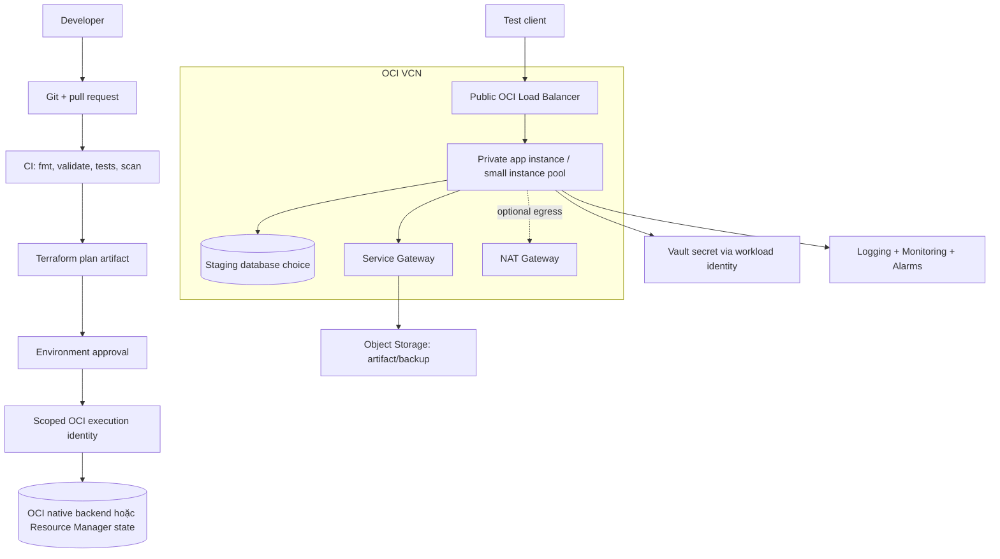

# Project 02 - OCI staging platform bằng Terraform

## Bài toán

Đưa service của Project 01 lên một môi trường staging OCI có hạ tầng tái tạo được bằng Terraform. Một pull request phải tạo plan có thể review; apply chỉ chạy sau approval; mọi tài nguyên có owner, cost tag, metric/log và cleanup path.

Đây là staging, không giả vờ là production. Dùng một hoặc nhiều Fault Domain tùy region/capacity, nhưng phải ghi rõ giới hạn HA.

## Kiến trúc mục tiêu



## Ba execution profile

| Profile | Tạo gì | Dùng để làm gì |
|---|---|---|
| `local` | Compose từ Project 01 | App/test/runbook, không cần cloud |
| `network-only` | VCN, subnet, route/security primitives tối thiểu | Học Terraform graph/import/drift với chi phí thấp; kiểm tra pricing hiện tại |
| `staging` | LB, app compute, storage/monitoring và dependency đã chọn | Demo end-to-end có budget và cleanup window |

Biến bật tài nguyên trả phí phải mặc định `false`, ví dụ `enable_staging_runtime = false`. Plan pipeline không được tự bật bằng branch name hoặc workspace ngầm.

## Yêu cầu Terraform

- Root module tách `environments/staging`; reusable modules tối thiểu `network`, `app-runtime`, `observability`.
- `required_version`, `required_providers` và `.terraform.lock.hcl` được commit/review.
- Remote state dùng OCI native backend (Terraform phù hợp) hoặc OCI Resource Manager; encryption, access và locking theo tài liệu hiện hành.
- Provider credential không ở `.tf`, `.tfvars`, state hoặc plan. CI dùng execution identity được phê duyệt; nếu buộc dùng signing key, lưu trong CI secret store, scope hẹp và có rotation/expiry process.
- Variables có type, description, validation; outputs không xuất secret.
- Tag tối thiểu: `environment`, `owner`, `project`, `managed_by`, `cost_center`, `expires_at` cho sandbox.
- Security rule xuất phát từ traffic matrix; không mở SSH/admin port `0.0.0.0/0`.
- Image được chọn qua approved image/version input hoặc data source có kiểm soát; production-like plan không phụ thuộc `latest` mơ hồ.
- CI chạy `fmt -check`, `init -backend=false`, `validate`, lint/security/policy tests và plan.
- Apply dùng đúng saved plan từ commit đã duyệt; production/staging apply có concurrency lock.

## Workload requirements

- App image immutable theo commit SHA/digest và chạy bằng non-root user.
- `/health/live`, `/health/ready`, `/metrics` giữ contract Project 01.
- App lấy secret runtime qua workload identity/Vault; không bake secret vào image/cloud-init.
- Deployment có smoke test và rollback về image digest trước.
- Database staging có backup/restore lab. Có thể dùng DB container trên compute để tiết kiệm, nhưng phải ghi rõ **không production-ready**; hoặc dùng managed database sau khi kiểm tra chi phí.

## Milestone

| Mốc | Output | Gate |
|---|---|---|
| M0 - Design | [ADR](../../Templates/ADR.md), account/compartment/region/state boundary, cost ceiling | Reviewer đồng ý scope và paid resources |
| M1 - Terraform foundation | version pin, backend bootstrap, module skeleton, tests | `validate` pass không cần apply |
| M2 - Network | VCN/subnet/routes/NSG, traffic matrix, network-only plan | Không public admin ingress; CIDR không overlap |
| M3 - Runtime | image pipeline, app runtime, LB/health, secret identity | Smoke + rollback pass |
| M4 - Operations | metrics/log/alarms, backup/restore, [runbook](./RUNBOOK.md) | Failure drill có timeline |
| M5 - Governance | plan approval, cost/security checks, drift schedule, cleanup | No-op plan + evidence đầy đủ |

## Lab/run sequence

### Lab 1 - Local validation không tạo cloud resource

```powershell
terraform -chdir=infra/environments/staging fmt -check
terraform -chdir=infra/environments/staging init -backend=false
terraform -chdir=infra/environments/staging validate
terraform -chdir=infra/environments/staging providers
```

Chạy unit/policy tests cho CIDR, required tags, public ingress và paid-resource flags.

### Lab 2 - Bootstrap state

1. Dùng một bootstrap stack/state riêng để tạo bucket/backend hoặc tạo OCI Resource Manager stack qua quy trình platform.
2. Bật versioning/recovery/access logging theo lựa chọn backend.
3. Cấp backend permission riêng cho plan/apply identity.
4. Chạy `terraform init -migrate-state` trong sandbox và xác minh lineage/state key.
5. Diễn tập lock contention; không dùng `-lock=false`.

### Lab 3 - Network-only apply

```powershell
terraform -chdir=infra/environments/staging plan -out=network.tfplan -var="enable_staging_runtime=false"
terraform -chdir=infra/environments/staging show network.tfplan
terraform -chdir=infra/environments/staging apply network.tfplan
terraform -chdir=infra/environments/staging plan -detailed-exitcode -var="enable_staging_runtime=false"
```

Xác minh scope/region/state trước apply. Exit code `0` của plan cuối là no-change; `2` là có diff cần review, không phải lỗi.

### Lab 4 - Staging runtime có approval

1. Kiểm tra pricing/quota/capacity và budget alert.
2. Bật runtime trong file `.tfvars` không chứa secret và mở pull request.
3. Review saved plan: số lượng, replacement, public IP, LB, NAT, storage và log.
4. Apply qua protected environment.
5. Chạy smoke/load nhỏ; ghi p95/error rate và image digest.
6. Deploy bad image có kiểm soát, xác minh health gate và rollback theo [runbook](./RUNBOOK.md).

### Lab 5 - Drift và restore

- Thay đổi một tag **không nhạy cảm** trong sandbox console, chạy plan để detect drift, rồi reconcile bằng code hoặc revert manual change.
- Tạo backup test, restore thành resource/database tạm, so sánh count/checksum, sau đó dọn bản restore.

## Security

- Compartment/policy và dynamic group/resource principal theo least privilege; tách deploy identity khỏi runtime identity.
- Private app/database subnet; public exposure kết thúc ở LB. Admin access qua approved bastion/session/VPN pattern, không public SSH.
- Vault/KMS key policy, rotation, network access và audit được ghi trong threat model.
- CI artifact/plan có retention ngắn và access hạn chế vì plan có thể chứa dữ liệu nhạy cảm.
- Security scan không được auto-fix provider/module major trong cùng PR deploy.

## Cost

- Trước apply, lập [capacity/cost review](../../Templates/CAPACITY-COST-REVIEW.md) gồm compute, LB, public IPv4, NAT, block volume, log ingestion/retention, Object Storage và egress.
- Đặt budget/alert và `expires_at`; owner nhận được alert.
- Không tạo NAT/LB/managed DB chỉ để `validate`.
- Cleanup report đối chiếu inventory và bill, không chỉ tin `terraform destroy`.

## Observability

- OCI Audit/control-plane events, app logs và load balancer/runtime metrics có retention rõ.
- Dashboard RED: rate, errors, duration; thêm saturation của CPU/RAM/disk/connection pool.
- Alarm dựa trên triệu chứng người dùng và dependency, có severity/duration/link runbook.
- Correlation ID đi từ LB/app tới log. Không gửi secret/PII vào log.

## Reliability

- Ghi failure modes: instance chết, health probe sai, image lỗi, DB unavailable, quota/capacity, state lock, backend mất quyền.
- App runtime có self-healing hoặc quy trình replace; immutable replacement thay vì sửa server lâu dài.
- Backup phải restore được. Mục tiêu RTO/RPO staging được định nghĩa và đo.
- Region một AD phải phân tán Fault Domain khi có nhiều instance; ghi rõ điều không chống được region/AD failure.

## Acceptance criteria

- [ ] `local` và `network-only` chạy mà không bật paid runtime.
- [ ] Terraform modules có validation/test/docs; lock file được commit.
- [ ] CI plan từ pull request; apply chỉ từ saved plan sau approval.
- [ ] Không credential/secret/private key trong repo, plan evidence hoặc state output.
- [ ] Không public admin port; app/database private trong target architecture.
- [ ] Image immutable, health gate và rollback drill pass.
- [ ] Dashboard/alarms phân biệt app lỗi với dependency lỗi.
- [ ] Drift được detect và reconcile; plan sau apply là no-op.
- [ ] Backup restore vào target tạm pass consistency check và RTO/RPO được ghi.
- [ ] Cost estimate, budget alert và cleanup inventory có evidence.
- [ ] [Runbook](./RUNBOOK.md) được người khác diễn tập và đánh dấu VERIFIED.

## Cleanup/decommission staging

1. Freeze apply và xác nhận không có migration/load test chạy.
2. Lưu evidence cần giữ; backup dữ liệu nếu policy yêu cầu.
3. Chạy destroy plan, review retained/soft-delete resource và dependency.
4. Apply destroy qua approval.
5. Kiểm tra compartments/inventory: instance, volume, backup, public IP, LB, NAT, log, bucket/object/version.
6. Không xóa backend/state/audit evidence cho đến khi xác nhận không cần recovery và retention cho phép.
7. Kiểm tra bill sau ít nhất một chu kỳ hiển thị phù hợp.

## Portfolio evidence

- Architecture/traffic/data-flow diagram và ADR.
- PR plan comment hoặc artifact đã redact, approval và apply log.
- Terraform tests/security findings với cách xử lý exception.
- Dashboard + alarm firing/recovery cho bad release.
- Restore test và runbook drill timeline.
- Cost before/after cleanup và danh sách known production gaps.
