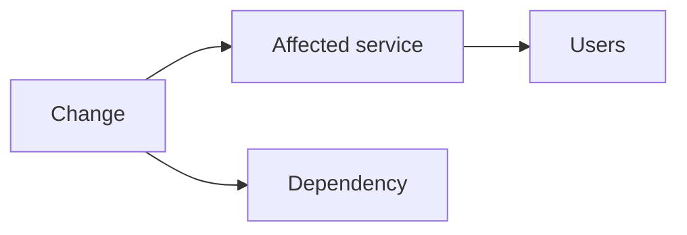

# Change plan và rollback - <Change title>

## Metadata

| Trường | Giá trị |
|---|---|
| Change ID / type | `<ID> / standard|normal|emergency` |
| Owner / operators | `<...>` |
| Reviewer/approver | `<...>` |
| Environment/scope | `<account/subscription/tenancy, region, service>` |
| Planned window | `<start-end + timezone>` |
| User impact | `<none/expected impact>` |
| Related PR/plan/artifact/ADR | `<links>` |
| Communication channel | `<link>` |

## Summary và reason

- Thay đổi: `<...>`
- Business/technical reason: `<...>`
- Nếu defer: `<risk/impact>`
- Success outcome: `<measurable result>`
- Explicit non-goals: `<...>`

## Scope và dependency

| Component | Current | Target | Owner | Dependency/order |
|---|---|---|---|---|
| `<...>` | `<version/config>` | `<...>` | `<...>` | `<...>` |

## Risk assessment

| Failure mode | Likelihood | Impact | Detection | Prevention/mitigation | Residual risk |
|---|---|---|---|---|---|
| `<...>` | `<L/M/H>` | `<L/M/H>` | `<signal>` | `<...>` | `<...>` |

- Blast radius maximum: `<...>`
- Security/data/compliance risk: `<...>`
- Capacity/cost impact: `<...>`
- Risk acceptance owner/expiry nếu có: `<...>`

## Prerequisites

- [ ] Đúng scope/identity/region/backend; execution role còn hiệu lực.
- [ ] PR/tests/security/policy/cost/saved plan từ đúng commit đã pass.
- [ ] Backup/checkpoint/restore test phù hợp và freshness trong mục tiêu.
- [ ] Known-good artifact/config/schema và rollback permission sẵn.
- [ ] Dependency owner/on-call/support đã biết window.
- [ ] Không có incident/change conflict; capacity/quota đủ.
- [ ] Dashboard/synthetic/log access và timeline đã mở.
- [ ] Feature flag/traffic control/maintenance communication sẵn nếu cần.

## Pre-change baseline

| Signal | Query/test | Expected baseline | Actual/time |
|---|---|---|---|
| Critical journey | `<...>` | `<...>` | `<...>` |
| Error/latency | `<...>` | `<...>` | `<...>` |
| Capacity/dependency | `<...>` | `<...>` | `<...>` |
| Data consistency/backup | `<...>` | `<...>` | `<...>` |

## Implementation plan

Mỗi bước nhỏ, có expected result, timeout và checkpoint.

| # | Action | Expected/verify | Timeout | Operator | Rollback point |
|---:|---|---|---:|---|---|
| 1 | `<...>` | `<...>` | `<...>` | `<...>` | `<...>` |
| 2 | `<canary/partial rollout>` | `<SLI gate>` | `<...>` | `<...>` | `<...>` |
| 3 | `<increase scope>` | `<...>` | `<...>` | `<...>` | `<...>` |

Không ghi secret trong command. Dùng immutable artifact/saved Terraform plan từ commit đã duyệt.

## Success criteria và observation

- [ ] Critical journeys pass từ user path.
- [ ] SLI/error/latency/saturation trong threshold trong `<duration>`.
- [ ] Data/schema/business invariant pass.
- [ ] Security/audit/permission checks pass.
- [ ] Đúng artifact/config/infrastructure version; full plan no unexpected drift.
- [ ] Cost/resource count trong expected range.

## Abort thresholds

Rollback/stop ngay nếu:

- error rate `> <threshold>` trong `<duration>`;
- p95/p99 latency `> <threshold>`;
- data consistency/security check fail;
- capacity/queue/replication lag vượt `<threshold>`;
- không hoàn tất step trước `<deadline>`;
- scope/identity/plan không khớp.

Không thay threshold giữa change để tránh rollback.

## Rollback plan

### Preconditions/limitations

- Schema/data có backward-compatible không: `<yes/no + strategy>`
- Last rollback point: `<...>`
- Expected rollback duration/impact: `<...>`

| # | Rollback action | Expected/verify | Timeout | Owner |
|---:|---|---|---:|---|
| R1 | `<stop rollout/fence writer>` | `<...>` | `<...>` | `<...>` |
| R2 | `<restore artifact/config/traffic>` | `<...>` | `<...>` | `<...>` |
| R3 | `<data reconciliation nếu cần>` | `<...>` | `<...>` | `<...>` |

Nếu rollback không khả thi, mô tả roll-forward/restore/failover và approval riêng. “Khôi phục backup” không đủ nếu chưa biết checkpoint, consistency và RTO.

## Communication

| Khi nào | Audience | Message/owner | Channel |
|---|---|---|---|
| Trước change | `<...>` | scope/window/impact | `<...>` |
| Start/checkpoint | `<...>` | progress/SLI | `<...>` |
| Rollback/incident | `<...>` | impact/action/next update | `<...>` |
| Complete | `<...>` | result/known risk | `<...>` |

## Execution record

| Time | Step/action | Result/evidence | Deviation/decision | Operator |
|---|---|---|---|---|
| `<...>` | `<...>` | `<...>` | `<...>` | `<...>` |

## Closure

- [ ] Observation window hoàn tất và stakeholder được thông báo.
- [ ] Temporary access/rule/capacity thu hồi.
- [ ] Manual change reconcile về code/state.
- [ ] Backup/artifact/plan/evidence xử lý đúng retention.
- [ ] Cost/orphan/drift check hoàn tất.
- [ ] Follow-up hoặc postmortem được tạo nếu có deviation/near miss.
