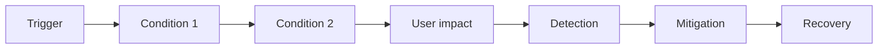

# Blameless postmortem - <Incident title>

## Metadata

| Trường | Giá trị |
|---|---|
| Incident ID / severity | `<ID> / <SEV>` |
| Start / detected / mitigated / ended | `<timestamps + timezone>` |
| Duration / user-impact duration | `<...>` |
| Services/regions/customers | `<...>` |
| Incident Commander | `<...>` |
| Authors/reviewers | `<...>` |
| Timeline | `<link tới INCIDENT-TIMELINE>` |
| Status | `Draft / Reviewed / Actions accepted / Closed` |

## Executive summary

Trong `<duration>`, `<users/journeys>` gặp `<impact>`. Sự cố bắt đầu khi `<trigger ở mức hệ thống>`, trở nên nghiêm trọng do `<contributing conditions>`, được phát hiện bởi `<signal>` và giảm thiểu bằng `<action>`. Không có/có `<data/security impact đã xác minh>`. Các thay đổi ưu tiên là `<top actions>`.

## Impact

### User/business impact

- Affected requests/users/tenants: `<count/percentage + cách đo>`
- Critical journeys: `<...>`
- Error/latency/data impact: `<...>`
- Contract/SLO/error-budget impact: `<...>`
- Revenue/support/compliance impact: `<... hoặc N/A + lý do>`

### Internal impact

- Teams/on-call hours: `<...>`
- Deployment/operations bị chặn: `<...>`
- Cost bất thường: `<...>`

Không dùng số “ước chừng” như fact. Gắn nhãn `estimate` và ghi phương pháp.

## Detection

- First signal: `<customer/alert/synthetic/log>` lúc `<time>`
- Alert hữu ích/không hữu ích: `<...>`
- Time to detect / declare: `<...>`
- Tại sao phát hiện sớm hơn không xảy ra: `<telemetry/threshold/ownership gap>`

## Response và recovery

- Mitigation đầu tiên: `<...>` và kết quả
- Quyết định quan trọng: `<...>`
- Recovery action: `<...>`
- Time to mitigate/recover: `<...>`
- Validation: `<SLI, smoke, consistency, security checks>`
- Manual change còn phải reconcile: `<...>`

## What happened

Mô tả chuỗi kỹ thuật/process theo causal chain. Tránh dừng ở “human error”. Hỏi: điều kiện nào khiến thao tác hợp lý ở thời điểm đó tạo impact?

## Contributing factors

| Nhóm | Điều kiện | Evidence | Vì sao control hiện tại không chặn/giảm được |
|---|---|---|---|
| Architecture | `<...>` | `<...>` | `<...>` |
| Change/review/testing | `<...>` | `<...>` | `<...>` |
| Automation/tooling | `<...>` | `<...>` | `<...>` |
| Observability/alerting | `<...>` | `<...>` | `<...>` |
| Runbook/on-call | `<...>` | `<...>` | `<...>` |
| Capacity/dependency | `<...>` | `<...>` | `<...>` |
| Organization/communication | `<...>` | `<...>` | `<...>` |

Phân biệt:

- Trigger: sự kiện khởi đầu.
- Contributing factors: điều kiện làm tăng xác suất/impact.
- Root systemic causes: cơ chế nền tảng cho phép failure tồn tại/lặp lại.

## Điều đã diễn ra tốt

- `<control/decision/team behavior giúp giảm impact>`

## Điều làm recovery khó hơn

- `<missing access/query/runbook/ownership/tooling>`

## May mắn/near misses

- `<điều có thể làm impact lớn hơn nhưng không xảy ra>`

Near miss cần action như incident thật nếu risk cao.

## Corrective/preventive actions

Action tốt thay đổi hệ thống, guardrail, test, detection hoặc recovery; không dùng “nhắc mọi người cẩn thận”.

| Priority | Action | Loại: prevent/detect/mitigate | Outcome đo được | Owner | Due | Tracking/status |
|---|---|---|---|---|---|---|
| P0 | `<...>` | `<...>` | `<test/metric>` | `<...>` | `<date>` | `<link>` |
| P1 | `<...>` | `<...>` | `<...>` | `<...>` | `<date>` | `<link>` |

### Action không chọn

| Ý tưởng | Lý do không chọn/defer | Risk acceptance owner | Review trigger |
|---|---|---|---|
| `<...>` | `<...>` | `<...>` | `<...>` |

## Lessons và updates

- ADR/architecture thay đổi: `<links>`
- SLO/alert/query thay đổi: `<links>`
- Runbook/change/DR plan thay đổi: `<links>`
- Training/game day cần thêm: `<...>`

## Blameless language check

- [ ] Không quy lỗi cho cá nhân hoặc dùng “đáng lẽ phải biết”.
- [ ] Mô tả context/thông tin/tool mà người thực hiện có tại thời điểm đó.
- [ ] Không che trách nhiệm: owner/action/decision vẫn rõ.
- [ ] Fact có evidence; hypothesis được gắn nhãn.
- [ ] Security/privacy/legal review đã redact dữ liệu phù hợp.

## Closure

Postmortem chỉ đóng khi action P0/P1 được accept vào tracking với owner/due date, manual change đã reconcile và reviewer xác nhận bài học được phản ánh trong system/process.
