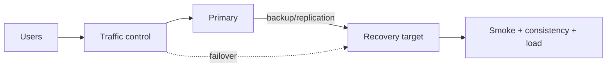

# DR test report - <Service/scenario>

## Metadata

| Trường | Giá trị |
|---|---|
| Test ID / status | `<ID> / Planned|Running|Pass|Conditional|Fail` |
| Service / owner | `<...>` |
| Primary / recovery target | `<region/cloud/account>` / `<...>` |
| Planned window | `<timestamps + timezone>` |
| Test coordinator / participants | `<...>` |
| Incident/change IDs | `<links>` |
| Runbook/version | `<link + commit/version>` |
| Data classification | `<...>` |

## Objective và success criteria

| Objective | Target | Cách đo | Pass/Fail rule |
|---|---:|---|---|
| RTO | `<duration>` | declaration → critical journey usable | `<= target` |
| RPO | `<duration/events>` | last durable source write → recovered checkpoint | `<= target` |
| Data consistency | `<invariants/checksum>` | `<query/tool>` | `<zero mismatch/tolerance>` |
| Capacity | `<load/headroom>` | `<load test/metric>` | `<threshold>` |
| Failback | `<duration/condition>` | `<...>` | `<...>` |

RTO phải gồm decision, restore/scale, validation, DNS/client cache và warmup; không dừng đồng hồ khi VM/database vừa tạo xong.

## Scope và exclusions

### In scope

- `<failure scenario, services, data, traffic, people/process>`

### Out of scope

- `<... + risk/owner/date sẽ test>`

### Assumptions cần kiểm chứng

| Assumption | Test/evidence | Owner |
|---|---|---|
| `<backup giải mã được>` | `<...>` | `<...>` |
| `<quota target đủ>` | `<...>` | `<...>` |

## Failure scenario

- Trigger giả lập: `<region unavailable, database corruption, credential loss...>`
- Injection method: `<safe mechanism>`
- Blast radius: `<sandbox/test cohort>`
- Không mô phỏng: `<...>`
- Abort conditions: `<security/data/production impact/timeout>`

Không phá production thật nếu chưa có approved change, isolation và stop mechanism.

## Architecture và recovery sequence

- Source of truth trước/Trong/sau failover: `<...>`
- Write fencing/split-brain prevention: `<...>`
- Backup/replication mechanism + freshness metric: `<...>`
- Identity/key/secret/certificate ở target: `<...>`
- DNS/traffic/client-cache behavior: `<...>`

## Pre-test checks

- [ ] Scope/participants/roles/communications và stop word rõ.
- [ ] Backup/replication freshness trong target; restore credential/key hoạt động.
- [ ] Recovery target quota/capacity/network/DNS/certificate/image/secret ready.
- [ ] Synthetic/load/consistency queries và clean test dataset ready.
- [ ] No conflicting deploy/change/incident.
- [ ] Security/compliance/data owner phê duyệt data ở target.
- [ ] Monitoring cả primary/target và canonical clock/timezone hoạt động.
- [ ] Cleanup/failback/rollback plan đã review.

## Execution plan và actual timeline

| Phase | Planned action/gate | Planned max | Actual start/end | Result/evidence | Decision/owner |
|---|---|---:|---|---|---|
| Declare | mở incident/roles, freeze change | `<...>` | `<...>` | `<...>` | `<...>` |
| Fence | chặn source writer, checkpoint | `<...>` | `<...>` | `<...>` | `<...>` |
| Restore/promote | tạo/scale recovery data/runtime | `<...>` | `<...>` | `<...>` | `<...>` |
| Validate | schema/checksum/security/smoke/load | `<...>` | `<...>` | `<...>` | `<...>` |
| Traffic | canary rồi full target | `<...>` | `<...>` | `<...>` | `<...>` |
| Operate | accept test writes/observe | `<...>` | `<...>` | `<...>` | `<...>` |
| Failback | sync, fence, validate, shift back | `<...>` | `<...>` | `<...>` | `<...>` |
| Cleanup | standby mode, revoke temporary access | `<...>` | `<...>` | `<...>` | `<...>` |

## Data validation

| Check | Pre-failure value | Recovery value | Tolerance | Result |
|---|---|---|---|---|
| Last durable transaction/checkpoint | `<...>` | `<...>` | `<...>` | `<...>` |
| Row/object count | `<...>` | `<...>` | `<...>` | `<...>` |
| Checksum/sample | `<...>` | `<...>` | `<...>` | `<...>` |
| Business invariant | `<...>` | `<...>` | `<...>` | `<...>` |
| Encryption/access/audit | `<...>` | `<...>` | none | `<...>` |

Ghi known data loss/duplicate/reconciliation. Không gọi test pass chỉ vì endpoint trả 200.

## Actual RTO/RPO breakdown

| Metric/phase | Target | Actual | Pass | Bottleneck/evidence |
|---|---:|---:|---|---|
| Detect + declare | `<...>` | `<...>` | `<...>` | `<...>` |
| Decide + fence | `<...>` | `<...>` | `<...>` | `<...>` |
| Restore/scale | `<...>` | `<...>` | `<...>` | `<...>` |
| Validate/warm | `<...>` | `<...>` | `<...>` | `<...>` |
| Traffic/client convergence | `<...>` | `<...>` | `<...>` | `<...>` |
| Total RTO | `<...>` | `<...>` | `<...>` | `<...>` |
| RPO | `<...>` | `<...>` | `<...>` | `<...>` |

## Observations

### Điều hoạt động tốt

- `<...>`

### Gap/near miss

- `<access, stale doc, quota, DNS cache, data mismatch, alert...>`

### Manual/toil và cost

- Manual steps/privilege: `<...>`
- Double-run/egress/restore cost: `<...>`
- Resources/orphans cần dọn: `<...>`

## Actions

| Priority | Gap/action | Outcome/test | Owner | Due | Tracking |
|---|---|---|---|---|---|
| P0 | `<...>` | `<...>` | `<...>` | `<date>` | `<link>` |

## Cleanup và steady state

- [ ] Source of truth/writer duy nhất được xác nhận.
- [ ] Replication/backup trở về policy và freshness bình thường.
- [ ] Recovery target về đúng pilot/warm capacity.
- [ ] Temporary rule/access/credential/capacity thu hồi.
- [ ] Terraform/IaC full plan không unexpected drift.
- [ ] Test data/artifact/log xử lý theo classification/retention.
- [ ] Cost/orphan inventory và stakeholder communication hoàn tất.

## Sign-off và test tiếp theo

| Role | Result/risk acceptance | Người/nhóm | Date |
|---|---|---|---|
| Service/data owner | `<...>` | `<...>` | `<...>` |
| SRE/operations | `<...>` | `<...>` | `<...>` |
| Security/compliance | `<...>` | `<...>` | `<...>` |

Next test date/scenario: `<...>`. Một test `Conditional/Fail` không được đổi thành `Pass` nếu action chưa verify.
