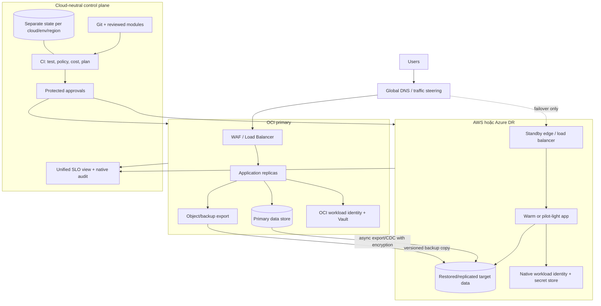

# Capstone - Multi-cloud resilience: OCI primary, AWS hoặc Azure DR

## Bài toán

Thiết kế và diễn tập một SaaS API chạy primary trên OCI, có warm-standby hoặc pilot-light disaster recovery trên **một** cloud thứ hai: AWS **hoặc** Azure. Chọn một đích để implementation đủ sâu; cloud còn lại chỉ cần decision matrix. Tránh triển khai cả ba để lấy số lượng logo.

Capstone phải trả lời được câu hỏi kinh doanh: multi-cloud giảm rủi ro nào, với RTO/RPO và chi phí nào? Nếu backup/restore cùng cloud đã đủ, ADR phải dám kết luận không cần multi-cloud.

## Kiến trúc tham chiếu



Không đặt OCI và DR cloud trong cùng một Terraform state. Không dùng một credential admin chung. Data replication không thay backup độc lập.

## Quyết định bắt buộc

Tạo ADR cho từng quyết định:

1. Business reason và failure scenario cần multi-cloud.
2. Chọn AWS hay Azure làm DR và vì sao.
3. Pilot light, warm standby hay active/passive; không chọn active/active nếu chưa giải quyết consistency.
4. Data replication/export/restore, source of truth và conflict rule.
5. Global traffic mechanism, TTL/health check và client caching limitation.
6. State/identity/ownership boundary.
7. Failover **và failback**, gồm write fencing/split-brain.
8. Điều kiện dừng capstone ở design/sandbox do cost/quota/compliance.

## Yêu cầu implementation

### Repository/module layout

```text
infra/
├── modules/
│   ├── oci-service-platform/
│   ├── aws-dr-platform/        # hoặc azure-dr-platform
│   └── contracts/              # schema/docs, không chứa provider block chung
└── live/
    ├── oci/primary/<env>/
    └── aws-or-azure/dr/<env>/
```

- Module interface có thể cùng intent (`environment`, `service`, CIDR, capacity class, tags), nhưng implementation giữ cloud-native semantics.
- Không tạo module `cloud = ...` với hàng trăm conditional resource.
- Mỗi root có provider lock, backend, identity, approval và drift schedule riêng.
- Output cross-stack được publish bằng contract nhỏ/versioned; không cho consumer đọc toàn state nếu không cần.

### Application/data portability

- Một immutable app artifact/digest được promote sang cả hai cloud; config/identity/secret là cloud-specific.
- Health, metrics, logs và OpenTelemetry semantic attributes nhất quán.
- Không hard-code metadata endpoint, region, bucket URL hoặc cloud credential chain trong business logic.
- Database schema/engine/version/extension compatibility được test. Data transform có checksum/reconciliation và idempotency.
- Source of truth, write freeze/fencing, CDC lag, backup freshness và conflict resolution được quan sát.

### Control plane

- CI dùng OIDC/workload identity hoặc short-lived role riêng từng cloud/account/environment.
- Plan role và apply role tách; production-like apply protected. Không có “multi-cloud super-admin”.
- Policy checks: allowed scope/region, encryption, public ingress, required tags, backup, deletion protection, paid-resource gate.
- Artifact/plan retention ngắn; audit/change/timeline giữ theo policy.

## Milestone

| Mốc | Output | Gate |
|---|---|---|
| M0 - Business/ADR | failure model, RTO/RPO, option matrix, cost ceiling | Multi-cloud có lý do hoặc quyết định dừng hợp lý |
| M1 - Contracts | app/data/telemetry/module contracts, threat model | Contract tests pass local |
| M2 - OCI primary | Terraform + workload + SLO/backup | Primary sandbox stable/no-op plan |
| M3 - DR cloud | separate state/identity/network/runtime | Standby deploy/restore pass |
| M4 - Data/traffic | replication/export, consistency checks, DNS/traffic | RPO observable, no split-brain path |
| M5 - Operations | unified SLO, native audit, alerts, capacity/cost | On-call thấy được cả hai cloud |
| M6 - DR drill | declaration, failover, validation, failback | RTO/RPO measured; gaps owned |
| M7 - Readiness/evidence | PRR, postmortem, portfolio narrative | Claims khớp evidence thực chạy |

## Lab/run sequence

### Lab 1 - Local dual-environment simulation

Dùng hai Compose project/kind namespace độc lập mô phỏng primary/DR:

- network, database volume và config riêng;
- cùng image digest;
- async export/restore hoặc event replication;
- traffic switch bằng local proxy/hosts chỉ trong lab;
- inject primary outage, freeze writer, promote DR, verify và failback.

Mục tiêu là hoàn thiện state machine/runbook trước khi trả phí cloud.

### Lab 2 - Cloud plan và policy

```powershell
terraform -chdir=infra/live/oci/primary/lab init -backend=false
terraform -chdir=infra/live/oci/primary/lab validate
terraform -chdir=infra/live/oci/primary/lab plan

terraform -chdir=infra/live/<aws-or-azure>/dr/lab init -backend=false
terraform -chdir=infra/live/<aws-or-azure>/dr/lab validate
terraform -chdir=infra/live/<aws-or-azure>/dr/lab plan
```

CI phải chứng minh mỗi root dùng backend/identity/scope khác. Placeholder `<aws-or-azure>` được thay bằng lựa chọn thật trong repository.

### Lab 3 - Primary và standby sandbox

1. Đặt budget, quota/capacity và cleanup window ở cả hai cloud.
2. Apply OCI primary; deploy artifact digest; chạy baseline load/SLI.
3. Apply DR ở pilot-light/warm profile; không nhận user traffic.
4. Export/replicate dataset giả; đo lag, checksum và backup freshness.
5. Xác minh secret/key được cấp riêng mỗi cloud và runtime không có quyền cloud còn lại.

### Lab 4 - DR failover

Dùng [DR test template](../../Templates/DR-TEST.md) và [runbook](./RUNBOOK.md):

1. Freeze change và tạo incident/timeline.
2. Inject outage trong sandbox hoặc đánh dấu primary unavailable bằng traffic control đã duyệt.
3. Fence writer primary, ghi replication checkpoint/expected data loss.
4. Scale/restore/promote DR, chạy consistency/security/smoke/load test.
5. Chuyển traffic canary rồi toàn phần.
6. Đo RTO từ declaration tới critical journey usable; đo RPO từ last durable write.

### Lab 5 - Failback

Failover chỉ là nửa bài. Phải:

- đồng bộ writes từ DR về primary mới/đã sửa;
- verify checksum/business invariant;
- fence DR writer trước đảo traffic;
- shift traffic có observation window;
- hạ DR về standby và giữ backup/audit;
- chạy full Terraform plan cả hai cloud, reconcile manual action.

## Security

- Threat model có trust boundary giữa clouds, CI, replication channel, DNS/edge và operator.
- Federation trust giới hạn issuer/audience/repository/branch/environment; session ngắn và audit.
- Key management độc lập. Nếu data copy cross-cloud, ghi rõ key ownership, re-encryption và revoke/rotation.
- State, backup, plan, logs và replication staging đều được data-classify và least-privilege.
- Không chuyển raw production logs/data sang cloud khác nếu residency/privacy chưa cho phép.
- WAF/firewall rule không copy máy móc; kiểm tra semantics OCI/AWS/Azure riêng.

## Cost

Lập [capacity/cost review](../../Templates/CAPACITY-COST-REVIEW.md) theo ba scenario:

| Scenario | Capacity | Chi phí cần tính |
|---|---|---|
| Normal | OCI full, DR pilot/warm | minimum standby, storage/backup, log, health check |
| Failover | DR scale lên production | burst compute/DB, quota reservation, DNS/LB |
| Rehearsal/failback | cả hai cùng hoạt động | double compute, replication, inter-cloud egress |

Tính public IPv4, NAT/LB, managed DB minimum, log ingestion/retention, backup retrieval, inter-AZ/region/cloud transfer và support/operational labor. Định nghĩa maximum monthly DR premium và điều kiện kiến trúc không còn đáng tiền.

## Observability

- Một SLO view dùng cùng định nghĩa user journey nhưng phân tách `cloud.provider`, `region`, `environment`, `service.version`.
- Giữ native audit/control-plane logs ở cloud nguồn; chỉ centralize signal cần điều tra sau redaction/aggregation.
- Dashboard có primary/DR readiness, replication lag, backup freshness, traffic weight, error budget, capacity/quota và cost anomaly.
- Synthetic probe chạy từ ngoài cả hai cloud; health check không chỉ kiểm tra TCP port.
- Alert phân biệt “standby not ready” và “user traffic impacted”; severity khác nhau.

## Reliability

- RTO gồm declaration, decision, restore/scale, DNS/client cache, consistency validation và warmup.
- RPO dựa trên durable checkpoint/lag thực, không dựa trên lịch backup lý thuyết.
- DNS failover không bảo đảm client đổi ngay; test resolver/client cache behavior.
- Replication có thể nhân corruption/deletion; backup immutable/versioned là lớp riêng.
- Target quota, image, certificate, DNS, secret, dependency và on-call đều phải sẵn trước incident.
- Failback là procedure first-class và được time-box/test.

## Acceptance criteria

- [ ] ADR chứng minh business value và so sánh phương án không multi-cloud.
- [ ] Chỉ một DR cloud được implement sâu; lựa chọn còn lại có decision matrix trung thực.
- [ ] OCI và DR có state, identity, scope, module implementation và approval tách biệt.
- [ ] Cùng immutable image chạy được cả hai cloud; contract tests pass.
- [ ] Không credential dài hạn/super-admin chung hoặc secret trong repo/state output/evidence.
- [ ] Data copy có encryption, lag/freshness metric, checksum và reconciliation.
- [ ] Failover drill không split-brain; critical journey usable trong RTO và data loss trong RPO.
- [ ] Failback drill hoàn tất; plan cả hai cloud không còn unexpected drift.
- [ ] Unified SLO và native audit đủ reconstruct incident timeline.
- [ ] Cost model gồm egress và double-run; budget/cleanup evidence ở cả hai cloud.
- [ ] Threat model, DR report, incident timeline, postmortem và PRR được review.
- [ ] Portfolio ghi rõ phần local simulation, cloud sandbox, design-only và limitation.

## Cleanup

1. Đưa traffic về trạng thái an toàn và xác nhận source of truth/writer duy nhất.
2. Lưu restore/DR evidence đã redact; giữ backup theo retention.
3. Destroy DR sandbox và primary sandbox bằng hai reviewed plans riêng.
4. Inventory từng cloud: compute, disk/snapshot/backup, public IP, LB/NAT, DNS, DB, log workspace, object/version, key/secret.
5. Thu hồi CI trust/role, temporary rule, replication credential và test certificate.
6. Giữ backend/state/audit tới khi recovery/compliance owner phê duyệt xóa.
7. Kiểm tra billing/egress sau chu kỳ hiển thị; đóng budget khi không còn resource.

## Portfolio evidence

- Architecture diagram + ADR option matrix + threat model.
- Hai independent Terraform plans/state topology và policy test report.
- Artifact digest/SBOM/provenance chạy ở cả hai cloud.
- Replication lag/checksum dashboard.
- DR timeline với RTO/RPO thực đo, traffic weight và consistency gates.
- Failback evidence, full no-op plans và cost after cleanup.
- Blameless postmortem nêu assumption sai và action item đã theo dõi.
