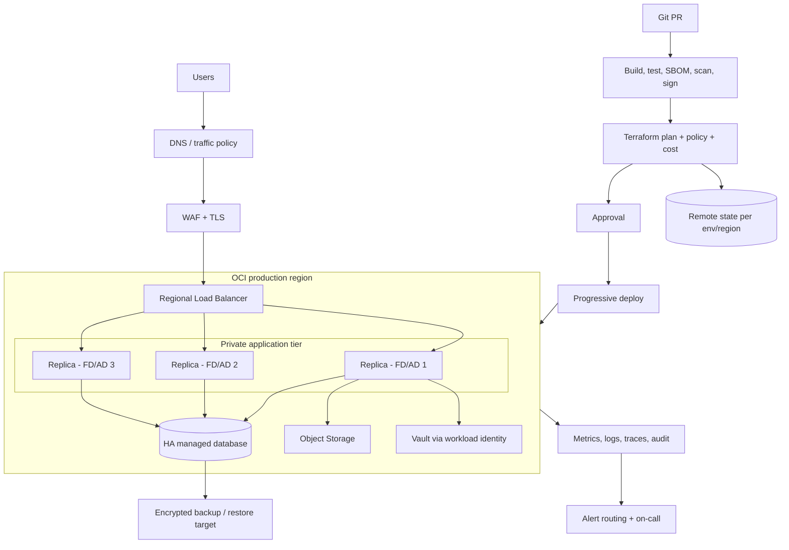

# Project 03 - OCI production platform có SLO và vận hành sự cố

## Bài toán

Thiết kế một nền tảng production cho API ở Project 01, dùng Terraform và OCI làm implementation chính. Nền tảng phải chứng minh được: blast radius có giới hạn, release an toàn, least privilege, quan sát theo SLO, phục hồi khi lỗi và kiểm soát chi phí.

Không cần trả tiền để chạy toàn bộ topology production trong thời gian dài. Portfolio gồm hai profile:

- `sandbox`: local/kind hoặc OCI footprint nhỏ, dùng để diễn tập pipeline, rollout, alert và restore;
- `production-design`: Terraform plan, policy/contract/integration tests, runbook và review evidence cho topology thật. Chỉ apply khi có tài khoản, budget, quota và approval phù hợp.

## Kiến trúc mục tiêu

Nếu region chỉ có một Availability Domain, phân tán app qua Fault Domain và ghi rõ risk còn lại. Không vẽ nhiều AD nếu region thực tế không có.

## Yêu cầu nền tảng

### Governance và tenancy

- Compartment/state boundary cho `network`, `security-observability`, `production-app` và `nonproduction` hoặc cấu trúc tương đương có ADR.
- Human federation + MFA; break-glass được audit/test. Workload dùng dynamic group/resource principal hoặc cơ chế native phù hợp.
- Policy-as-code/guardrail cho region, public exposure, encryption, required tags, approved image/shape và deletion protection.
- Network CIDR/IPAM, DNS ownership và egress control có owner; production không phụ thuộc public SSH.

### Terraform và delivery

- Root state nhỏ theo lifecycle/trust boundary; module implementation có tests và version contract.
- Remote state encrypted, versioned, locked và có restore procedure. Plan/apply identity khác runtime identity.
- Pipeline tách build artifact khỏi deploy; artifact có digest, SBOM, provenance/signature và promotion giữa môi trường, không rebuild production.
- Pull request chạy format/validate/test/security/policy/cost + saved plan. Apply protected, đúng commit/plan và có concurrency control.
- Progressive delivery: rolling, canary hoặc blue/green với health/SLO gate và automatic stop; rollback không phụ thuộc tag `latest`.
- Schema change theo expand/migrate/contract, tương thích ít nhất một release trước/sau.

### Runtime/data

- Ít nhất hai replica ở failure domains/zones phù hợp; anti-affinity, resource request/limit và capacity headroom.
- Database private, HA/backup/PITR/deletion protection theo RTO/RPO; restore/failover/failback được test.
- Timeout, retry budget, circuit breaker/bulkhead nơi phù hợp; idempotency cho retry write.
- Secret/key rotation không cần rebuild image; audit data-plane access quan trọng.

### Operations

- [SLO](../../Templates/SLO.md), error-budget policy và multi-window burn-rate alert.
- Logs/metrics/traces/audit có retention, access, redaction và cost control.
- Runbook cho high error rate, saturation, bad deploy, DB failover, state lock, secret rotation và DR.
- On-call, severity, incident commander, communication channel/status cadence và postmortem threshold.
- [Production readiness review](../../Templates/PRODUCTION-READINESS.md) không còn blocker chưa accepted.

## Milestone

| Mốc | Output | Exit gate |
|---|---|---|
| M0 - Service contract | user journey, SLO/SLI, dependency map, data classification | Owner/SRE/security đồng ý mục tiêu |
| M1 - Landing zone | compartments, IAM, network, state, audit/policy | Threat model + access test pass |
| M2 - Supply chain | reproducible build, tests, SBOM, scan/sign/promotion | Artifact immutable và verifiable |
| M3 - Runtime/data | HA topology, backup/PITR, migration strategy | Load + restore test pass |
| M4 - Delivery | canary/blue-green, SLO gate, rollback | Bad release tự dừng và rollback |
| M5 - Operations | dashboard, alerts, runbooks, on-call, game days | Incident drill đạt tiêu chí |
| M6 - DR/cost/readiness | DR test, capacity/cost review, PRR | Risk accepted hoặc blocker đóng |

## Labs và game days

### Lab 1 - Production-like sandbox

1. Chạy app/database/telemetry local trên kind/k3d/Compose hoặc OCI sandbox nhỏ.
2. Áp cùng image, health contract, deployment policy và dashboards như production-design.
3. Dùng synthetic traffic có request ID và dataset giả.
4. Lưu test report; không dùng production data/credential.

### Lab 2 - Progressive delivery

1. Baseline release `N` và ghi SLI.
2. Release `N+1` cho 5% traffic hoặc một replica.
3. Inject error/latency có feature flag ở canary.
4. Xác minh SLO gate dừng promotion, alert có context và rollback về đúng digest.
5. Xác minh database schema vẫn compatible và full Terraform plan no-op.

### Lab 3 - Reliability game day

Chọn ít nhất ba scenario, chạy trong sandbox với [change plan](../../Templates/CHANGE-PLAN-ROLLBACK.md):

- kill một app replica;
- làm health endpoint sai;
- connection pool/database latency tăng;
- disk/log ingestion saturation;
- revoke một runtime permission cần thiết;
- state lock mồ côi giả lập;
- quota/capacity không đủ cho scale-out.

Đo detection time, mitigation time, user impact, false assumptions và runbook gap.

### Lab 4 - Backup/restore và DR

- Restore backup vào target cô lập, chạy checksum/business query và vulnerability/access check.
- Diễn tập regional recovery ở mức phù hợp bằng [DR test template](../../Templates/DR-TEST.md).
- Đo RPO từ last durable write/backup và RTO từ declaration tới service usable, không chỉ “resource đã tạo”.
- Diễn tập failback hoặc ghi rõ vì sao chưa thể.

### Lab 5 - Incident simulation

Một người làm incident commander, một người operations, một người observer nếu có thể. Dùng [incident timeline](../../Templates/INCIDENT-TIMELINE.md), cập nhật status theo cadence, ưu tiên giảm impact trước root cause. Sau đó viết [postmortem blameless](../../Templates/POSTMORTEM-BLAMELESS.md).

## Security

- Threat model bao phủ internet edge, CI supply chain, Terraform state, workload identity, database, backup và operator access.
- WAF/TLS không thay input validation/authz. Network private không thay data-plane IAM.
- Không có cross-environment admin credential. Production apply/session có thời hạn và approval.
- Image dependency/CVE exception có owner, expiry, compensating control; critical finding không bị bỏ qua bằng comment chung chung.
- Backup/state/log được coi là dữ liệu nhạy cảm; encryption, retention, audit và restore access được test.
- Key/secret rotation runbook giữ service available và revoke bản cũ sau verification.

## Cost và capacity

- Forecast theo request/sec, concurrent connection, CPU/RAM, DB IOPS/storage, backup growth, log GB/day và egress.
- Ghi headroom target cho normal/peak/failure mode; scale test chứng minh bottleneck.
- Unit economics: chi phí trên 1.000 request hoặc active user/tháng.
- Budget/anomaly alert có owner; sandbox TTL/cleanup; production rightsizing dựa trên telemetry đủ dài.
- Review chi phí observability, NAT/LB/public IP và inter-AD/region transfer, không chỉ compute.

## Observability và SLO

Tối thiểu hai SLI user-centric:

- Availability: tỷ lệ request hợp lệ thành công trên tổng request hợp lệ.
- Latency: tỷ lệ request hợp lệ dưới ngưỡng cho từng critical journey.

Telemetry cần nối được `release → request → dependency`. Dashboard có:

- traffic/error/latency theo route, version và region;
- saturation/capacity của runtime, DB, connection pool, storage;
- rollout marker, alert state, backup freshness và certificate expiry;
- error budget remaining/burn rate.

## Reliability

- Mỗi dependency có timeout/retry/fallback và failure owner.
- Autoscaling không phải HA nếu quota/capacity/image/startup time không đủ; test cold scale.
- Health check phản ánh khả năng phục vụ nhưng không tạo cascade/restart storm.
- Backup, replica và DR giải quyết failure khác nhau; không dùng replication thay backup.
- Runbook có abort threshold, rollback và escalation. Manual mitigation được reconcile về code.

## Acceptance criteria

- [ ] SLO/SLI query tái lập được; alert firing/recovery đã test và link đúng runbook.
- [ ] Threat model không còn high risk chưa có owner/accepted exception.
- [ ] Terraform state/module boundaries và IAM hạn chế blast radius; full plan no-op sau apply.
- [ ] Build reproducible; artifact có digest/SBOM/scan/signature và được promote, không rebuild.
- [ ] Canary bad release tự dừng; rollback đạt mục tiêu và schema compatible.
- [ ] Load test chứng minh capacity/headroom và xác định bottleneck đầu tiên.
- [ ] App replica failure không làm gián đoạn vượt SLO trong sandbox.
- [ ] Backup restore pass consistency/security test; RTO/RPO thực đo.
- [ ] Một incident drill hoàn chỉnh có timeline, communication, postmortem và action tracking.
- [ ] Capacity/cost review có unit cost, forecast, budget và cleanup evidence.
- [ ] Production readiness review có sign-off hoặc exception với owner/expiry.
- [ ] README phân biệt rõ phần đã chạy với phần chỉ design/plan; không phóng đại production experience.

## Cleanup và lifecycle

### Sandbox

Destroy qua reviewed plan, sau đó inventory instance/volume/IP/LB/NAT/backup/log/bucket và kiểm tra bill. Giữ evidence đã redact theo retention; không giữ data dump thật.

### Production-design

Không tạo resource nên cleanup là xóa artifact/plan nhạy cảm theo retention và thu hồi credential test.

### Production thật

Decommission dùng [change plan/rollback](../../Templates/CHANGE-PLAN-ROLLBACK.md): drain traffic, archive/restore-test data, thu hồi integration, destroy theo dependency, giữ state/audit theo policy và xác nhận billing. Không dùng một lệnh destroy tùy hứng.

## Portfolio evidence

- ADR, SLO, threat model, capacity/cost review và production readiness record.
- Plan/policy/test/SBOM/sign evidence đã redact.
- Canary dashboard với release marker và rollback timing.
- Load test result + bottleneck analysis.
- Restore/DR report có RTO/RPO/checksum.
- Incident timeline, postmortem và action item đã đóng hoặc có owner/date.
