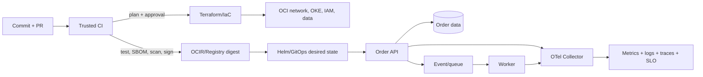

# Practical Capstone – OrderFlow Production Platform

## Mục tiêu

Thiết kế, triển khai và vận hành một lát cắt production-like trên OCI, đồng thời giải thích phần portable sang AWS/Azure. Bài đánh giá toàn bộ D01–D20 và ưu tiên evidence hơn slide.

Thời lượng gợi ý: 25–40 giờ trong nhiều phiên. Chấm **100 điểm** theo [capstone-rubric.md](capstone-rubric.md).

## Bối cảnh

`OrderFlow` nhận order qua HTTPS, lưu trạng thái giao dịch và phát event cho worker. Yêu cầu:

- Build container một lần, promote đúng digest qua `dev` → `prod`.
- Runtime chính là OKE/Kubernetes; nếu quota không cho phép, dùng `kind`/`k3d` cho runtime và nộp reviewed Terraform plan OCI cho cloud resources chưa apply.
- Public entrypoint, workload private; database/cache/message có thể dùng managed sandbox hoặc implementation nhỏ có documented limitation.
- Workload dùng workload/instance identity và secret reference; không nhúng cloud key/password vào image/Git.
- Có OpenTelemetry/metrics/logs/traces, SLI/SLO, burn-rate alert và change correlation.
- Có backup + restore test; tabletop regional DR và ít nhất một live failure drill trong sandbox.
- Có cost model/unit cost, budget và cleanup plan.
- Có golden path giúp một service thứ hai onboard mà không copy-paste toàn bộ stack.

## Mô hình logic

Sơ đồ chỉ là logical model. Người học phải bổ sung trust boundary, request/return path, data ownership, failure domain và telemetry pipeline.

## Workstream bắt buộc

### A. Product, architecture và risk

- Viết service objective, user journey, SLI/SLO, RTO/RPO và assumptions.
- Vẽ architecture, request/data/trust flow; threat model tối thiểu năm threat.
- Ghi ADR cho runtime/data/deployment/state/DR; nêu alternative và decision trigger để xem xét lại.
- Tạo risk register có impact/likelihood/control/owner/evidence.

### B. Foundation, IaC và image/config

- OCI dev/prod boundary, network public/private, IAM least privilege, logging/audit, budget/tag/quota.
- Terraform module/root composition, remote state được bảo vệ, provider/module lock/version, plan review.
- Packer hoặc documented image decision; cloud-init nhỏ/idempotent; configuration có một source of truth.
- Không dùng long-lived admin key cho pipeline nếu workload federation khả dụng.

### C. CI/CD và software supply chain

- PR: lint/unit/integration, secret scan, IaC/security/policy checks.
- Build deterministic container, tạo SBOM/provenance, scan và ký exact digest.
- Untrusted PR không nhận production secret; action/dependency được pin/review.
- Promote same digest; production approval, concurrency/stale-plan control, deploy record và rollback/roll-forward gate.
- Database migration theo expand/contract.

### D. Kubernetes/GitOps runtime

- Deployment/Service/Ingress hoặc Gateway, readiness/startup/liveness đúng semantics.
- Requests/limits, graceful shutdown, disruption/rolling policy và failure-capacity assumption.
- RBAC, NetworkPolicy/default deny, non-root/minimum capabilities và secret reference.
- Helm chart hoặc equivalent package; GitOps reconciliation, drift/break-glass/runbook.
- Admission/policy kiểm tra digest/signature và security context, có recovery path.

### E. Data và messaging

- Order có idempotency key; transaction/outbox hoặc documented delivery model chống double-processing.
- Cache policy có TTL/invalidation/stampede control nếu dùng cache.
- Schema migration/backfill có metric và compatibility.
- Backup encrypted/versioned phù hợp; restore sandbox đo RPO/RTO và chạy invariant/application test.

### F. Observability, SRE và performance

- Structured logs có correlation nhưng không lộ secret/PII.
- OTel trace qua API→data/message→worker; metrics RED/USE và cardinality budget.
- SLI/SLO + multi-window burn alert; dashboard từ user symptom tới saturation.
- Load test có model, bottleneck/evidence và headroom khi một failure domain mất.
- Runbook cho latency, queue backlog, dependency failure và bad release.

### G. Platform, FinOps và leadership

- Golden path/template/API onboard service thứ hai; versioned contract, docs, guardrail, escape hatch.
- Đo time-to-first-deploy, support toil, adoption và reliability.
- Cost allocation/tag, budget/anomaly, unit cost/order, telemetry/egress cost và cleanup.
- Executive one-pager: outcome, status, risk, cost, decision cần stakeholder và next gate.

## Bốn bài diễn tập

1. **Bad release:** canary/rolling làm burn rate tăng; phát hiện, dừng, rollback/roll-forward, giữ timeline/evidence.
2. **Dependency latency:** inject delay trong sandbox; chứng minh timeout/retry/circuit/backpressure không tạo cascade.
3. **Restore:** xóa/corrupt dữ liệu test có kiểm soát, restore vào sandbox mới, đo và verify invariant/app.
4. **Regional DR tabletop:** giả lập region/connection partition, replication lag vượt RPO; quyết định failover/degrade, fencing/split-brain, comms và failback.

Mọi drill phải có scope, owner, stop condition và cleanup. Không thử phá production.

## Deliverables

1. Source code/IaC/Helm/pipeline đã redact, dependency lock và hướng dẫn tái lập.
2. Architecture + request/data/trust/failure diagrams.
3. ADR, threat model, risk register, SLO/error-budget policy và cost model.
4. SBOM, provenance/signature verification và runtime digest evidence.
5. Redacted CI plan/deploy record, Kubernetes events/config, OTel trace/dashboard/alert test.
6. Restore report có thời gian/invariant; bốn drill report/timeline/action.
7. Golden-path onboarding demo cho service thứ hai.
8. Runbooks, postmortem và executive one-pager.

## Acceptance checks

- Build lại cùng input có explainable/reproducible artifact; runtime chạy exact digest đã approved.
- Untrusted PR không có production credential; identity/action scope audit được.
- App không có public node IP; network path và default-deny exception được chứng minh.
- Secret scan sạch; Git/image/log/state không chứa credential thật.
- Pod graceful rollout, probe/resource policy đúng; test một node/Pod failure.
- Trace nối API tới worker; SLO/alert test hoạt động và cardinality nằm trong budget.
- Duplicate request không double-process business side effect theo invariant đã định.
- Restore test chạy end-to-end và có measured RTO/RPO.
- Cost/unit và cleanup được xác nhận; không để resource sandbox vô chủ.

## Oral defense

Người chấm chọn tối thiểu 8 câu, trong đó có một câu data, security, incident và cost:

1. Chứng minh bytes đang chạy xuất phát từ commit nào.
2. Vẽ packet/return path và trust boundary từ user tới Pod/database.
3. Vì sao probe hiện tại không tạo restart loop?
4. Nếu OTel backend hỏng, app và SLO evidence bị ảnh hưởng thế nào?
5. Message redelivery có thể double-charge không? Chứng minh bằng invariant/test.
6. Backup gần nhất restore trong bao lâu và thiếu dependency nào?
7. Nếu region partition và replica lag, ai quyết định failover theo tiêu chí nào?
8. Golden path giảm toil gì và metric nào chứng minh adoption có giá trị?
9. Giảm 30% cost ở đâu mà không phá SLO/security?
10. Phần nào portable sang AWS/Azure, phần nào không nên abstraction?
11. Corrective action nào xuất phát từ drill và đã verify đóng?
12. Nếu chỉ còn hai tuần, bạn cắt scope nào và residual risk do ai chấp nhận?

