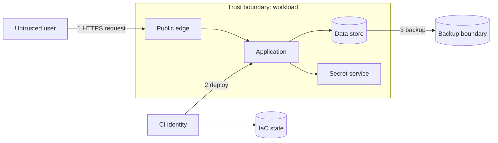

# Threat model - <System/change>

## Metadata

| Trường | Giá trị |
|---|---|
| System/scope/version | `<...>` |
| Owners/facilitator | `<...>` |
| Participants | `<engineering/security/data/SRE>` |
| Date / review trigger | `<...>` |
| Data classification | `<public/internal/confidential/restricted>` |
| Related architecture/ADR | `<links>` |
| Status | `Draft / Reviewed / Accepted with risks` |

## Security objectives

- Confidentiality: `<data nào phải bí mật với ai>`
- Integrity: `<state/transaction/config nào không được sửa trái phép>`
- Availability: `<journey/SLO nào phải duy trì>`
- Accountability/non-repudiation: `<audit nào cần>`
- Privacy/compliance: `<residency/retention/consent>`

## Scope, assumptions và non-goals

### In scope

- `<components, interfaces, identities, CI/state/backup>`

### Out of scope

- `<... + owner/review date>`

### Assumptions cần test

- `<cloud control behaves..., identity trust..., client...>`

Assumption không có evidence là risk, không phải fact.

## Architecture, trust boundaries và data flows

Đánh số flow và mô tả:

| Flow | Source → destination | Data/classification | Authn/authz | Encryption | Validation/logging |
|---|---|---|---|---|---|
| 1 | `<...>` | `<...>` | `<...>` | `<...>` | `<...>` |
| 2 | `<...>` | `<...>` | `<...>` | `<...>` | `<...>` |

## Assets

| Asset | Giá trị/impact nếu mất | Owner | Location/retention | Required controls |
|---|---|---|---|---|
| Credential/key | `<...>` | `<...>` | `<...>` | `<...>` |
| Customer/business data | `<...>` | `<...>` | `<...>` | `<...>` |
| Terraform state/plan | `<...>` | `<...>` | `<...>` | `<...>` |
| Artifact/source/config | `<...>` | `<...>` | `<...>` | `<...>` |
| Audit/log/backup | `<...>` | `<...>` | `<...>` | `<...>` |

## Actors và entry points

| Actor | Legitimate capability | Potential abuse | Entry point/trust |
|---|---|---|---|
| External user/attacker | `<...>` | `<...>` | `<...>` |
| Authenticated user | `<...>` | `<...>` | `<...>` |
| Developer/CI/operator | `<...>` | `<...>` | `<...>` |
| Compromised workload/dependency | `<...>` | `<...>` | `<...>` |
| Cloud/vendor insider/outage | `<...>` | `<...>` | `<...>` |

## Threat enumeration

Dùng STRIDE như prompt, không như checklist duy nhất:

- Spoofing: giả danh identity/workload/user.
- Tampering: sửa data/artifact/config/state/log.
- Repudiation: hành động không truy vết được.
- Information disclosure: lộ secret/data/metadata.
- Denial of service: exhaustion, dependency/region failure.
- Elevation of privilege: vượt role/scope/trust boundary.

## Risk register

Quy ước scoring: `Likelihood 1-5 × Impact 1-5 = Inherent risk 1-25`. Ghi tiêu chí tổ chức nếu khác.

| ID | Threat/abuse case | STRIDE | Asset/flow | L | I | Inherent | Existing control/gap | Proposed control/test | Residual | Owner/due |
|---|---|---|---|---:|---:|---:|---|---|---:|---|
| T-01 | `<attacker does X causing Y>` | `<...>` | `<...>` | `<n>` | `<n>` | `<n>` | `<...>` | `<...>` | `<n>` | `<...>` |

Threat cần mô tả actor + action + asset + impact, không chỉ ghi “DDoS” hoặc “data leak”.

## Abuse/misuse cases cần test

- [ ] Credential CI bị dùng từ repo/branch không được phép.
- [ ] Workload cố truy cập secret/data ngoài scope.
- [ ] User A truy cập object của user B.
- [ ] Malformed/oversized/replayed request.
- [ ] Artifact/dependency/signature bị thay.
- [ ] State/backup/log access trái phép hoặc public exposure.
- [ ] Quota/rate/storage/connection bị exhaustion.
- [ ] Key/secret rotate/revoke hoặc dependency auth unavailable.
- [ ] Break-glass dùng và audit/revoke.

Chọn case phù hợp hệ thống và thêm domain-specific threat.

## Controls và verification plan

| Control | Prevent/detect/respond | Implementation | Test/evidence | Failure owner |
|---|---|---|---|---|
| `<least privilege>` | `<...>` | `<...>` | `<negative access test>` | `<...>` |
| `<encryption/key>` | `<...>` | `<...>` | `<rotation/restore test>` | `<...>` |
| `<supply chain>` | `<...>` | `<...>` | `<provenance/sign verify>` | `<...>` |
| `<logging/alert>` | `<...>` | `<...>` | `<alert drill>` | `<...>` |

## Residual risk và acceptance

| Risk ID | Residual risk | Vì sao chưa giảm thêm | Compensating control | Acceptor | Expiry/review trigger |
|---|---:|---|---|---|---|
| `<...>` | `<...>` | `<...>` | `<...>` | `<authorized role>` | `<...>` |

High/critical risk không thể tự accept bởi người triển khai. Exception phải có expiry và tracking.

## Completion checklist

- [ ] Diagram/data flows khớp implementation hiện tại.
- [ ] Human, workload, CI, backend/state và break-glass identities đều có trong model.
- [ ] Data classification, residency, retention, backup/delete flow rõ.
- [ ] Network-private không bị coi là thay thế authentication/authorization.
- [ ] Threat/control có negative test hoặc evidence, không chỉ policy document.
- [ ] Residual risks có authorized owner/expiry.
- [ ] Security events có alert/runbook/incident path.
