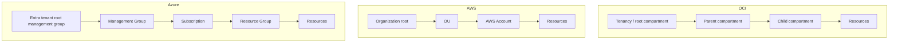
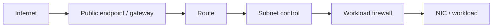

# 02 - Khác biệt nền tảng khi viết Terraform

## 1. Ranh giới tổ chức: không có ánh xạ 1:1



| Thuộc tính | OCI Compartment | AWS Account | Azure Subscription | Azure Resource Group |
|---|---|---|---|---|
| Billing boundary độc lập | Không hoàn toàn | Có | Có | Không |
| Quota/service limit scope | Tùy service; thường tenancy/region và quota theo compartment | Thường account/region | Thường subscription/region | Hiếm khi |
| Security isolation mạnh | Vừa; vẫn trong một tenancy | Mạnh, phù hợp blast-radius boundary | Mạnh hơn RG; phù hợp policy/quota boundary | Scope RBAC/lifecycle, không phải tenant isolation |
| Cây phân cấp | Có thể lồng compartment | Organization/OU chứa account; không lồng account | Management Group chứa subscription | RG không lồng RG |
| Resource bắt buộc thuộc scope | Phần lớn thuộc compartment | Thuộc account | Thuộc subscription và thường thuộc RG | Hầu hết ARM resource thuộc đúng một RG |
| Guardrail từ parent | OCI policy/Security Zone | SCP/RCP từ Organization/OU | Azure Policy/RBAC từ MG/subscription | Kế thừa RBAC/Policy từ subscription/MG |
| Di chuyển resource | Một số resource đổi compartment được | Cross-account thường là migrate/share/recreate | Một số resource move subscription được | Một số resource move RG được, có ràng buộc |

Kết luận thiết kế:

- Một OCI tenancy nhiều compartment **không nên mặc định** thành một AWS account nhiều tag. Production, security, log archive và sandbox thường đáng tách account.
- Một compartment theo ứng dụng có thể gần với Azure resource group về quản lý vòng đời; compartment theo môi trường/security boundary có thể gần subscription hơn. Chọn theo mục tiêu, không theo tên.
- Không đặt toàn bộ enterprise vào một state chỉ vì toàn bộ resource cùng một tenancy/account/subscription.

## 2. Provider và địa chỉ resource

| Thành phần | OCI | AWS | Azure |
|---|---|---|---|
| Provider source | `oracle/oci` | `hashicorp/aws` | `hashicorp/azurerm` |
| Major hiện hành lúc kiểm tra | `8.x` | `6.x` | `5.x` |
| Provider block | `provider "oci"` | `provider "aws"` | `provider "azurerm" { features {} }` |
| Region phổ biến trong provider | `region = "ap-singapore-1"` | `region = "ap-southeast-1"` | `location` thường nằm trên từng resource; provider chọn subscription/environment |
| VCN/VPC/VNet | `oci_core_vcn` | `aws_vpc` | `azurerm_virtual_network` |
| Subnet | `oci_core_subnet` | `aws_subnet` | `azurerm_subnet` |
| Firewall workload | `oci_core_network_security_group` | `aws_security_group` | `azurerm_network_security_group` |
| Route table | `oci_core_route_table` | `aws_route_table` | `azurerm_route_table` |
| Internet gateway | `oci_core_internet_gateway` | `aws_internet_gateway` | Không có resource 1:1; thường là `azurerm_public_ip` + NIC/LB/frontend |
| NAT gateway | `oci_core_nat_gateway` | `aws_nat_gateway` | `azurerm_nat_gateway` + subnet/public IP association |
| VM | `oci_core_instance` | `aws_instance` | `azurerm_linux_virtual_machine` / `azurerm_windows_virtual_machine` |
| Workload identity | `oci_identity_dynamic_group` + `oci_identity_policy` | `aws_iam_role` + policy/attachment | `azurerm_user_assigned_identity` + `azurerm_role_assignment` |
| Object storage | `oci_objectstorage_bucket` | `aws_s3_bucket` + resource cấu hình phụ | `azurerm_storage_account` + `azurerm_storage_container` |
| Block disk | `oci_core_volume` | `aws_ebs_volume` | `azurerm_managed_disk` |
| Managed database | `oci_database_db_system` hoặc service-specific resource | `aws_db_instance`/`aws_rds_cluster` hoặc service-specific resource | `azurerm_mssql_*`, `azurerm_postgresql_flexible_server` hoặc service-specific resource |
| Load balancer | `oci_load_balancer_load_balancer` | `aws_lb` | `azurerm_lb` hoặc `azurerm_application_gateway` |
| DNS zone | `oci_dns_zone` | `aws_route53_zone` | `azurerm_dns_zone` / `azurerm_private_dns_zone` |
| Metric alarm | `oci_monitoring_alarm` | `aws_cloudwatch_metric_alarm` | `azurerm_monitor_metric_alert` |
| Log group/workspace | `oci_logging_log_group` | `aws_cloudwatch_log_group` | `azurerm_log_analytics_workspace` |
| Key management | `oci_kms_vault` + `oci_kms_key` | `aws_kms_key` | `azurerm_key_vault` + `azurerm_key_vault_key`, hoặc Managed HSM resource |
| Secret | `oci_vault_secret` | `aws_secretsmanager_secret` + `aws_secretsmanager_secret_version` | `azurerm_key_vault_secret` |

Địa chỉ Terraform như `aws_vpc.main` chỉ là địa chỉ trong state; ID cloud thật là thuộc tính như `id`, `arn` hoặc OCID. Khi migration, không thể đổi `oci_core_vcn.main` thành `aws_vpc.main` bằng `moved` block: đó là hai resource type/provider khác semantics. Hãy tạo/import resource đích và cut over dữ liệu/traffic có kế hoạch.

### Giới hạn phiên bản đúng cách

Root module nên chặn major provider chưa kiểm thử và commit lock file:

```hcl
terraform {
  required_version = "~> 1.16.0"

  required_providers {
    aws = {
      source  = "hashicorp/aws"
      version = "~> 6.0"
    }
  }
}
```

- `~> 6.0` cho phép các bản `6.x`, không tự nhảy sang `7.0`.
- `.terraform.lock.hcl` chốt bản provider cụ thể và checksum sau `terraform init`; commit file này.
- Nâng version qua pull request riêng: đọc upgrade guide, chạy `init -upgrade`, review lock diff, plan từng environment rồi rollout dần.
- Reusable child module thường chỉ đặt **minimum version** tương thích; root module chịu trách nhiệm upper bound.

## 3. Authentication: local khác CI/CD

| Cloud | Local development | CI/CD khuyến nghị | Không nên |
|---|---|---|---|
| OCI | `~/.oci/config` profile hoặc security token | Resource/instance principal, OKE workload identity, hoặc federation phù hợp runner | Commit private API signing key/passphrase vào repo/tfvars |
| AWS | AWS CLI profile/SSO: `AWS_PROFILE`; kiểm tra bằng `aws sts get-caller-identity` | OIDC/Web Identity → IAM Role; instance/task role nếu runner ở AWS | IAM user access key dài hạn trong provider block |
| Azure | `az login`, chọn subscription bằng `az account set`; kiểm tra `az account show` | OIDC → service principal/workload identity hoặc managed identity | Client secret dài hạn trong `.tf`/`.tfvars`; giả định Azure PowerShell login luôn được AzureRM provider dùng |

Provider block nên chỉ chứa routing/context, không chứa secret:

```hcl
# AWS: credential lấy từ profile, OIDC hoặc execution role
provider "aws" {
  region = var.aws_region
}

# Azure: Azure CLI/OIDC/Managed Identity cấp token
provider "azurerm" {
  subscription_id = var.subscription_id
  features {}
}
```

Các nguyên tắc vận hành:

1. CI dùng credential ngắn hạn và audience/subject bị giới hạn theo repo, branch/environment.
2. Role chạy `plan` có thể read rộng nhưng không nhất thiết write; role chạy `apply` chỉ được assume sau approval.
3. Backend và provider là **hai client xác thực riêng**. Có quyền tạo resource không đồng nghĩa có quyền đọc/lock state.
4. Không in environment variables/token trong log; không truyền secret bằng `-var` nếu có thể lấy trực tiếp từ secret manager/data source.
5. `sensitive = true` chỉ che CLI/UI; giá trị vẫn có thể nằm trong state.

Tài liệu: [OCI provider authentication](https://docs.oracle.com/en-us/iaas/Content/dev/terraform/configuring.htm), [AWS provider authentication](https://registry.terraform.io/providers/hashicorp/aws/latest/docs#authentication-and-configuration), [AzureRM authentication](https://registry.terraform.io/providers/hashicorp/azurerm/latest/docs#authenticating-to-azure).

## 4. Region, Availability Domain/Zone và Fault Domain

| Cấp | OCI | AWS | Azure |
|---|---|---|---|
| Geographic region | Region, ví dụ `ap-singapore-1` | Region, ví dụ `ap-southeast-1` | Location, ví dụ `southeastasia` |
| Datacenter isolation | Availability Domain (AD) | Availability Zone (AZ) | Availability Zone |
| Nhỏ hơn zone/AD | Fault Domain (3 trong mỗi AD) | Placement group/rack awareness tùy service; không có mapping chung 1:1 | Availability Set fault/update domain cho VM non-zonal; không tương đương hoàn toàn |
| Scope subnet | Regional (khuyến nghị) hoặc AD-specific legacy/use case | Luôn một AZ | Regional, không gắn zone |

Những bẫy quan trọng:

- Tên OCI AD có prefix theo tenancy; dùng data source thay vì hard-code.
- Với một số AWS account/region, tên `ap-southeast-1a` giữa hai account có thể không cùng physical AZ. Khi cần phối hợp cross-account, dùng **AZ ID**.
- Azure logical zone `1/2/3` có thể map physical zone khác nhau giữa subscription. Tra mapping khi cần colocate cross-subscription.
- Không phải region nào cũng có cùng số zone/AD hay cùng service/SKU. Query data source/API và xác minh capacity trước production.
- “Multi-AZ” không tự động có nghĩa app HA: cần nhiều replica, health check, state replication, failure test và routing phù hợp.

Nguồn: [OCI Regions and Availability Domains](https://docs.oracle.com/en-us/iaas/Content/General/Concepts/regions.htm), [AWS Availability Zones và AZ IDs](https://docs.aws.amazon.com/global-infrastructure/latest/regions/aws-availability-zones.html), [Azure Availability Zones](https://learn.microsoft.com/en-us/azure/availability-zones/az-overview).

## 5. IAM semantics

### OCI

Policy đọc gần ngôn ngữ tự nhiên, thường gắn group/dynamic group và scope tenancy/compartment:

```text
Allow dynamic-group app-instances to read secret-bundles in compartment production
```

### AWS

Policy JSON có `Effect`, `Action`, `Resource`, `Condition`. Identity policy, resource policy, trust policy, permissions boundary và Organizations policy được evaluate cùng nhau. Explicit deny thắng allow.

```json
{
  "Version": "2012-10-17",
  "Statement": [{
    "Effect": "Allow",
    "Action": "secretsmanager:GetSecretValue",
    "Resource": "arn:aws:secretsmanager:REGION:ACCOUNT:secret:app/*"
  }]
}
```

### Azure

RBAC tách **role definition** (các action) và **role assignment** (principal + role + scope). Azure Policy kiểm soát compliance/deny/deploy-if-not-exists; nó không thay cho RBAC.

```hcl
resource "azurerm_role_assignment" "read_secret" {
  scope                = azurerm_key_vault.app.id
  role_definition_name = "Key Vault Secrets User"
  principal_id         = azurerm_user_assigned_identity.app.principal_id
}
```

Quy tắc chuyển đổi:

- OCI dynamic group → AWS IAM role trust + workload identity; Azure managed identity/federated credential.
- OCI policy trên compartment → có thể cần nhiều AWS identity/resource policies và SCP guardrail, hoặc Azure RBAC assignments + Azure Policy.
- Đừng dịch động từ `manage/use/read/inspect` thành wildcard. Liệt kê API thực tế, chạy Access Analyzer/what-if, thu hẹp sau quan sát.
- Tách quyền control plane và data plane. Ví dụ Azure Contributor quản resource không mặc định đọc blob; AWS role tạo S3 bucket không nhất thiết đọc object nếu policy/KMS chặn.

## 6. Naming, ID và tag

| Chủ đề | OCI | AWS | Azure |
|---|---|---|---|
| Display name | Nhiều resource cho phép trùng; ID thật là OCID | Quy tắc/unique scope theo service; ARN là canonical cho IAM | Quy tắc ký tự/độ dài/scope khác cho từng resource; nhiều tên không đổi được |
| Tên global | Object Storage dùng namespace tenancy + bucket; quy tắc riêng | S3 bucket và một số endpoint name global/partition-wide | Storage account, web app và một số public endpoint global |
| Default tags | Tag defaults trong OCI governance | AWS provider `default_tags` hỗ trợ resource có tag | Dùng `locals`, module hoặc Azure Policy; AzureRM không có provider-wide default tags tương đương |
| Case | Tùy resource/tag | Tùy service/tag | Tùy resource; storage account chỉ lowercase/alphanumeric |

Mẫu naming portable:

```hcl
locals {
  base_name = lower(join("-", [var.organization, var.workload, var.environment, var.region_code]))
  common_tags = {
    managed_by  = "terraform"
    environment = var.environment
    workload    = var.workload
    owner       = var.owner
    cost_center = var.cost_center
  }
}
```

Sau đó tạo biến thể per service (`replace(local.base_name, "-", "")` cho Azure Storage, suffix deterministic khi cần global uniqueness). Không nhét email cá nhân, dữ liệu nhạy cảm hay giá trị thay đổi thường xuyên vào tên immutable.

Nguồn: [Azure naming convention](https://learn.microsoft.com/en-us/azure/cloud-adoption-framework/ready/azure-best-practices/resource-naming) và [Azure resource naming rules](https://learn.microsoft.com/en-us/azure/azure-resource-manager/management/resource-name-rules).

## 7. Network semantics qua một luồng packet



| Checkpoint | OCI | AWS | Azure |
|---|---|---|---|
| Public path | Internet Gateway + public IP/LB | Internet Gateway + public IPv4/EIP/LB | Public IP gắn NIC/LB/App Gateway/Front Door |
| Route | VCN route rule | VPC route | System route + UDR |
| Subnet firewall | Security List | NACL (stateless) | NSG nếu gắn subnet (stateful) |
| Workload firewall | NSG | Security Group (stateful) | NSG gắn NIC + optional ASG membership |
| OS/app | `iptables`/service listener | OS firewall/service listener | OS firewall/service listener |

Nếu `curl` timeout, kiểm tra theo cả hai chiều: DNS → public/private endpoint → route → firewall subnet → firewall workload → listener → return route. “Đã mở port trong Terraform” không chứng minh application đang listen.

## 8. Remote state và locking

| Môi trường | Backend điển hình | Locking | Khuyến nghị |
|---|---|---|---|
| OCI | Native `oci` backend (Terraform >= 1.12) hoặc OCI Resource Manager | Theo native backend/service | S3-compatible backend cũ đã deprecated; dùng native OCI backend/Resource Manager. |
| AWS | `s3` backend | `use_lockfile = true`; DynamoDB locking đã deprecated | Bật bucket versioning, encryption, public access block và least-privilege object prefix. |
| Azure | `azurerm` backend trên Blob Storage | Native blob lease | Dùng Microsoft Entra ID khi phù hợp, private access/firewall, versioning/soft delete. |
| Cloud-neutral | HCP Terraform/Enterprise | Run queue + state locking | Hữu ích cho multi-cloud, policy, audit và dynamic credentials. |

Partial backend configuration, không hard-code secret:

```hcl
# AWS
terraform {
  backend "s3" {
    bucket       = "org-terraform-state-prod"
    key          = "network/prod.tfstate"
    region       = "ap-southeast-1"
    use_lockfile = true
    encrypt      = true
  }
}
```

```hcl
# Azure
terraform {
  backend "azurerm" {
    storage_account_name = "orgtfstateprod"
    container_name       = "tfstate"
    key                  = "network/prod.tfstate"
    use_azuread_auth     = true
  }
}
```

Bootstrap bucket/storage account bằng state tách biệt. Không để một stack tự tạo chính backend mà nó đang dùng. Không chạy `-lock=false` để “chữa nhanh”.

Nguồn: [S3 backend](https://developer.hashicorp.com/terraform/language/backend/s3), [AzureRM backend](https://developer.hashicorp.com/terraform/language/backend/azurerm), [OCI Object Storage state](https://docs.oracle.com/en-us/iaas/Content/dev/terraform/object-storage-state.htm).

## 9. Provider alias cho multi-account/subscription/region

AWS alias thường biểu diễn account/region khác:

```hcl
provider "aws" {
  alias  = "dr"
  region = var.dr_region

  assume_role {
    role_arn = var.dr_deployment_role_arn
  }
}

module "dr" {
  source = "./modules/app"
  providers = {
    aws = aws.dr
  }
}
```

Azure alias thường biểu diễn subscription khác; location vẫn là input của resource/module:

```hcl
provider "azurerm" {
  alias           = "connectivity"
  subscription_id = var.connectivity_subscription_id
  features {}
}

module "hub" {
  source = "./modules/hub"
  providers = {
    azurerm = azurerm.connectivity
  }
}
```

Không đặt provider block trong reusable child module. Khai báo `configuration_aliases` nếu module cần alias, và truyền mapping rõ từ root.

## 10. Các khác biệt dễ gây plan bất ngờ

- AWS thường tách một logical service thành nhiều Terraform resource, ví dụ S3 bucket, versioning, encryption, lifecycle và policy. Azure/OCI có thể dùng nested block hoặc resource khác; review graph thay vì đếm resource.
- AzureRM v5 mặc định không tự đăng ký Resource Provider. Chỉ đăng ký namespace cần dùng (`resource_providers_to_register`) hoặc để platform team đăng ký trước.
- Nhiều API dùng giá trị mặc định do server thêm vào; provider refresh có thể hiện drift sau upgrade.
- `ForceNew`/replacement khác nhau theo provider. Một thay đổi tên/subnet/zone có thể update tại chỗ ở cloud này nhưng replace ở cloud khác.
- Timeout/eventual consistency khác nhau. Không thêm `time_sleep` mù quáng; kiểm tra dependency, API readiness và issue/upgrade guide của provider.
- Import chỉ đưa object vào state; import không tự tạo configuration hoàn chỉnh và không chứng minh resource phù hợp module standard.
