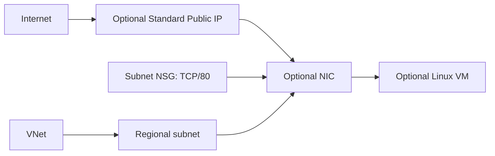

# Azure lab - VNet + VM tùy chọn

Lab này chuyển các khái niệm OCI VCN/Subnet/NSG/Compute sang Azure VNet/Subnet/NSG/Virtual Machine.

Mặc định `create_compute = false`, chỉ tạo Resource Group, VNet, subnet và NSG. Bật compute mới tạo Standard public IP, NIC, Linux VM và managed OS disk.

## Mô hình



So với OCI:

| OCI | Azure trong lab | Lưu ý |
|---|---|---|
| Tenancy/Compartment | Subscription/Resource Group | RG gần lifecycle scope hơn isolation/billing boundary. |
| VCN | VNet | Đều regional. |
| Regional subnet | Subnet | Azure subnet regional; VM/service chọn zone nếu cấu hình zonal. |
| NSG | NSG | Azure NSG có rule priority và có thể gắn subnet/NIC. |
| Compute shape | VM size | Không quy đổi OCPU/vCPU 1:1; kiểm tra SKU/capacity và benchmark. |
| Platform Image | Marketplace image reference | Production nên dùng Azure Compute Gallery/approved pinned image. |

## Chi phí và an toàn

- Network-only không tạo NAT Gateway, Load Balancer, Private Endpoint hoặc Log Analytics. Resource Group/VNet/subnet/NSG cơ bản thường không có hourly charge; kiểm tra [Azure Virtual Network pricing](https://azure.microsoft.com/en-us/pricing/details/virtual-network/) hiện tại.
- `create_compute = true` tạo VM, 30 GiB Standard_LRS OS disk, NIC và Standard public IP; **có thể phát sinh phí** dù VM nhỏ hoặc có credit.
- NSG chỉ mở TCP/80, không mở SSH. VM vẫn có public endpoint để demo; production nên private + Bastion/VPN/App Gateway/Front Door/WAF/TLS tùy threat model.
- Chạy destroy ngay sau lab và kiểm tra resource group/bill; soft-delete/backup/resource do service tạo có thể sống ngoài state.

## Điều kiện

- Terraform CLI `1.16.x`.
- Azure CLI và một Azure subscription.
- Quyền quản Resource Group/Network; thêm Compute khi bật VM.
- Nếu `register_resource_providers = true`, identity cần quyền đăng ký `Microsoft.Network` và `Microsoft.Compute` khi cần. Nếu platform team đã đăng ký, đặt biến thành `false`.
- VM size/image phải có ở location đã chọn.

## 1. Xác thực và xác minh subscription

PowerShell:

```powershell
az login
az account list --output table
az account set --subscription "SUBSCRIPTION_NAME_OR_ID"
az account show --output table
```

AzureRM dùng Azure CLI cho local. Azure PowerShell context không thay cho `az login`. Trong CI, dùng OIDC workload identity/service principal hoặc managed identity thay vì client secret dài hạn.

## 2. Chạy network-only

```powershell
Copy-Item terraform.tfvars.example terraform.tfvars
terraform fmt -check
terraform init
terraform validate
terraform plan -out=network.tfplan
terraform show network.tfplan
terraform apply network.tfplan
terraform output
```

Review `execution_context.subscription_id` và plan. Plan network-only phải **không có** public IP/NIC/VM.

Nếu identity không có quyền register provider nhưng namespace đã được platform team đăng ký, sửa:

```hcl
register_resource_providers = false
```

AzureRM v5 mặc định không đăng ký provider nào; sample đăng ký danh sách tối thiểu có chủ đích.

## 3. Bật VM có chủ đích

Tạo SSH key nếu chưa có:

```powershell
ssh-keygen -t ed25519 -f "$env:USERPROFILE\.ssh\terraform_lab" -C "terraform-lab"
Get-Content "$env:USERPROFILE\.ssh\terraform_lab.pub"
```

Chỉ dán nội dung file `.pub` một dòng vào `terraform.tfvars`:

```hcl
create_compute = true
ssh_public_key = "ssh-ed25519 AAAA... terraform-lab"
```

Không dán/commit private key. Sample không mở port 22; key là yêu cầu xác thực Linux VM và dành cho bài mở rộng qua Bastion/private access.

```powershell
terraform plan -out=compute.tfplan
terraform show compute.tfplan
terraform apply compute.tfplan
terraform output -raw public_url
```

VM cài nginx qua cloud-init; chờ vài phút nếu URL chưa trả kết quả.

## 4. Cleanup bắt buộc

```powershell
terraform plan -destroy -out=destroy.tfplan
terraform show destroy.tfplan
terraform apply destroy.tfplan
```

Sau đó kiểm tra Resource Group, Virtual Machines, Disks và Public IPs trong đúng subscription. Đừng xóa local state trước khi xác nhận destroy hoàn tất.

## Remote state cho team

`backend.azurerm.tf.example` minh họa Blob backend dùng Microsoft Entra ID. Bootstrap Storage Account/container bằng state riêng, bật private access/firewall, versioning/soft delete và cấp data-plane role hẹp. Đổi template thành `backend.tf`, rồi:

```powershell
terraform init -migrate-state
```

Azure Blob backend dùng native lease cho state locking. Backend permission data plane khác Azure Resource Manager permission tạo resource.

## Các bài mở rộng

1. Tạo VM private, Azure Bastion hoặc VPN; bỏ public IP.
2. Tạo hai VM ở nhiều zone sau khi kiểm tra logical zone mapping/SKU, đặt sau zone-redundant Load Balancer/Application Gateway.
3. Thêm Private DNS Zone/Private Endpoint cho Key Vault/Storage.
4. Tách network/app thành state riêng và publish subnet ID bằng contract nhỏ.
5. Thêm diagnostic settings, Azure Monitor alert, budget và Azure Policy.

Nguồn: [AzureRM provider](https://registry.terraform.io/providers/hashicorp/azurerm/latest/docs), [AzureRM 5.0 upgrade guide](https://registry.terraform.io/providers/hashicorp/azurerm/5.0.0/docs/guides/5.0-upgrade-guide), [Azure authentication](https://learn.microsoft.com/en-us/azure/developer/terraform/authenticate/authenticate-to-azure), [AzureRM backend](https://developer.hashicorp.com/terraform/language/backend/azurerm).
