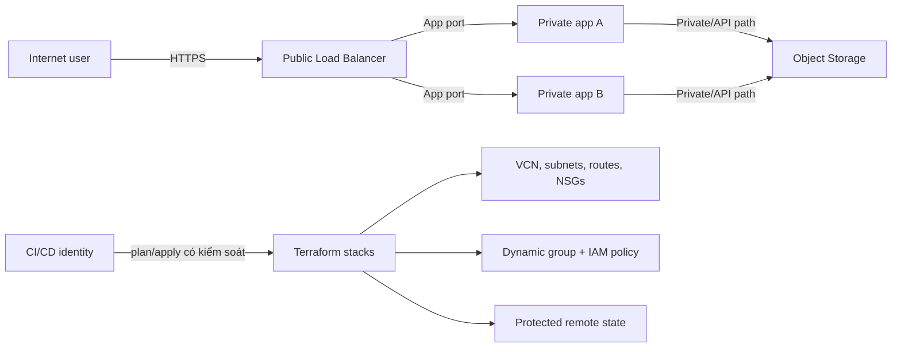

# Practical Assessment – OCI Production-Ready Foundation

## Mục tiêu

Trong một OCI sandbox, xây một nền tảng web nhỏ bằng Terraform đủ để chứng minh năng lực L01–L17. Bài này đánh giá **quy trình và quyết định kỹ thuật**, không chỉ việc `apply` thành công.

Thời lượng gợi ý: 12–20 giờ, chia nhiều phiên. Điểm: 100 theo [capstone-rubric.md](capstone-rubric.md).

## Bối cảnh

Công ty cần triển khai dịch vụ `orders`:

- Người dùng vào HTTPS qua public load balancer.
- App chạy trên ít nhất hai compute instance hoặc một cơ chế pool tương đương, không có public IP.
- App cần OCI API access bằng resource principal/instance principal, không lưu API private key trên instance.
- Artifact/backup mẫu nằm trong Object Storage; quyền truy cập là least privilege.
- Có môi trường `dev` và `prod` tách state và credential/blast radius.
- Thiết kế production phải có health signal, backup/restore story và một phương án DR được giải thích. Không bắt buộc trả chi phí triển khai DR thật.

Bạn có thể thay compute/LB bằng biến thể Free Tier hoặc mock ở `dev` nếu quota/chi phí không cho phép, nhưng phải giải thích phần nào chưa được apply và đưa plan/test bằng chứng.

## Mô hình logic tối thiểu

Sơ đồ là logic, không phải đáp án routing hoàn chỉnh. Bạn phải tự chỉ ra gateway, route, DNS, ingress/egress và trust boundary.

## Yêu cầu bắt buộc

### 1. Repository và module contract

- Tách root composition khỏi child modules. Tối thiểu có module network và app/service; tránh mega-module chứa mọi thứ.
- Khai báo `required_version`, provider `source`/constraint và commit dependency lock file.
- Variables có type/description/validation phù hợp; outputs chỉ expose contract cần thiết và không xuất secret.
- Dùng `for_each` với key ổn định cho resource lặp; format/validate sạch.

### 2. OCI network

- VCN với CIDR có lý do; public subnet cho LB và private subnet cho app (hoặc regional subnet tương ứng).
- Gateway/route đúng cho Internet ingress, app egress và/hoặc OCI service access. Không cấp public IP cho app.
- NSG/security rules mô tả đúng luồng; không dùng inbound `0.0.0.0/0` tới SSH/app backend. Nếu cần quản trị, đề xuất Bastion/OS Management/đường riêng.
- Có cách kiểm tra LB-to-backend health path và DNS/TLS assumption.

### 3. Compute, identity và data

- Bootstrap nhỏ, idempotent; không hard-code secret trong `user_data`, variable default, log hoặc state.
- Dynamic group + policy tối thiểu cho workload; pipeline principal tách workload principal.
- Object Storage có encryption mặc định/phù hợp, private access, versioning/retention theo giả định RPO. Mô tả cách test restore.
- Compute phân bố failure domain hợp lý với region/quota; health check thực sự xác nhận app.

### 4. State và environment

- `dev` và `prod` có state key/backend/credential boundary rõ. Không dùng local state cho team production.
- Backend có access control, encryption, backup/versioning và locking hoặc cơ chế serialize writer được mô tả chính xác theo backend đã chọn.
- Không commit state, saved plan nhạy cảm, `.tfvars` secret hay private key.
- Viết runbook: stale lock, mất backend, state restore và quyền break-glass.

### 5. Pipeline và quality gates

Pipeline/pseudocode phải có:

1. pin Terraform/provider/tool version;
2. `fmt -check`, `validate`;
3. lint + security/policy scan;
4. plan gắn commit/environment, artifact được bảo vệ;
5. review/approval cho prod;
6. serialized apply với đúng reviewed commit/plan;
7. post-deploy health/SLO check và audit evidence.

Nêu cách chống stale plan và fork PR lấy secret/production credential.

### 6. Hai bài diễn tập bắt buộc

**Drill A – Refactor không recreate:** đổi một resource lặp hoặc chuyển vào child module. Dùng `moved` block/state migration có backup. Bằng chứng cuối phải là plan không destroy/recreate ngoài chủ ý.

**Drill B – Drift/incident:** thay đổi một thuộc tính vô hại ngoài Terraform trong sandbox, phát hiện bằng plan, tìm audit evidence rồi chọn revert remote hoặc cập nhật code. Không thực hành xóa production. Viết post-incident note ngắn.

## Deliverables

1. Source Terraform đã redact secret; dependency lock file.
2. `README` chạy từ zero: prerequisite, auth không chứa key thật, init/plan/apply/test/destroy cho sandbox.
3. Sơ đồ kiến trúc và data/trust flow.
4. Hai ADR ngắn: (a) state/environment strategy, (b) module/network/security design.
5. Pipeline code hoặc pseudocode có quality gates.
6. Redacted evidence: `fmt`, `validate`, lint/scan, plan summary, health test, drift drill, refactor drill.
7. Runbook state incident + app deployment failure + DR/restore.
8. Cost estimate/budget assumption và cleanup checklist.

## Acceptance tests gợi ý

- `terraform fmt -check -recursive`
- `terraform validate`
- Hai lần plan liên tiếp sau apply cho kết quả no-op (trừ giá trị được giải thích).
- Public client chỉ vào LB:443; không vào app trực tiếp.
- LB health check healthy; tắt một app node không làm mất toàn dịch vụ trong giới hạn thiết kế.
- Workload đọc đúng object bằng instance principal; truy cập ngoài scope bị từ chối.
- Secret scan không phát hiện credential thật; Git không chứa `.tfstate`/plan/private key.
- Drill refactor không tạo replacement ngoài dự kiến.
- Cleanup plan được review; dữ liệu cần giữ đã backup/test restore.

## Câu hỏi bảo vệ (oral defense)

Người chấm chọn ít nhất 5 câu:

1. Nếu bỏ state, Terraform mất thông tin gì và phục hồi thế nào?
2. Vì sao rule network hiện tại là tối thiểu? Vẽ cả return path.
3. Một API key bị lộ trong state thì xử lý theo thứ tự nào?
4. Điều gì xảy ra khi thêm một app node với `for_each`?
5. Vì sao pipeline không apply một plan cũ sau merge khác?
6. Region lỗi thì RTO/RPO thiết kế là bao nhiêu và dependency nào chặn failover?
7. Phần nào của module có thể tái dùng sang AWS/Azure, phần nào phải viết riêng?
8. Khi nào bạn chọn công cụ khác thay Terraform?

