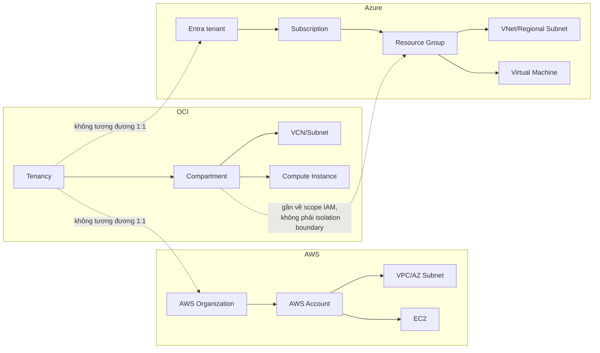

# Tham chiếu Terraform đa đám mây: OCI → AWS và Azure

Thư mục này giúp người đã học Terraform với Oracle Cloud Infrastructure (OCI) chuyển kiến thức sang AWS và Microsoft Azure. Mục tiêu là **ánh xạ khái niệm**, không phải thay tên dịch vụ một cách máy móc: nhiều dịch vụ chỉ tương đương về mục đích, nhưng khác ranh giới quản trị, mô hình HA, IAM, API và chi phí.

> Trạng thái tài liệu: đối chiếu theo tài liệu chính thức ngày **2026-08-27**. Giá, quota, vùng hỗ trợ và hành vi provider có thể thay đổi; luôn kiểm tra tài liệu/price calculator trước khi triển khai thật.

## Bắt đầu ở đâu?

| Nhu cầu | Tài liệu |
|---|---|
| Tìm dịch vụ tương đương | [01 - Bảng đối chiếu dịch vụ](./01-bang-doi-chieu-dich-vu.md) |
| Hiểu provider, auth, IAM, region/AZ, naming, state | [02 - Khác biệt nền tảng](./02-khac-biet-nen-tang.md) |
| Thiết kế một hệ thống chạy trên nhiều cloud | [03 - Thiết kế multi-cloud](./03-thiet-ke-multi-cloud.md) |
| Chuyển workload hoặc Terraform state an toàn | [04 - Checklist migration](./04-checklist-migration.md) |
| Tránh lỗi thiết kế phổ biến | [05 - Anti-patterns](./05-anti-patterns.md) |
| Kiểm tra nguồn và phiên bản | [06 - Nguồn chính thức](./06-nguon-chinh-thuc.md) |
| Thực hành AWS | [AWS lab: network + compute tùy chọn](./aws/minimal-network-compute/README.md) |
| Thực hành Azure | [Azure lab: network + compute tùy chọn](./azure/minimal-network-compute/README.md) |

## Bản đồ tư duy nhanh

Điểm phải nhớ:

- OCI **compartment** là scope tổ chức/IAM bên trong tenancy; AWS thường dùng **account** làm security/billing boundary mạnh; Azure dùng **subscription** cho quota/billing/governance và **resource group** cho vòng đời tài nguyên.
- OCI subnet thường là regional; AWS subnet luôn gắn với một Availability Zone; Azure subnet là regional và tài nguyên mới là thứ chọn zone khi dịch vụ hỗ trợ.
- Cùng một mục tiêu “cho phép traffic” nhưng OCI có Security List và NSG, AWS có Security Group và NACL, Azure chủ yếu có NSG. Stateful/stateless và điểm gắn policy khác nhau.
- Terraform giúp chuẩn hóa workflow và module interface; nó không làm API, SLA, IAM hay semantics của ba cloud trở nên giống nhau.

## Cách học phần này

1. Chọn một khái niệm OCI đã biết và tìm trong bảng dịch vụ.
2. Đọc cột “khác biệt phải nhớ”, rồi xem chi tiết nền tảng.
3. Chạy lab ở chế độ mặc định `create_compute = false` để chỉ tạo network.
4. Đọc plan, bật compute có chủ đích, kiểm tra chi phí và destroy ngay sau lab.
5. Dùng checklist migration để tự thiết kế lại một workload OCI nhỏ trên AWS rồi Azure.

## Quy ước an toàn của sample

- Không chứa access key, secret, password hoặc private key.
- Compute mặc định **tắt**; bật bằng `create_compute = true` sau khi đã đọc cảnh báo chi phí.
- Không tạo NAT Gateway, managed database, load balancer hay DNS zone vì các tài nguyên này có thể phát sinh phí dù ít traffic.
- Provider được giới hạn theo major đã kiểm tra (`hashicorp/aws ~> 6.0`, `hashicorp/azurerm ~> 5.0`); Terraform CLI dùng nhánh `1.16.x`.
- `.terraform.lock.hcl` nên được commit sau `terraform init`; state, plan file và `.tfvars` thực có thể chứa dữ liệu nhạy cảm nên không commit.

## Đây không phải cam kết “dịch tự động”

Một migration tốt thường là **re-platform có kiểm soát**, không phải tìm tài nguyên Terraform cùng tên rồi thay provider. Trước mỗi quyết định cần kiểm tra: RTO/RPO, data residency, SLA, quota, giới hạn vùng, mô hình identity, egress, license, backup/restore và khả năng rollback.
